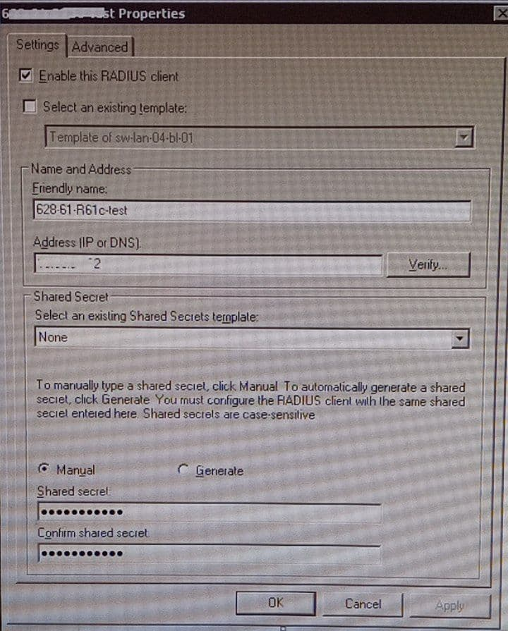
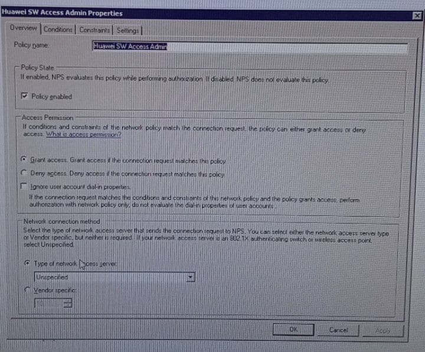
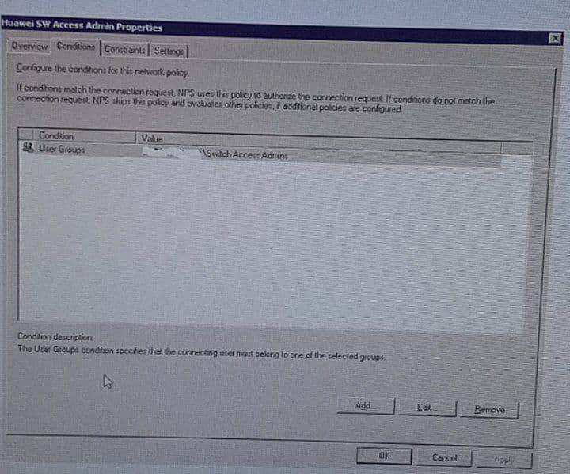
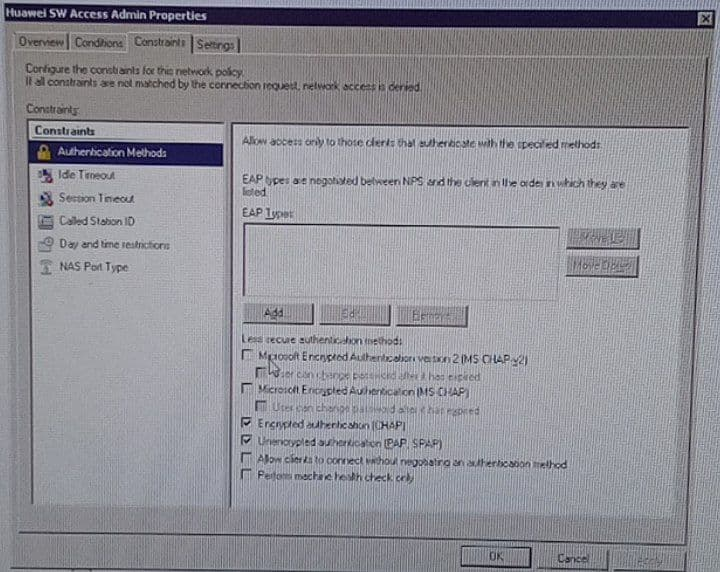
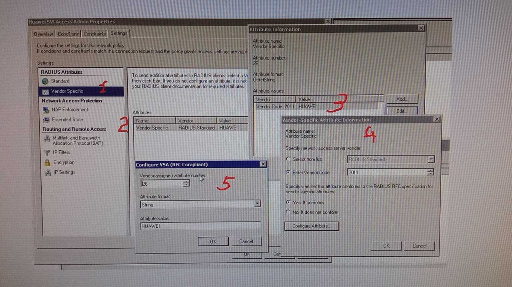

# Настройки AAA

на SW
Настройки
Добавление локальных пользователей:

```
local-user admin password irreversible-cipher <SECRET_ADMIN_PASSWORD>
 local-user admin privilege level 15
 local-user admin service-type terminal http
 local-user netadmin password irreversible-cipher <SECRET_NETADMIN_PASSWORD>
 local-user netadmin privilege level 15
 local-user netadmin service-type terminal ssh
...
ssh user admin
ssh user admin authentication-type password
ssh user admin service-type all
ssh user netadmin
ssh user netadmin authentication-type password
ssh user netadmin service-type all
```

Заменить на свои значения <AUTH>, <TEMPLATE_RADIUS>, <DOMAIN_NAME>
```
aaa
 authentication-scheme default
  authentication-mode local
 authentication-scheme <YOUR_SCHEME>
  authentication-mode local radius
 authentication-scheme radius
  authentication-mode radius
 authorization-scheme default
  authorization-mode local
 accounting-scheme default
  accounting-mode none
 accounting-scheme <YOUR_SCHEME>
  accounting-mode radius
  accounting start-fail online
 local-aaa-user password policy administrator
  password expire 0
 domain default
  authentication-scheme default
  accounting-scheme default
  radius-server default
 domain default_admin
  authentication-scheme <YOUR_SCHEME>
  accounting-scheme default
  radius-server default
 domain <DOMAIN_NAME>
  authentication-scheme <YOUR_SCHEME>
  accounting-scheme <YOUR_SCHEME>
  radius-server <TEMPLATE_RADIUS>
...
 
...
radius-server template default
 undo radius-server user-name domain-included

radius-server template <TEMPLATE_RADIUS>
 radius-server shared-key cipher <Pa55w0rd>
 radius-server authentication <NPS_IP_ADDR> 1812 source ip-address 10.96.20.32 weight 80
 radius-server accounting <NPS_IP_ADDR> 1813 weight 80
 radius-server retransmit 2
 radius-attribute nas-ip 10.96.20.32
 radius-server user-name domain-included
radius-server authorization <NPS_IP_ADDR> shared-key cipher <Pa55w0rd2>
...
user-interface vty 0 4
 authentication-mode aaa
 user privilege level 15
 protocol inbound all
```

Настройки NPS:
1. Регистрируем Switch

2. Настраиваем Policy




