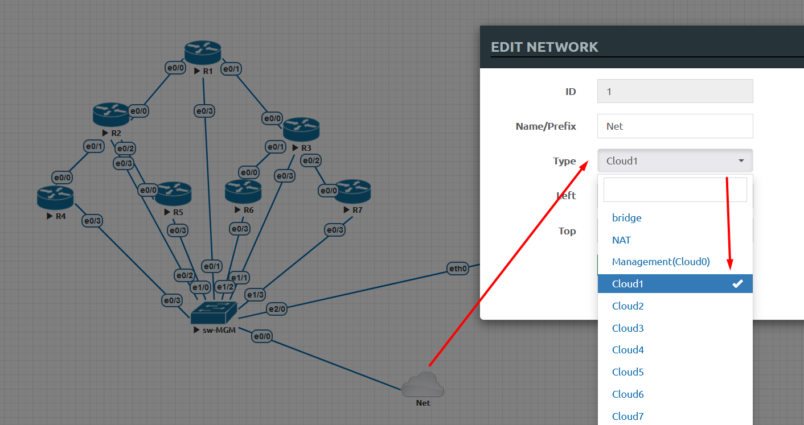

Oct. 31, 2022
https://learning.oreilly.com/live-events/ansible-in-4-hours/0636920123842/

https://github.com/sandervanvugt/ansiblefundamentals

При первичной настройке EVE-NG очень много времени потрачего на первоначальные конфигурации R1...R7. Основная задача: при загрузке Rxx должен брать первоначальный конфигурационный файл с tftp сервера. Алгоритм выстроен следующим образом:
1. Базовые настройки Rxx сохраняем и выгружаем в startup-конфиг EVE-NG, чтобы при wipe устройства оно конфигурировалось в минимальном объеме, достаточном для скачиванивания конфига с tftp
<details><summary>R1</summary>
    <pre>
hostname R1
!
boot-start-marker
boot host tftp R1-confg 192.168.10.131
boot-end-marker
!
interface Ethernet0/3
 ip address dhcp
 no shutdown
!
no ip http server
no ip http secure-server
    </pre>
   </details>
2. Обязательно делаем WR MEM  на роутере, после чего задаем загрузку Rxx из startup-конфиг EVE-NG 
3. В схему EVE-NG вводим "сеть", из списка подключенных к EVE интерфейсов, на котором работает DHCP, чтобы при включении Rxx получал ip и мог выйти на связь с tftp


4.  Для установки tftp под UBUNTU
```
apt install xinetd tftpd tftp
```
6. В tftp создаем файлы с именами R1...R7, которые будут открываться загрузчиком 
```
administrator@admin-UB01:~$ cd /var/tftpboot/
administrator@admin-UB01:/var/tftpboot$ ll
total 44
drwxrwxrwx  3 nobody root 4096 ноя 13 10:35 ./
drwxr-xr-x 15 root   root 4096 ноя 10 10:10 ../
-rw-r--r--  1 root   root  606 ноя 13 10:33 R1-confg
-rw-r--r--  1 root   root  605 ноя 13 10:34 R2-confg
-rw-r--r--  1 root   root  605 ноя 13 10:34 R3-confg
-rw-r--r--  1 root   root  605 ноя 13 10:34 R4-confg
-rw-r--r--  1 root   root  605 ноя 13 10:34 R5-confg
-rw-r--r--  1 root   root  605 ноя 13 10:34 R6-confg
-rw-r--r--  1 root   root  605 ноя 13 10:35 R7-confg
-rw-r--r--  1 root   root  605 ноя 10 21:41 R8-confg
```

5. Проверяем через Wipe или очистку конфига
```
do erase startup-config
c
do reload
```


