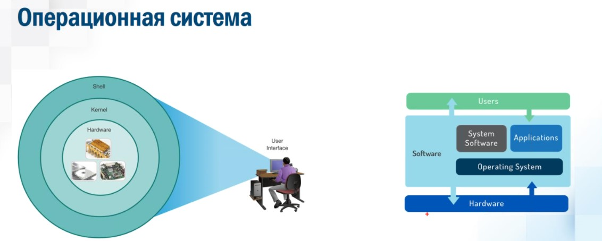

# 20210222 Pavel Monakhov
Linux - название ядра ОС. Полностью название GNU/LINUX
- GNU - набор свободного ПО, который содержит аналоги программ из коммерческой ОС UNIX
- LINUX - ядро ОС
Вся история Linux - история развития языка программирования "C". Любой может посмотреть исходники ПО 
- Linux появился в 1991 г., как хобби Линуса Торвальдса, когда он учился в Хельсинксом универе
- Проект GNU был разработан Ричардом Столлманом в 1983 г. GNU - [G Not UNIX]
- Объединив ядро и основные утилиты, удалось создать полноценную ОС

Linux = ядро + GNU/

Если кто-то другой добавляет утилиты, то появляются "дистрибутивы": https://distrowatch.com
Известные дистрибы:
- Linux
- RedHat
- Ubuntu

До графики использовался только CLI, но именно из CLI можно выполнять различные назначенные задания и циклы.

- shell - командная строка
- bash - born again shell (переписанный, перерожденный shell)

Подключение в bash - при помощи putty, через SSH.