# Карманов
Инструменты управления PKI

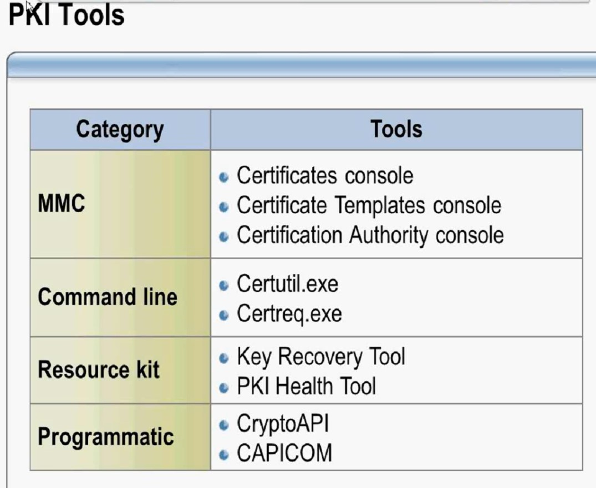

задачи бьем на 2 группы:
- операционные/частые
   - выдача сертов
- Административные/редкие
   - управление CA
   - изменение шаблонов, политик
   - PKI Health Tools

Сейчас работать с CA можно уже через GPO и Powershell

## Введение в Криптографию

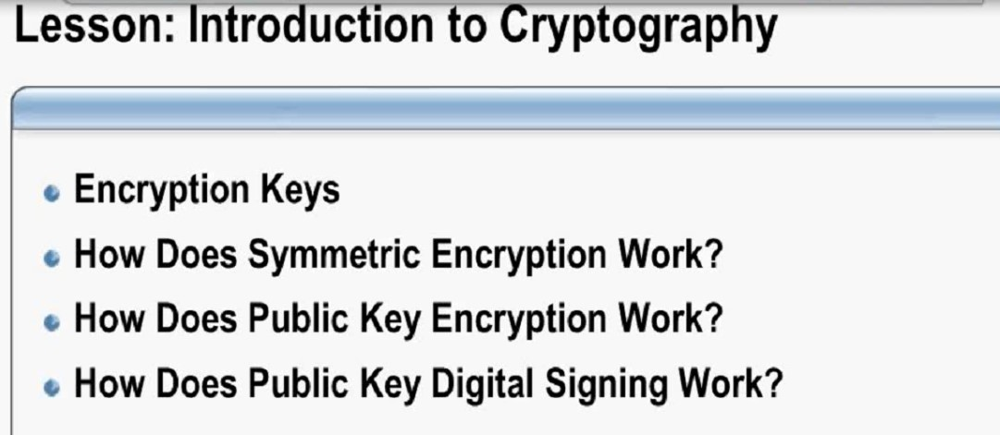

Типы алгоритомв генерации ключей (надо оценивать ключи на уязвимость):
- Symmetric: один и тот же ключ используется для шифрования/дешифрования
   - DES - 64-битовый ключ, но 8 бит используются для проверки целостности (вычислимы из остальных 56), поэтому "ключевое пространство" - ___56 бит___(7 байт)
- Asymmetric: состоит из public и private частей; private - защищаемая, спрятанная в сейфе, public - распространяемая часть ключа; private - для шифрования, public - для дешифрации

Размеры ключей быстро растут (сейчас уже больше 2048).
Алгоритм DH - для одновременной генерации сервисных ключей (наиболее широка в IPSEC). 

rsa.com
Схема работы symmetric шифрования (ГОСТ не удастся сбрутить)
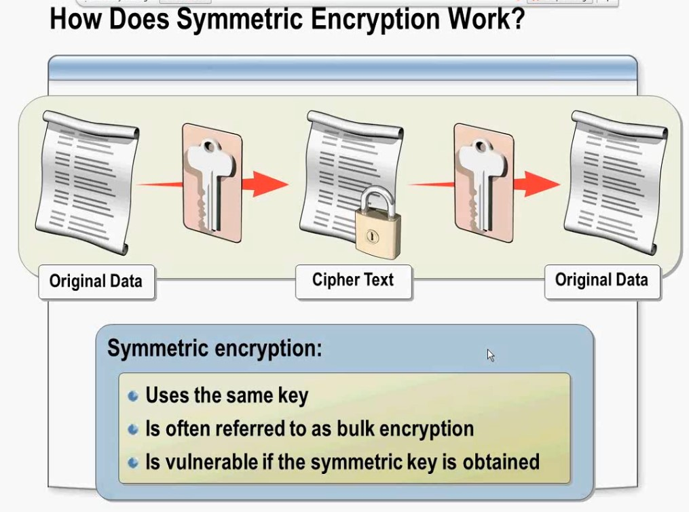

Cipher Text - зашифрованный текст. Алгоритм - простой, повторяется N-раз (DES/3DES и т.д.), что упрощает разработку алгоритмов: SHA1 - перетирает все 80 раундовб уже есть SHA3

Как работает Public key процесс асимметричного алгоритма шифрования (с 50-го года, например RSA.  RSA шифруют или хэши, или другие ключи (ключи для защиты других ключей)

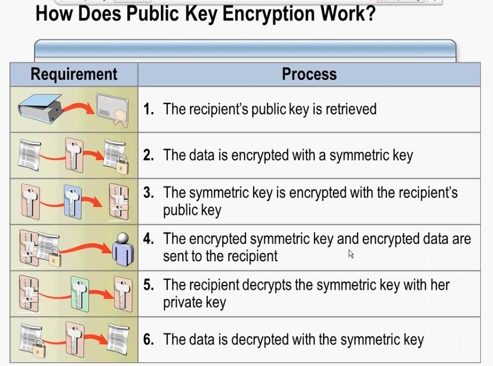

- генерируются 2 ключа (в функцию вбрасываются стартовые параметры/константы), вычислить ключи из другого ключа - нельзя
- Данные шифруются ___symmetric___ ключами
- Symmetric ключ шифруется public ключом получателя
- Зашифрованный Symmetric ключ и зашифрованные данные отправляются DST
- DST получив symmetric ключ расшифровывает его своим private ключом
- данные расшифровываются symmetric ключом

Процесс подписывания

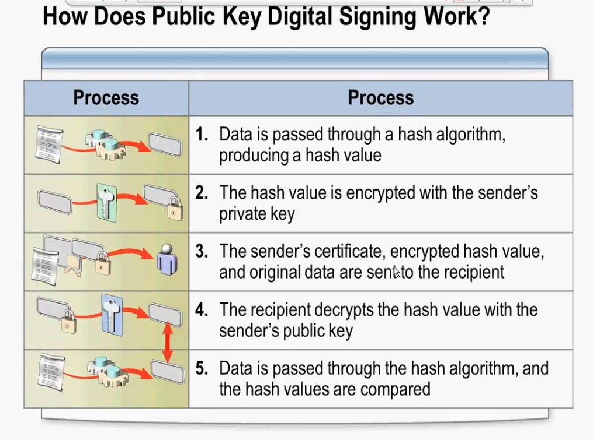

- Данные хэшируются для получения хашированного значения
- Хашированное значение шифруется закрытым ключом отправителя
- Сертификат отправителя, зашифрованное хэшированное значение и исходные данные отправляются получателю
- получатель расшифровывает хэшированное значение при помощю ключа отправителя
- Данные в этот момент хэшируются и затем оба значения хэша сравниваются:   
   - Если хэши совпали - документ не менялся (99,999, но не исключено что хэши совпали даже у измененного материала)
   - Если хэши различаются - капец...

## Сертификаты и Центры Сертификации (Cert authority)

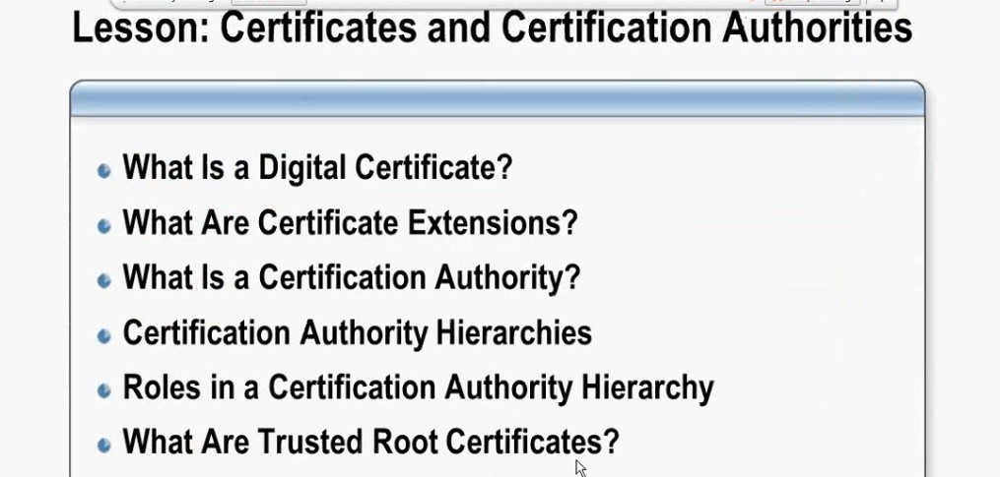

Цифровой сертификат:
- Большой объемов информации (поля с содержимым, чать - обязательные, часть - не критичные к изменениям).
   - можно указывать для чего этот серт можно применять
- Криптографическая инфа (public ключ), часто сравнивают не сами ключи, а их хэши

CA - подписывает эту связку: считается хэш и шифруется закрытым ключом CA (файл с расширением .cer)

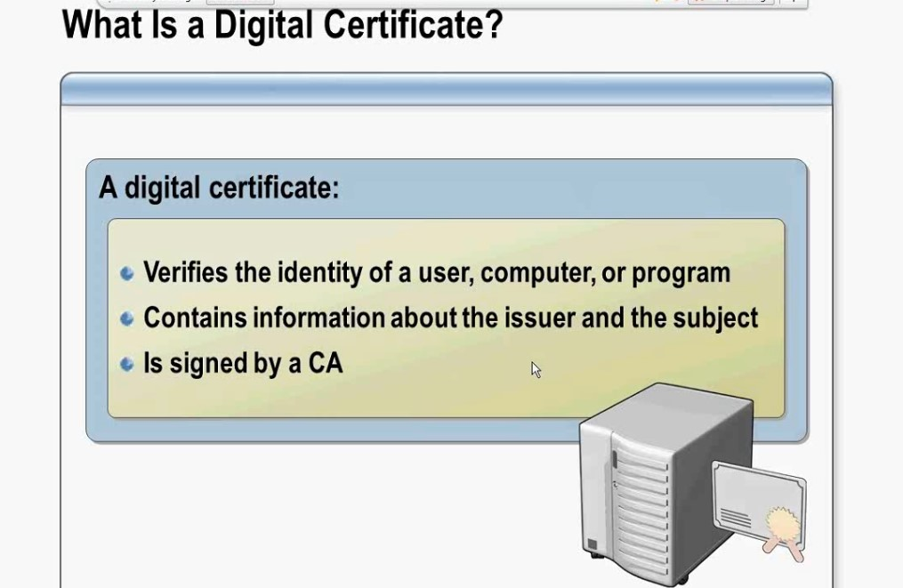

Хитрость MS: генерим ключи (ключевую пару) на сервере

Пример серта:

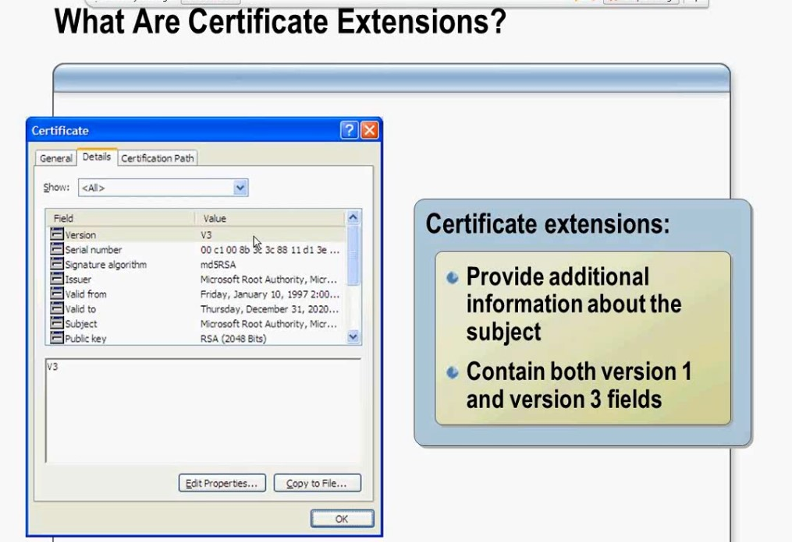

- Версия
- serial num
- Sign algor - алгоритм подписи
- Issuer - кто выдал
-...
- Subject (зачем выдан)

## CA - центр сертификации 
это самый верхний центр сертификации, выдает сертификаты подчиненным Subordoinate CA.

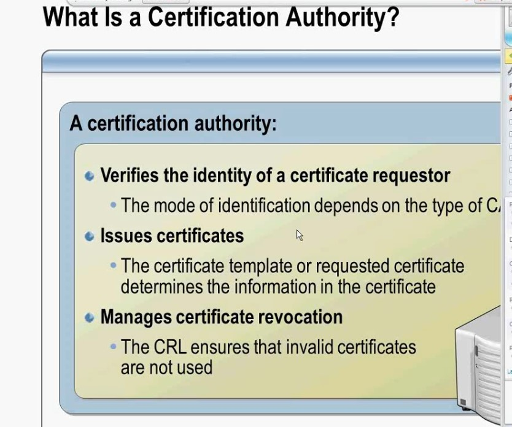

CA умеет:
- Идентифицирует идентичность, проверяет данные из учетки (те, кто пришел с kerberos-тикетом Вася, является Васей)
- Issue cer (выпускает сертификат) - на основании templates
- Manage Revocation (управляет жизненным циколм/отзывом сертов) - в некой таблице CRL

## Иерархия:
- дерево с корнем (множествы выдающих в филиалах)
- разные CA, с разным функционалами (один - для серверов, другой - для пользователей)

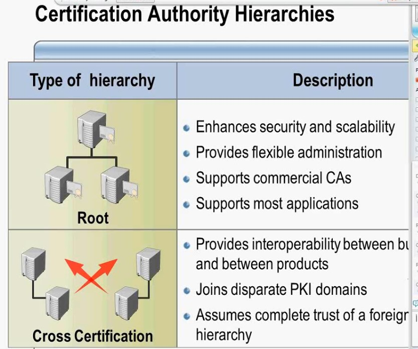

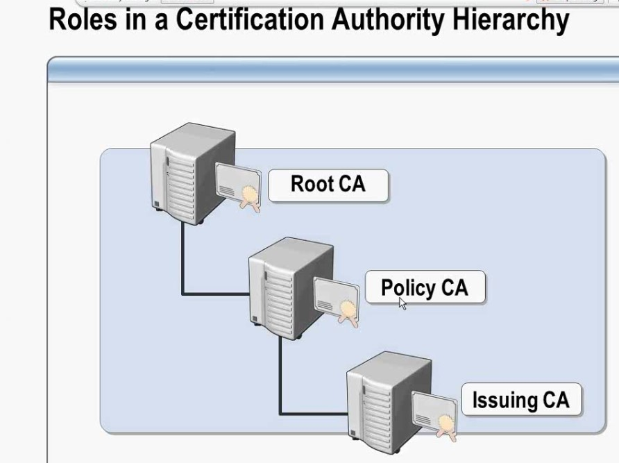

Root чаще всего выключен, а его ключи "заперты" в сейфе, на случай если кто-то сопрет сервер, но отозвать ключи - не сможет.

## Доверенные серты

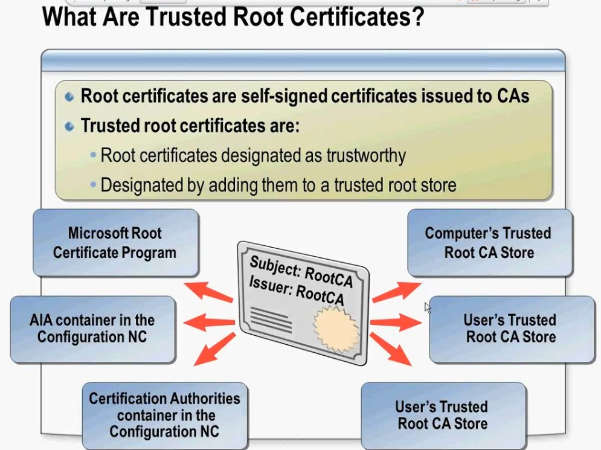

Доверенные серты - самый-самый, которому все доверяют и на основании которого проверяют другие серты
- доверенные серты - самоподписные, корневые
- Хранилища trusted root CA:
   - Users
   - Computers
   - cert authority
   - AIA container
   - MS root cert (MS сама выкадывает действительные серты в виде патчей)

best practices - раздать GPO root CA cert всем в домене, на случай если будет снесен CA, то чтобы не было разрыва окна обслуживания. 

Дополнительная практика по развертыванию CA: https://github.com/fazzzan/Admining/tree/master/SCCM/GregShield/01 - п.п. 5

Выясним что и где лежит, включая места физического хранения

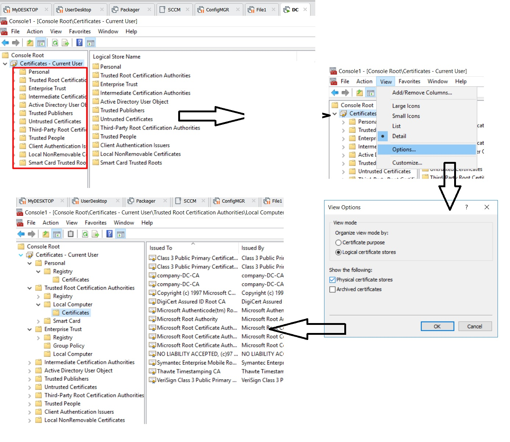

root CA cert - можно определить по одинаковым полям Issuer, Subject:

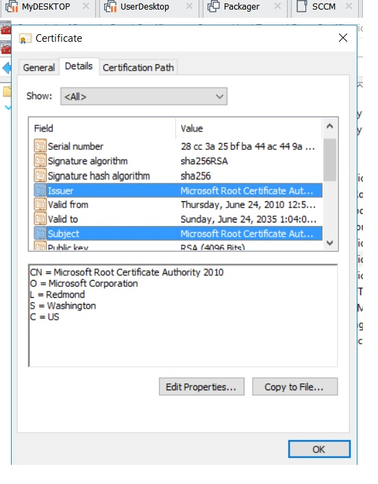

