# Карманов

## Разработка иерархии

JC
на заре развития MS 2000 была еще технология с отдельныит сертификатами - Exchange, но MS решила затем в 2003 PKI допилить, но в разных ОС (Ent, Stand) - различались. Для полнофункционального надо докупить было Ent 2002.

## Требования к дизайну CA иерархии
К внутреннему CA - требования ниже, чем к CA, к которым будут обращаться другие. Легче купить серт, чем выпускать свои

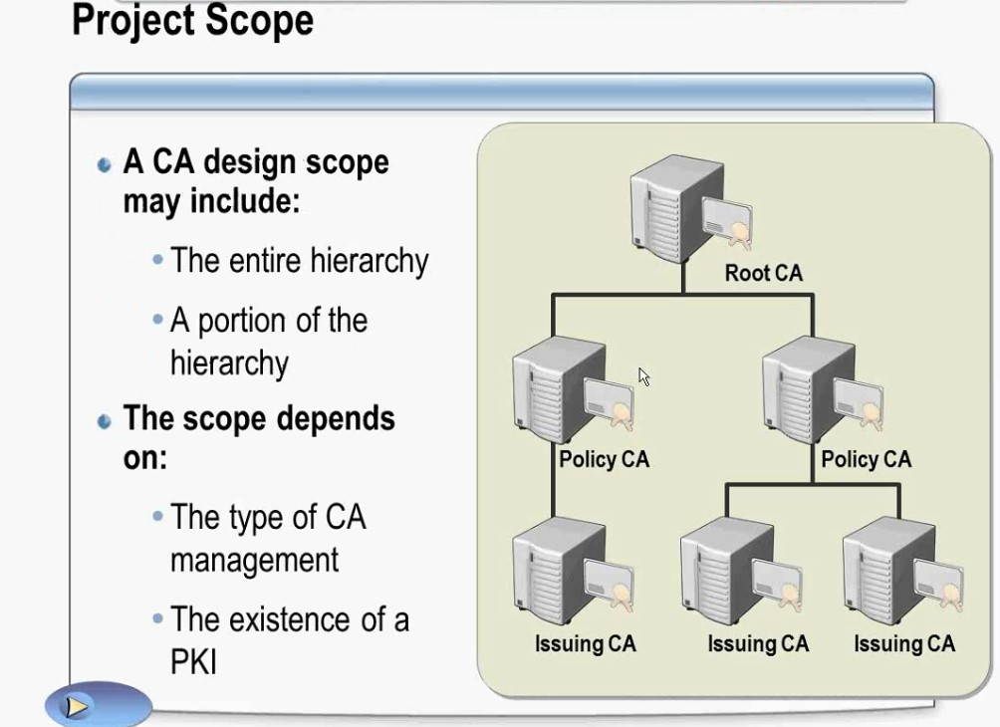

Тут есть:
- Root CA - это есть во всех Ent, стратовая точка доверия. Выдает штутчное количество сертов, выложить список отзывов CLR, к которым все имеют доступ по http и все. После этого rootCA - выключаем, чтобы у нас не сперли закрытые ключи или не отозвали корневой сертификат.
   - на root CA не ставят WEB-морду
   - при установке root CA - указывают root, на не subordinate (но в одной AD может быть несколько CA)
   - при создании new private key на новых ОС, если у вас сть старые ОС - могут бы проблемы, если задаете сложные алгоритмы генерации ключа
   - common Name - короткое имя/идентификатор, которое показывает в пространстве  иерархических имен наименование в контейнере последнего объекта
   - distinguished name - полное ldap имя (включает в себя название всех промежуточных контейнеров и CN финального объекта): CN=company-DC-CA, DC=company, DC=pri
   - RDN - хвостик ВТ (например CN=company-DC-CA) 
   - validity - период годности (время смены ключевой информации). Термин время жизни - это другое: сертификат можно перегенерировать и при этом не отзывать старый
   - Certificate database - где расположена база сертификатов

Итак, запустив CA, получим зеленую галочку, которая не обозначает что "все хорошо", а только говорит что сервис запущен:

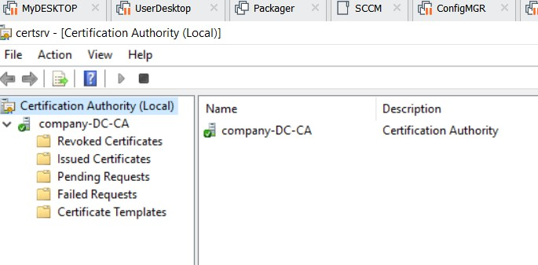

Если хотим управлять шаблонами (и увидеть что у template "Computer" имя шаблона Machine - надо сделать ПКМ на папке "Certificate Template")

Увидеть что произошло после поднятия CA в домене можно через ADSI

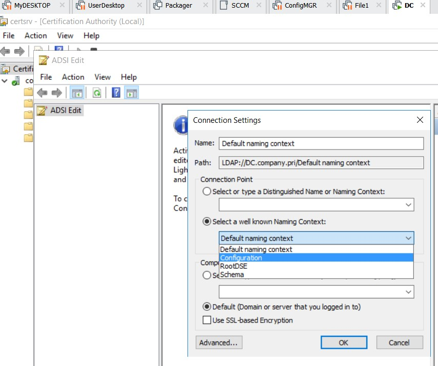

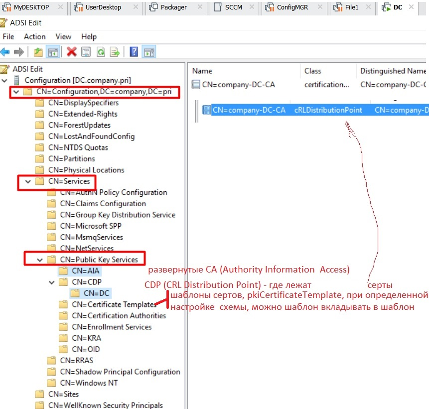

У DC есть свой отдельный шаблон сертификатов, это нужно для обеспечения регистрации по смарт-картам и подписание трафика репликации по SMTP (по недоверенным каналам) - DC писал DC письмо и подписывал его своим сертов

После поднятия CA - рекомендуется сразу раздавать сертифкат CA клиентам через GPO (в проде есть):

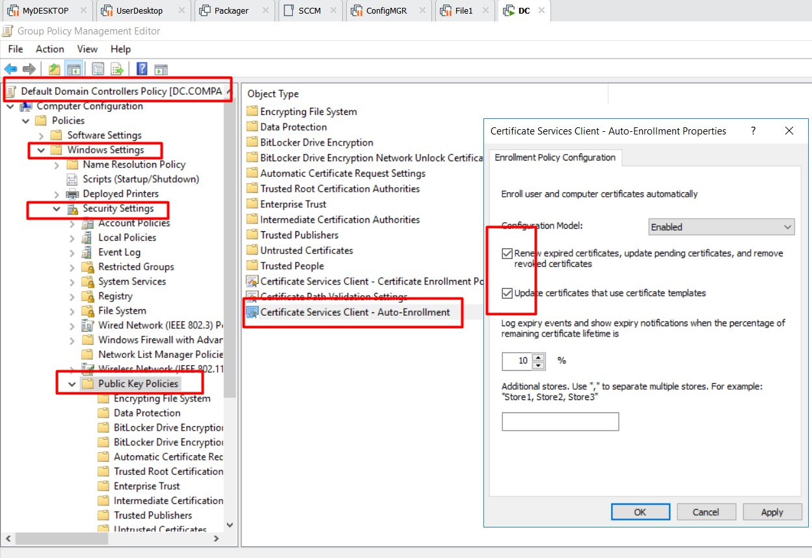

Эта настройка отвечает за раскатку сертов из стандартных шаблонов, поэтому переименовывать шаблоны без необходимости нельзя (после переименования шаблона сертификат выпущенный со старым шаблоном перевыпущен не будет)

В проде следующая настройка не активирована, почитать

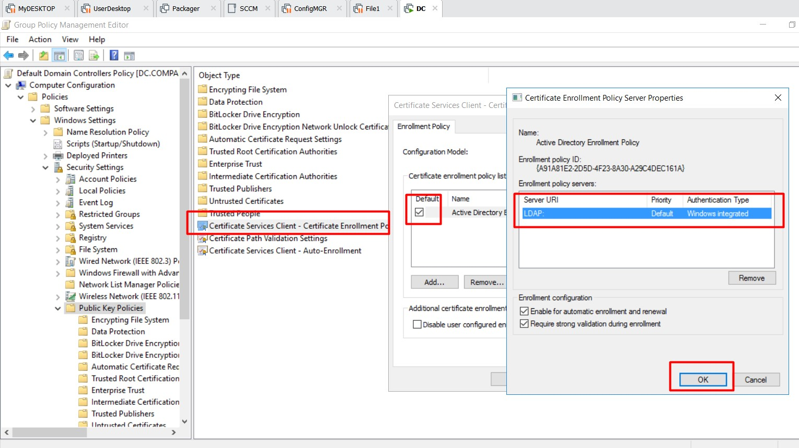

Также не настроены шаблоны, чтобы DC сами подъедали сертификаты:

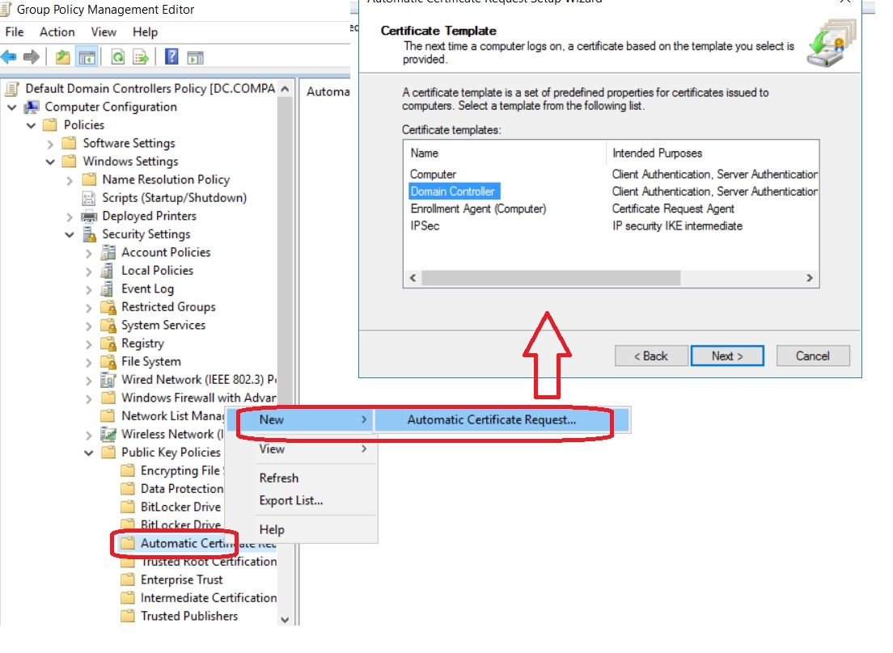

А вот как выглядит сертификат CA в ADSI:

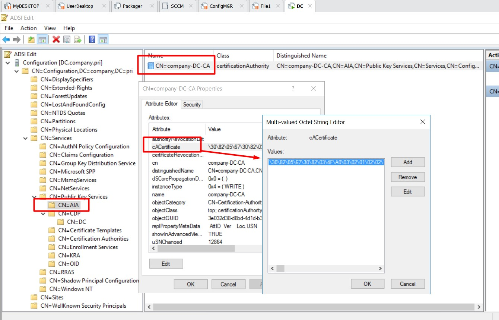

Приведенные выше картинки помогут узнать информацию про развернутый центр сертификации. Конкретных файлов мы не увидим и не получим. Если нам надо узнать был ли отозван сертификат, нам нужна CRL (кстати в проде она в сертификатах объектов не указана, что странно).

Следующий момент - контейнер CA (тут информация отличается от информации из AIA):

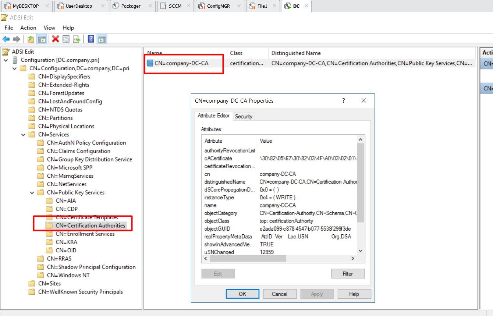

Служба выдачи: Enrollment Services - то что умеет выдавать CA (какие шаблоны). Сюда прибегают машины и ищут свой шаблон Machine

Агент восстановления: в самом начале настройки CA такой контейнер есть, но функционал не настроен (кстати в проде - тоже), то есть пока архивировать ключи мы не можем. KRA - нужен на случай, если какой-то негодяй спер ключевую пару. Тогда можно из открытого сертификата и настроенных ранее KRA расшифровать ключ и получить файл в формате ___pfx___

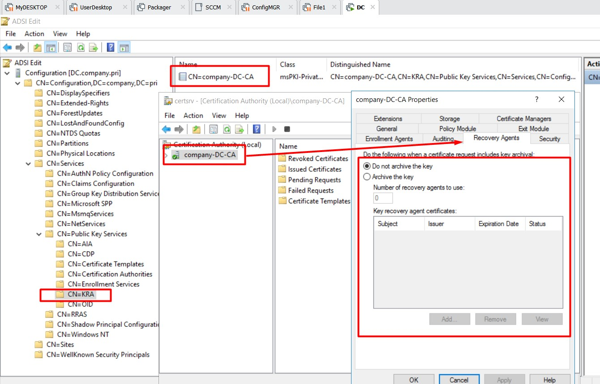

контейнер OID - это все то, что было добавлено в PKI в плане криптографических примитивов со стороны MS. Примитивы можно править/добавлять.

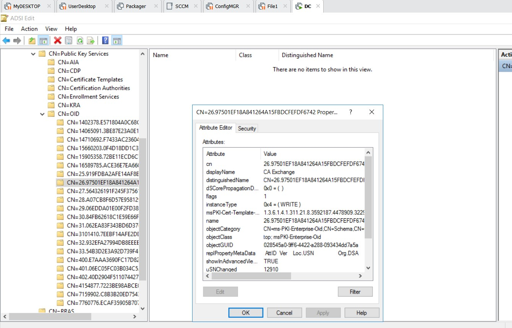

___PKI развернутый в домене - по умолчанию будет доступен во всем лесу___
