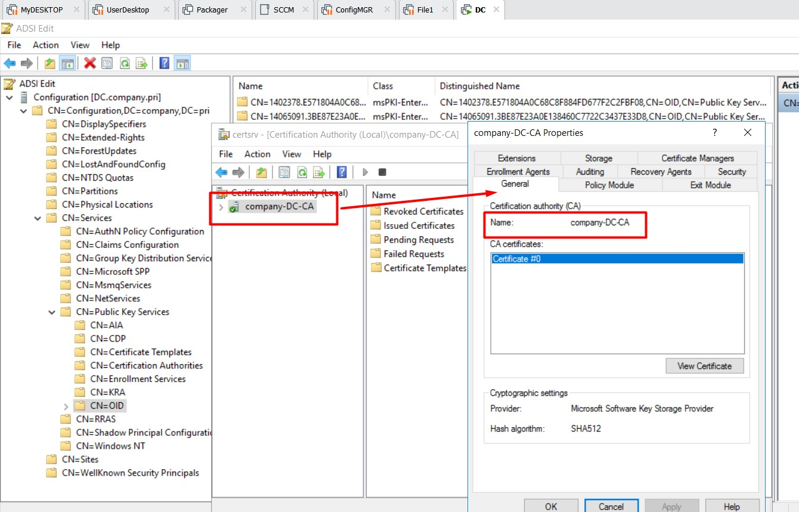
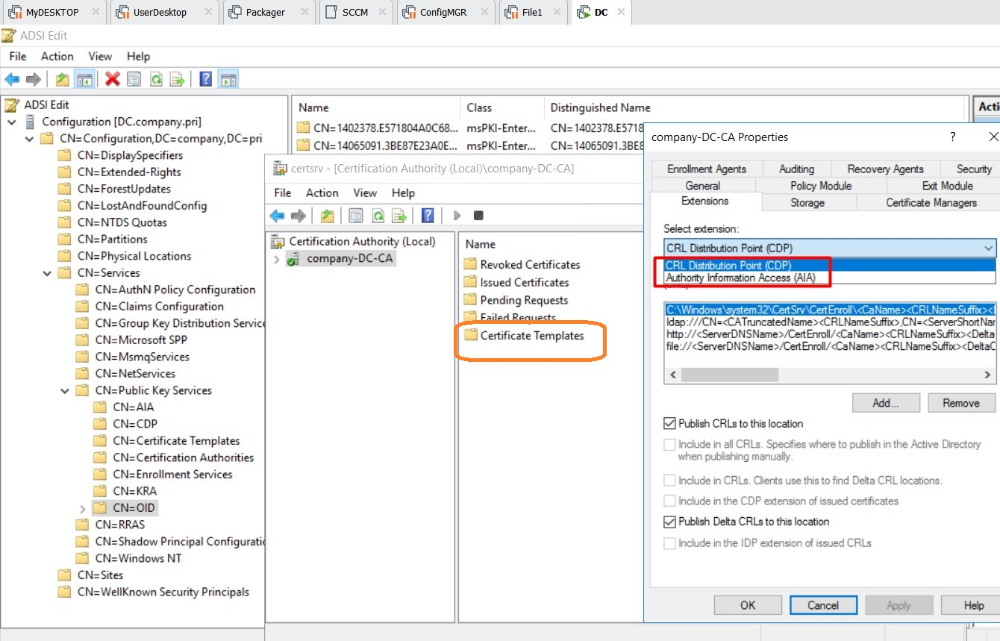
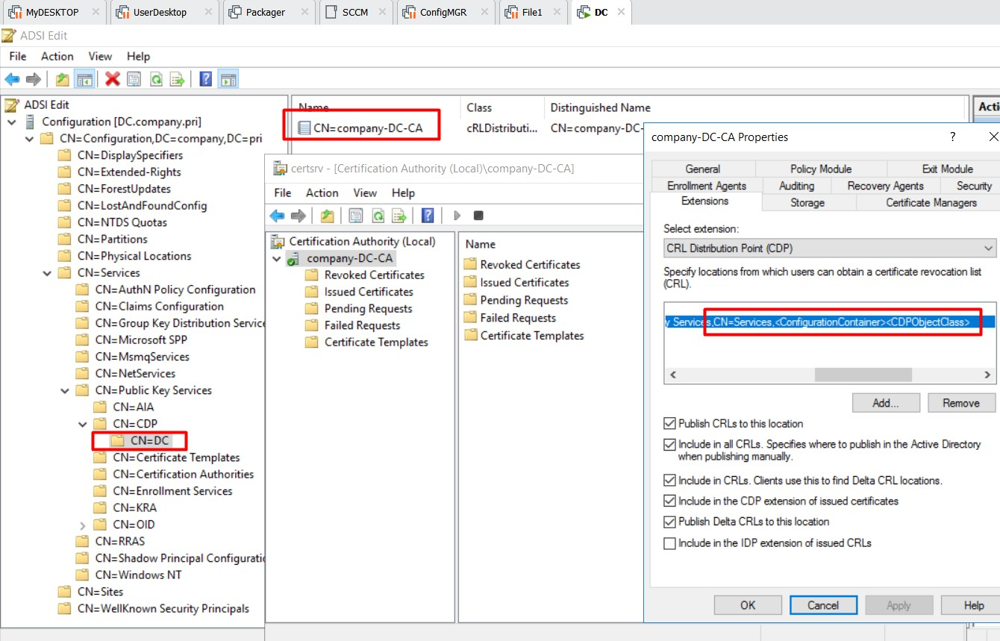

# Карманов
При развертывании CA мы давали ему советы: 
- имя (на CA имя может и не совпадать с именем сервера)
- provider (в проде Microsoft strong Cryptogr. Prov.)
- hash алгоритм (SHA-1)

В проде я столкнулся именно в тем, что как я думал, root CA был назван отлично от имени сервера, и как оказалось он совсем не root CA: сертификат ему был выдан другим сервером, а данный сервер был настроен как ISSUE сервер, то есть выпускающий/выдающий сертифимкаты. Также ___Create Template Name___ = SubCA (ха-ха-ха). Рядом лежал еще один подобный сервер, тоже не root. Ищу пока работающий root CA или его закрытые сертификаты.

Следующее свойство: 
- CDP (точка проверки отзыва) [CRL distribution Point] - по полю CDP у сертификата можно раскрутить инфу: отозван ли этот серт или нет
- AIA (точка доступа информации о выдающем центре (Authority Information Access): для уточнения информации о том кто выдавал конкретный сертификат (по цепочке сертов пройти вверх)

Во всех сертах, которые он будет выдавать, буду использоваться шаблоны указанные в Certificate Templates, а на вкладке Extensions - общая для них конфигурация

___CDP___
локации для distribution Point, то есть информации об отозванных сертификатах:
- локации куда сервер будет пытаться публиковать CRL
   - ldap - в данную локацию этот CA может публиковать и читать оттуда информацию об отзыве (строго для внутреннего применения) - интеграция с AD. Список галок

На одном сервер можно поднять CА с одним именем, потом грохнуть его, поднять CA с другим именем, и в данном контейнере (с именем сервера) будет лежать объект CDP с классом cRLDistributionPoint. и на этот объект могут годами обращаться, даже если сам CA уже удален. 

В проде - 3 контейнера, и пока не совсем понятно почему

- Продолжение пункта "локации куда..."
    - c:\Windows\system32...

- Что писать в выдаваемый сертификат

