# Вводная часть
Сертификация - 70-703

Задачи обучения:
   - Разработка и установка Primary Site
   - Слегка коснуться Multi-Site вариантов эксплуатации
   - Queries/Reports
   - Развертывание Soft, Updates, Operation systems
   - Распространение SCCM на Internet устройства (DMZ/Firewall)
   - Интеграция SCCM и MS Intune


# Лаборатория
 - подготовка VM
 - Конфигурирование PKI/ADCS
 - Развертывание/Автоустановка Certificates 

## Инфораструктура стенда
6 VM: 
2016: DC (домен, форрест), ConfigMGR (primary site сервер), File1 (fileserver),
Win10: Mydesktop, UserDesktop, Packager (для снапшотов)

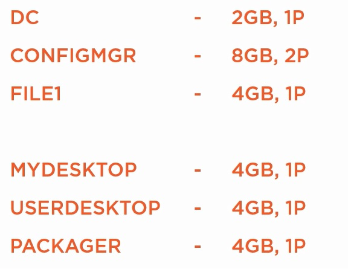

Сетевая часть:
192.168.3.0/24 - Production
xxx - NAT сеть

DC: 192.168.3.100, ConfigMGR: 192.168.3.150; File1: 192.168.3.160
Mydesktop: 192.168.3.99; Userdesktop: dhcp; Packager: dhcp

Internal AD domain: company.pri
External AD domain companydotpri.com
Azure AD domain: companydotpri.onmicrosoft.com

1. Установка 3 VM 2016; 3 VM 10 1803+
   - Сделал 2016Template расклонировал 3 VM, нарезал ip
   - Сделал Win10TemplateLTSB-1607, Win10Template-LTSC, надо сделать template Win8.1
2. firewall: разрешить все
   - GPO с DC: 
```
default Domain Policy
   - Конфигурация компьютера;
    - Политики -> Административные шаблоны -> Сеть -> Сетевые подключения -> Брандмауэр Windows -> Профиль домена -> - Брандмауэр Windows: Защита всех сетевых подключений -> Отключено
```   
Предоставление входа по RDP: GPO для спец OU с серверами

```
1. Computer Config > Windows Settings > Security Settings > Local Policies > User Rights Assignments > Allow logon through Remote Desktop Services
2. Computer Configuration -> Policies -> Administrative Templates -> Windows Components -> Remote Desktop Services -> Remote Desktop Session Host -> Connections -> Allow users to connect remotely by using Remote Desktop Services: Enable
3. ??? не обязательно: Computer Configuration -> Policies -> Administrative Templates -> Windows Components -> Remote Desktop Services -> Remote Desktop Session Host -> Security -> Set Require user authentication for remote connections by using Network Level Authentication: Enable.
```
Почитать позже про настройку RDP по сертификату: https://docs.microsoft.com/en-us/previous-versions/windows/it-pro/windows-server-2012-r2-and-2012/dn781533(v=ws.11)

Также почитать материал по NTP: https://winitpro.ru/index.php/2017/01/06/nastrojka-sinxronizacii-vremeni-po-ntp-s-pomoshhyu-gruppovyx-politik/


3. DC: DNS, DHCP, ADDS
   - Ставим ADDS, затем promotion to DC и настраиваем DNS:
   - level Server 2012 R2
   - pass P@ssw0rd
   - netbios COMPANY
   - REBOOT
   - DHCP
При вводже в домен напаролся на одинаковые SID: Пуск -> Выполнить -> sysprep

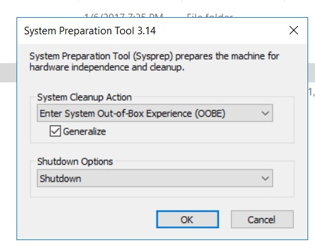

5. ADCS+templates - пункт не по-порядку, но по духу видео ))
   - На DC ставим Authority сервис
   - PostConfigure - настройка роли RootCA

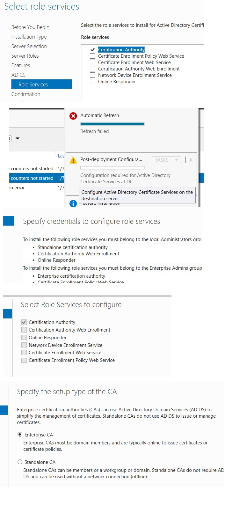

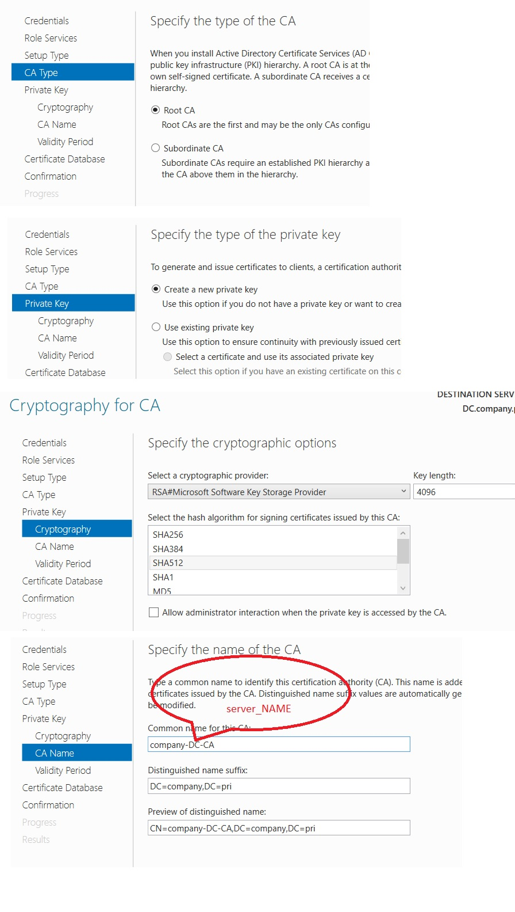

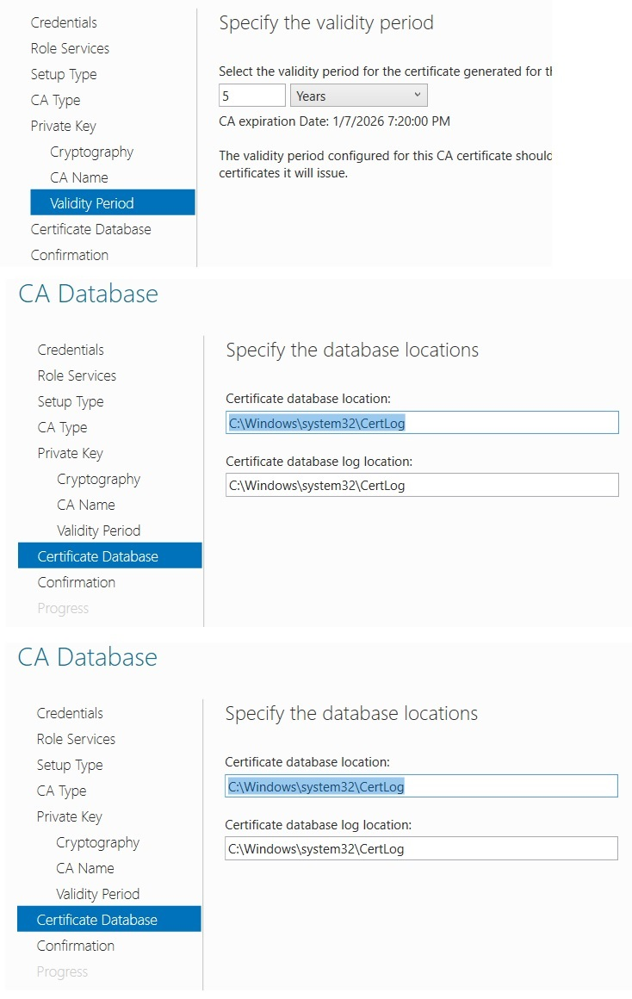
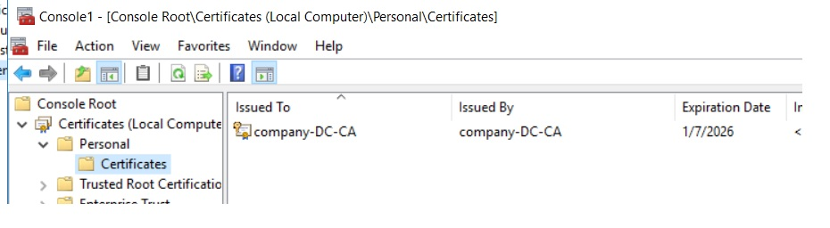

   - Настроить templates (в данном курсе 4 типа templates)
     - WebServer templates: для любого http-ориентировнного сервера с какой-либо установленной ролью SCCM (Management Point; Distribution Point, Software Update Point, State migration Point) - они все используют IIS механизм для передачи информации на другие машины, или клиенты. HTTPS использует аутентификацию. не позволяет выгружать private ключи
     - Web Server with Private Key - для AZURE, как я понял, позволяет выгружатиь private ключи
     - workstation authentication template - автоматически раскатываеvst сертификаты на WS через GPO, также не позволяет выгружать private key
     - workstation authentication with private key template - для выгрузки private key

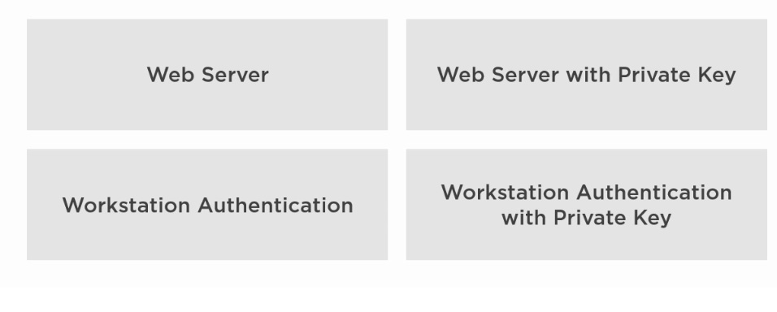

Настройки сертификатов заключаются в следующем:
   - конслоь CA->Manage Templates->ПКМ Manage

2 template, которые нужно продублировать - Duplicate Template

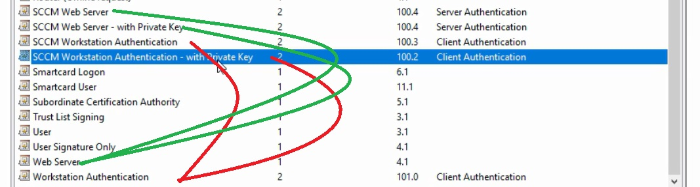

При редактировании всех шаблонов, важно:
   - SubjectName строить из информации AD, например ```DNS Names``` (FQDN)
   - Security: 

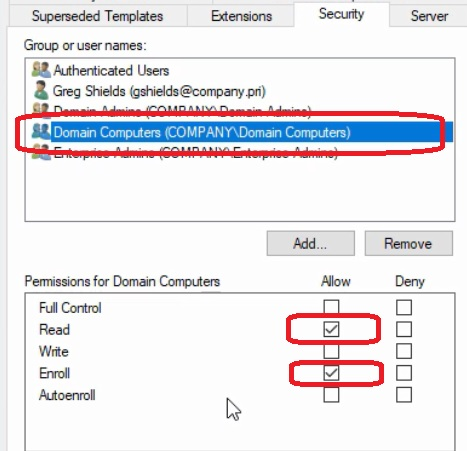

При редактировании шаблонов для экспортируемых ключей, важно:
 
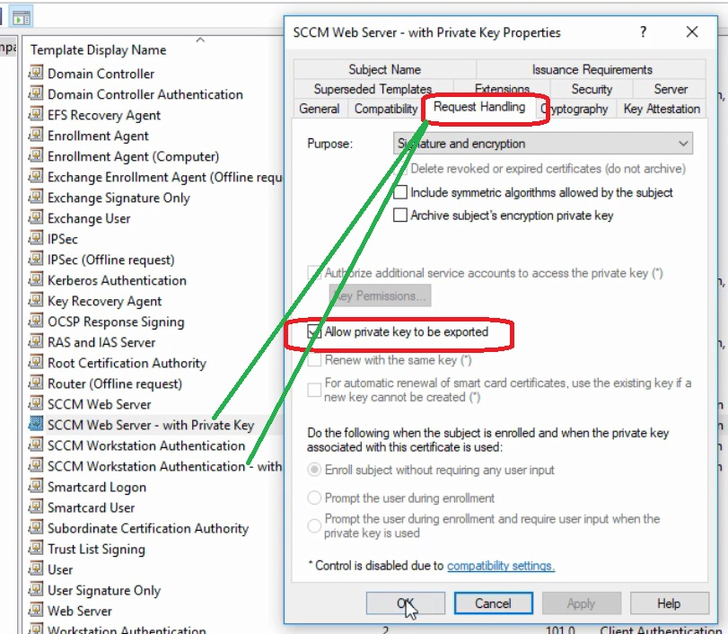 

при редактировании шаблонов для Workstation, важно:

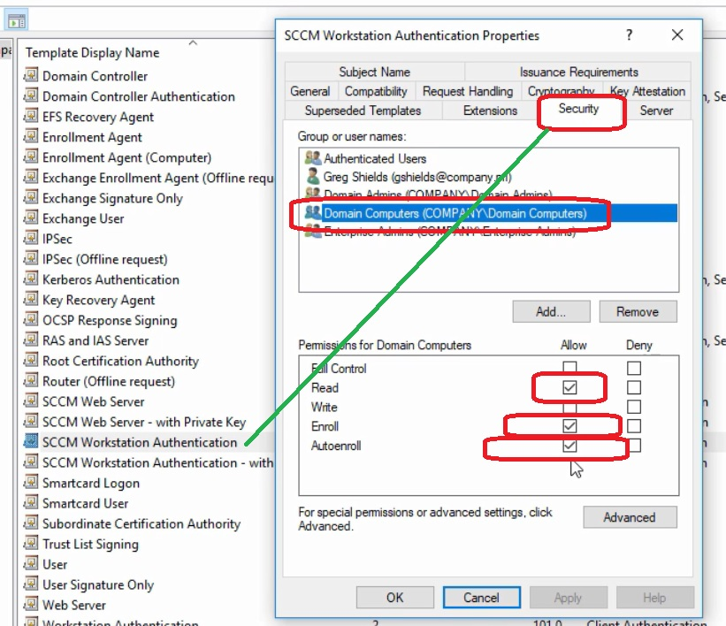 

После настройки templates, делаем их доступными для issue/использования:

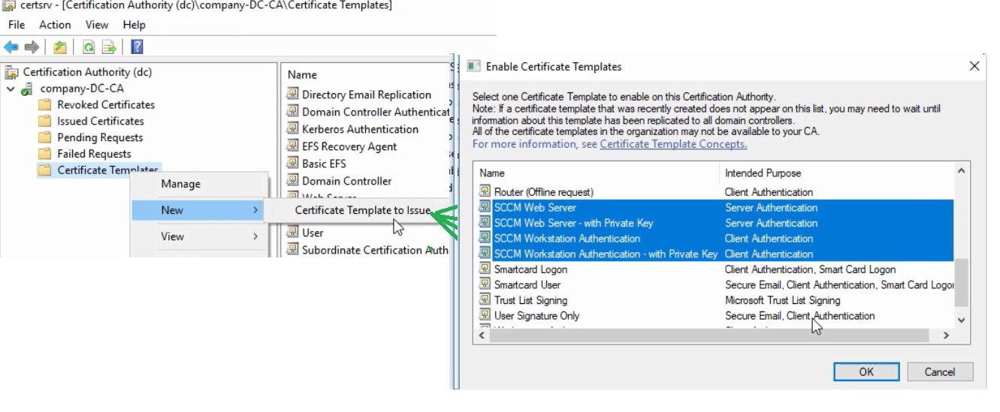 

и...Это еще не все...А видео , мать их, сняли гораздо больше...

Надо на DC запросить новый сертификат для ConfigMGR? так как для серверов autoenrollment - нетути:
   - Active Directory Enrollment policy -> SCCM web Server

Распространение certificate по ПК домена - enrollment. AutoEnrollment делают обычно при помощи policy:
   - Создаем OU для Desktops
   - Создаем OU для Servers
   - Создаем новую GPO, специально для Desktops ```Enroll SCCM Workstation Authentication Certificate: Computer->Policies->Windows->Security->Public Key Policies->"Certificate Services Client - Auto-Enrollment": ``` ___ENABLED___

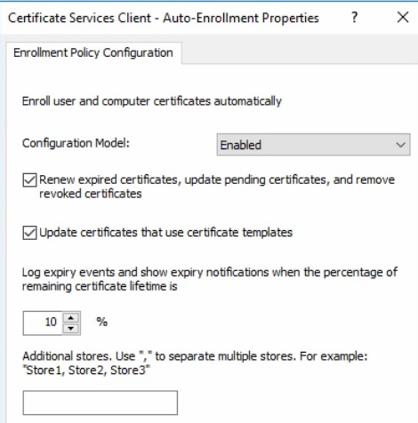   

После перезагрузки - тачки из этого OU автоматически обратятся за сертом, сгенеренным на основании серта из п.п. 5.

Чтобы тачки автоматически попадали в нужный OU - используем команду ```redircmp "OU=01.DESKTOP,dc=company,вс=pri"```
```
   - Redircmp - Перенаправляет контейнер по умолчанию для вновь созданных компьютеров в указанную целевую организационную единицу (OU), чтобы вновь созданные объекты компьютеров создавались в определенной целевой OU, а не в CN=Computers.

   - Redirusr - Перенаправляет контейнер по умолчанию для вновь созданных пользователей в указанную целевую организационную единицу (OU), чтобы вновь созданные пользовательские объекты создавались в определенной целевой OU, а не в CN=Users.
```
Взято отсюда: http://pyatilistnik.org/redircmp-and-redirusr-will-keep-the-default-container-in-ad/
И там же описано как посмотреть какие контейнеры имеют значения по умолчанию...

4. ConfigMGR: SQL server 2016+SRSS; WSUS


