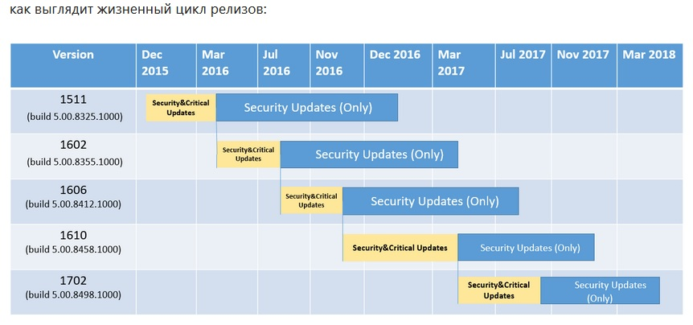
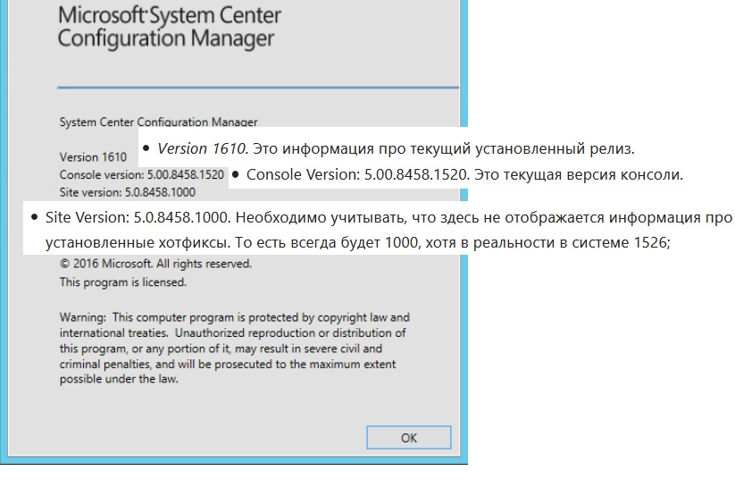
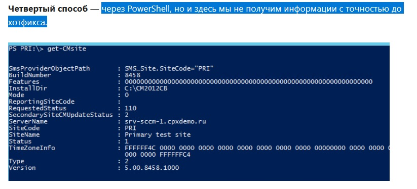
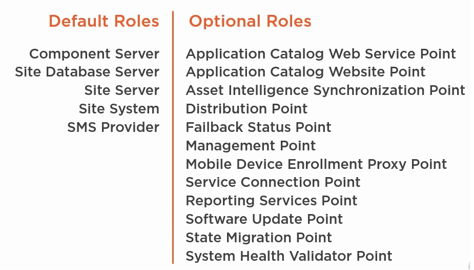
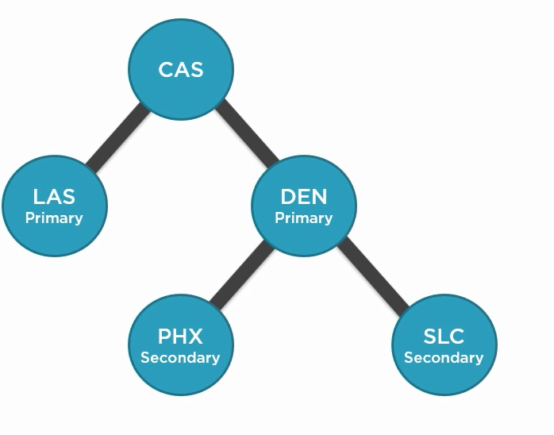

# Install, configure and maintain a Primary Site
названия изобилуют разными буквами: CM2012, SCCM 2012 R2 SP1, SCCM Current Branch, SCCM CB 1702, ConfigMgr 2016: 
- (SMS) вплоть до 2007 года
- В 2007 году выходит SCCM 2007
- В 2012 году System Center 2012 Configuration Manager RTM (build 5.00.7711) (еще их называют SCCM 2012, CM2012 и ConfigMgr 2012)
- В мае 2015 года - две версии SCCM — SCCM 2012 R2 SP1/SCCM 2012 SP2 (R2 требовала доп лицензии при определенных условиях)
- В декабре 2015 выходит SCCM Current Branch 1511 (SCCM CB 1511) - цифры означают год и месяц выхода данного релиза, время поддержки каждого релиза — 12 месяцев. 

Ебнутая ситуация: пока не вышел более новый релиз, будут приходить security&critical обновления. Как только выходит следующий релиз, для SCCM с предыдущим релизом – будут приходить только security обновления. На апрель 2017 вышли следующие релизы: SCCM CB 1602, SCCM CB 1606, SCCM CB 1610, SCCM 1702. 

 

необходимо регулярно знакомится с этим списком (https://docs.microsoft.com/en-us/sccm/core/plan-design/changes/whats-new-incremental-versions), дабы не упустить новых фич.

На 2017 год - две актуальные версии SCCM:
- SCCM 2012 R2 SP1/SCCM SP2. Дата выхода 14.05.2015 и поддерживает только Windows 10 RTM (1507) и Windows 10 1511. Окончание поддержки — 11.07.2017, окончание расширенной поддержки — 12.07.2022.
- SCCM Current Branch. SCCM as Service — продолжение развития SCCM 2012, первая версия вышла в декабре 2015 (SCCM CB 1511). Обновляется несколько раз в год выпуском релизов, каждый релиз поддерживается ровно год. Основная идея — обеспечить поддержки Windows 10 CB и Windows 10 CBB. То есть на данный момент SCCM CB 1511 и SCCM CB 1602 уже не поддерживаются, SCCM CB 1606, SCCM CB 1610, SCCM 1702 — актуальные версии. Начиная с SCCM CB 1606, используется сокращение ConfigMgr 2016.
- Курс демонстрируется уже на версии 1802

 

 

## Design SCCM
### Site System Server
Default roles серверов:
   - ___Component Server___ - компоненты SCCM
   - ___Site Database server___ - необходимо для работы SCCM/ Допускается как раздельная, так и совместная установка Site Server и database server
   - ___Site server___ - участник иенрархии SCCM
   - ___Site system___ - содержит контейнеры
   - ___SMS Provider___ - Что-то про доступ администратора к консоли, к database. Механизм контроллирующий работу SCCM с database.

Optional roles дофига, перечислим основные:
   - ___Distribution point___ - сюда клиенты приходят скачать контент: zip, приложения. Их может быть несколько, даже раскиданных по разным регионам? так как один DP - до 4000 клиентов
   - ___Management Point___ - сюда сваливается вся информация инвентаризации от клиентов (до 25000 на одну MP) и отсюда клиенты скачивают полиси. Очень важно различать контент и полиси, MP - полиси, DP - контент
   - ___Software Update point___ - тут информация WSUS (читать как даблвьюСАС) - до 25000 клиентов
   - ___state migration Point___ - для secondary серверов

   

___ConfigMGR___ - будет primary сервером сайта и тащить на себе все default роли, а кроме этого DP и MP. До 175000 клиентов. SUP - пока не будет ((

С primary сервера мы будем управлять клиентами и делать все операции SCCM. Если есть несколько сайтов, то один сервер будет primary, другие - Secondary и т.д. Secondary - содержат в себе информацию с primary сайта, она реплицируется на secondary (их может быть аж 250 штук). Даже возможна ситуация, когда кто-то из админов поднимет себе второй primary сайт. и тут уже объединить их можно только через CAS - central administration site, который нужен для объединения primary сайтов из различных географических зон

CAS - буквально отдельный primary сайт, со своими ролями/серверами. CAS может поддерживать 25 primary sites.

## Install SCCM Primary Site

Что-то о запрете на переименование серверов с развернутыми ролями, запрет на установку в кластер запрет на установку на CORE сервера. .NET 3.5, 4.5.2, 4.7, 4.7.1

Необходимо установить WinADK

## Configure support for Clients and devices

## Prepare content Distribution

## Prepare OS Deployment

## delegate SCCM Permissions

## Maintain an SCCM Primary Site
