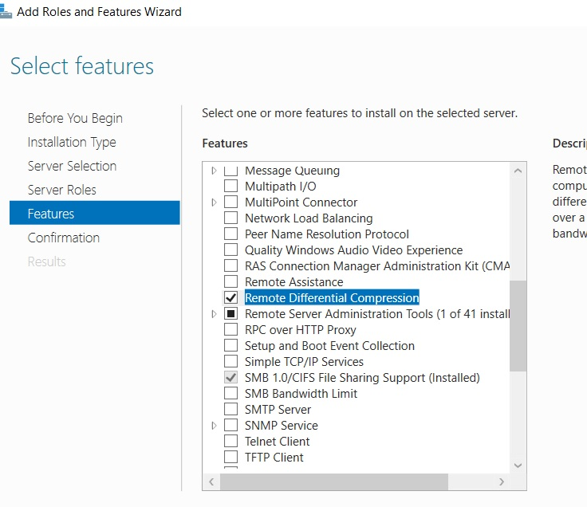
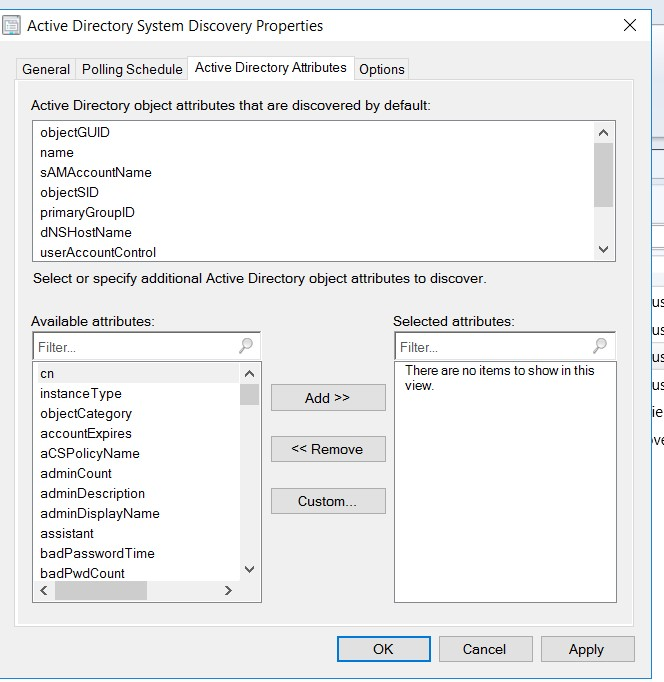
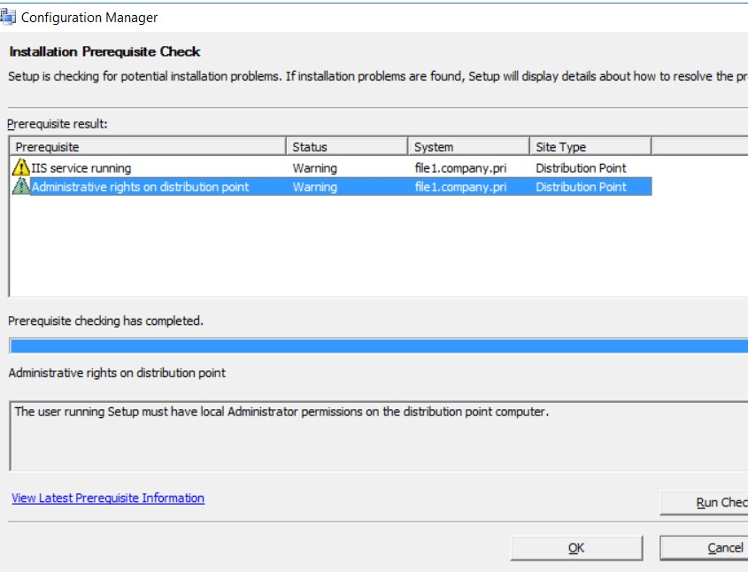

# Install, configure and maintain a Primary Site
названия изобилуют разными буквами: CM2012, SCCM 2012 R2 SP1, SCCM Current Branch, SCCM CB 1702, ConfigMgr 2016: 
- (SMS) вплоть до 2007 года
- В 2007 году выходит SCCM 2007
- В 2012 году System Center 2012 Configuration Manager RTM (build 5.00.7711) (еще их называют SCCM 2012, CM2012 и ConfigMgr 2012)
- В мае 2015 года - две версии SCCM — SCCM 2012 R2 SP1/SCCM 2012 SP2 (R2 требовала доп лицензии при определенных условиях)
- В декабре 2015 выходит SCCM Current Branch 1511 (SCCM CB 1511) - цифры означают год и месяц выхода данного релиза, время поддержки каждого релиза — 12 месяцев. 

Ебнутая ситуация: пока не вышел более новый релиз, будут приходить security&critical обновления. Как только выходит следующий релиз, для SCCM с предыдущим релизом – будут приходить только security обновления. На апрель 2017 вышли следующие релизы: SCCM CB 1602, SCCM CB 1606, SCCM CB 1610, SCCM 1702. 

 
 

необходимо регулярно знакомится с этим списком (https://docs.microsoft.com/en-us/sccm/core/plan-design/changes/whats-new-incremental-versions), дабы не упустить новых фич.

На 2017 год - две актуальные версии SCCM:
- SCCM 2012 R2 SP1/SCCM SP2. Дата выхода 14.05.2015 и поддерживает только Windows 10 RTM (1507) и Windows 10 1511. Окончание поддержки — 11.07.2017, окончание расширенной поддержки — 12.07.2022.
- SCCM Current Branch. SCCM as Service — продолжение развития SCCM 2012, первая версия вышла в декабре 2015 (SCCM CB 1511). Обновляется несколько раз в год выпуском релизов, каждый релиз поддерживается ровно год. Основная идея — обеспечить поддержки Windows 10 CB и Windows 10 CBB. То есть на данный момент SCCM CB 1511 и SCCM CB 1602 уже не поддерживаются, SCCM CB 1606, SCCM CB 1610, SCCM 1702 — актуальные версии. Начиная с SCCM CB 1606, используется сокращение ConfigMgr 2016.
- Курс демонстрируется уже на версии 1802

 

 

## Design SCCM
### Site System Server
Default roles серверов:
   - ___Component Server___ - компоненты SCCM
   - ___Site Database server___ - необходимо для работы SCCM/ Допускается как раздельная, так и совместная установка Site Server и database server
   - ___Site server___ - участник иенрархии SCCM
   - ___Site system___ - содержит контейнеры
   - ___Ssccm 8192der___ - Что-то про доступ администратора к консоли, к database. Механизм контроллирующий работу SCCM с database.

Optional roles дофига, перечислим основные:
   - ___Distribution point___ - сюда клиенты приходят скачать контент: zip, приложения. Их может быть несколько, даже раскиданных по разным регионам? так как один DP - до 4000 клиентов
   - ___Management Point___ - сюда сваливается вся информация инвентаризации от клиентов (до 25000 на одну MP) и отсюда клиенты скачивают полиси. Очень важно различать контент и полиси, MP - полиси, DP - контент
   - ___Software Update point___ - тут информация WSUS (читать как даблвьюСАС) - до 25000 клиентов
   - ___state migration Point___ - для secondary серверов

   

___ConfigMGR___ - будет primary сервером сайта и тащить на себе все default роли, а кроме этого DP и MP. До 175000 клиентов. SUP - пока не будет ((

С primary сервера мы будем управлять клиентами и делать все операции SCCM. Если есть несколько сайтов, то один сервер будет primary, другие - Secondary и т.д. Secondary - содержат в себе информацию с primary сайта, она реплицируется на secondary (их может быть аж 250 штук). Даже возможна ситуация, когда кто-то из админов поднимет себе второй primary сайт. и тут уже объединить их можно только через CAS - central administration site, который нужен для объединения primary сайтов из различных географических зон


CAS - буквально отдельный primary сайт, со своими ролями/серверами. CAS может поддерживать 25 primary sites.

## Install SCCM Primary Site

Что-то о запрете на переименование серверов с развернутыми ролями, запрет на установку в кластер запрет на установку на CORE сервера. .NET 3.5, 4.5.2, 4.7, 4.7.1

Очень сильно обманулся, думая что запустил инсталляху от доменного админа, затем долго разбирался и в итоге дал именное доступ из-под локального админа


Необходимо установить WinADK

Проверка установки: 
```
X:\SMSSETUP\BIN\X64\Precheck.exe /local
```
Ошибки
- Не настроена Scheme AD
- SQL сервер должен быть запущен от доменного аккаунта
- .NET 3.5 - минимум
- Win deployment tool (ADK)
- USMT
- ...
Короче ошибок оно покажет дофига... Пойдем по пути: http://pyatilistnik.org/kak-ustanovit-sccm-system-center-configuration-manager-2012r2-v-windows-server-2012r2-1-chast-podgotovka/

Для .Net - на забываем указывать alternate sorces с примапленного дистриба WIN


Ставим SQL 2014SP2 (что нашел...надо было 2012SP3)

Модернизируем схему в соответствии с файлом, который лежит тут: 
```
X:\SMSSETUP\BIN\X64\ConfigMgr_ad_schema.ldf 
- отредактировал, заменив CN=x CN=company,CN=pri и пересохранив на \\DC\c$\Temp
на DC импортировал файл

C:\Users\Administrator>ldifde -i -f c:\Temp\ConfigMgr_ad_schema.ldf
Connecting to "DC.company.pri"
Logging in as current user using SSPI
Importing directory from file "c:\Temp\ConfigMgr_ad_schema.ldf"
Loading entries.............................................
44 entries modified successfully.

The command has completed successfully

extadsch.exe - скопировал на DC и запустил. Она тоже добавила в схему свою лепту
c:\Temp>extadsch.exe
Microsoft System Center 2012 Configuration Manager v5.00 (Build 7958)
Copyright (C) 2011 Microsoft Corp.

Successfully extended the Active Directory schema.

Please refer to the ConfigMgr documentation for instructions on the manual configuration of access rights in active directory which may still need to be performed.  (Although the AD schema has now be extended, AD must be configured to allow each ConfigMgr Site security rights to publish in each of their domains.)
```
И даже после этого надо добавить вручную через ADSIedit контейнер System->System Management, куда SCCM будет писать данные. А также создать группу ___SCCM - Servers___ и дать full control на этот контейнер и все descendent объекты


Доставляем на primary сервер


 
и настраиваем взаимодействие с SQL:
   - регистрируем юзера SQLSCCMDB
   - даем ему админские права на сервер
   - настраиваем от него сервис SQL 

Также ставлю ADK, причем как оказалось нужен как для 10б так и для 8.1...
Причем выбираем из всего многообразия только 
- Dep tools
- WinPE
- USMT


Возможно потребуется донастроить разрешения на файлы, которые IIS ConfigMGR разрешено отдавать клиентам

Потратил 5 чаксов, чтобы найти файлы сторго SCCM 2012 SP2 и 


Назначаются MP& DP, привязываем их в тестовой среде к HTTP


И наконец...


Как уже было сказано, хранить все роли на сервере - не всегда удобно, также иногда надо поднимать подчиненные/secondary сервера. Настройку secondary сайта можно запустить и с текущего primary


Проверка установки primary сайта:


## Configure support for Clients and devices
### Configure Site Prop ###
   - ___Administration->Site Configuration->Sites___

Тут можно найти версию SCCM, на какой AD сделана публикация, способ взаимодйествия клиента и серверов (HTTP/HTTPS)? администраторов системы (здесь добавлять нельзя), шифрование обмена (для доменов, где не развернуть PKI/CA)

### Explore system role prop ###
   - ___Administration->Site Configuration->Servers and site system Roles___ - Сервера и роли. Роли - смотри вышел. 

___В проде___ картина такая:

      - SCCM-01 - primary site
         - APP cat Web Service Point [WSP]
         - APP cat website point [WebSiteP]
         - Component server
         - Fallback status point [StatP]
         - MGM point (предоставляет клиентам информацию о политиках и расположении контента)
         - Site server
         - Site system (на случай если захотим раздавать обновления группе в интернетж настройки proxy)
         - SUP
      - SCCM-DB-01 - Site system server + Database SQL server
         - Component server
         - Reporting Service Point  [RepServP]
         - Site DB server [SDBS] (количество дней, которое parent/child будут ждать ресинхронизации...бредовая информация какая-то)
         - Site system
      - SCCM-DP-01
         - DP
         - Site system  

___В песочнице___ попроще:

      - ConfMGR
         - Component serv
         - DP
         - MGM point
         - SDBS
         - Site server
         - Site system
В 2016 появилась роль ___ServiceConnection Point___ - для Azure

### Config boundar and boundr group ###
Дело в том, что сайты могут работать с разными подсетями/сайтами (например на случай если компания географически разделена). Эта информация берется из AD.
Сначала задаем Boundaries, затем  Boundary Group и потом прилинковываем Site к определнной location
Boundary  можно задать 4 способами (IP Subnet - предпочтительно)


Привязываем Boundary к Group. Клиенты этих подсетей будут направлены к DP конкретного site, что задается на следующей вкладке, с указанием конкретных серверов данного сайта.


### Config discover method ###
Для Boundary Group задается discovery метод. По-умолчанию в SCCR 2012 SP2 - 6 методов:
   - Network discover - рассматривалась последним пунктом, разрешает:
      - скан по подсетям
      - скан по доменам
      - скан по SNMP
      - DHCP (на основании DHCP выдавшего ip)


   - Heartbit discovery (хранение объектов в БД после обнаружения, в проде - 1 сутки, в лабе - 1 неделя)
   - AD System Dyscovery (настроено в проде, можно организовать поиски в определенном контейнере, но перед этим проверить, чтобы в данной OU не было слишком старых объектов) - вот тут у меня и вылезала ошибка подключения к AD, пока я не добавил именную учетку в админы SCCM и не запустил оснастку в профиле нужного домена. но это все лирика )). Также напоминаем, что если OU к которым была привязка в настройках SCCM, переименуются, то фильтрация превратится в тыкву. Итак, натравить импорт на контейнер


С помощью этой вкладки можно обнаруживать ПК по дополнительным критериям, что поможет избежать ошибки "95% установки агентов, когда часть ПК уже давно не включалась", или поможет сгруппировать ПК по департаментам, версиям ОС



Чтобы задать время опроса AD:


Чтобы избежать импорта старых ПК, можно задать количество суток с последнего входа и обновления пароля - аккуратно с теми пользователями, кто любит уезжать надолго со своими ПК


Ипортируем пользаков домена 


|AD Groups Discovery - позже используем их длля развертывания ПО, и настроек "сервисов самообслуживания развертывания ПО", на основании каталогов

   - AD Forest Discovery (настроено в проде - натравливается на лес)

Принудительно запустить discovery


### Publish site data to AD ###
В процессе развертывания SCCM, мы выполняли развертывание в лесе AD. Просмотреть детали можно в AD:

Сайт:


MP:


### Explore device and user collection ###
Рузальтатом выполнения всех настроек и методов discovery является заполненная ___ASSETS and COMPLIANCE___
- Devices - все устройства
- Users - все пользователи, но часть свойств не импортировалась, их надо задавать через дополнитиельные атрибуты обнаружения
- Device Collections - тут пока ничего не настроено, так как не были настроены дополнительные query

Например, для создания Static (не автоматически обновляемой) группы, которую можно позднее использовать для развертывания ПО, можно использовать следующий алгоритм и задать конкретные DIRECT названия ПК, путем выбора их (```system Resources->Name->%```, затем при нажатии NEXT будут выданы имена всех System/ПК/серверов, которые можно будет впихнуть в эту группу)


## Prepare content Distribution
### Plan for Content distribution and DP role ###
DP [distributio Point] роль - важная роль, самые большие по объему каталоги, отсюда клиенты качают контент. Клиенты автоматически подсасывают наиболее подходящую DP из Boundary Group.
Стратегии развертыванимя DP:
- По географическому признаку
- Использование BranchCache и PeerCache, чтобы клиенты сами могли распространять контент (клиенты ищут тех, у кого уже скачаны обновления и грузят их)
- HTTPS-enable DP? для поддержки клиентов вне периметра
- Pull-DP, на случай     если много сайтов
- Prestage Content, для удаленных сайтов с медленными каналами

### general DP property ###
В проде: 
- allow client to connect anonymously
- boundary group - привязка существующих BoundaryGroups к конкретному DP

В свойствах сайта также есть настройки DP, относящиеся к одновременному количеству закачиваемых пакетов, учетки от которой идет скачка пакетов и т.д.
В проде создана специальная учетка as-sccm-naa. Также если работа ведется на недоменных машинах, этот аккаунт может быть исполльзован для предоставления доступа недоменным тачкам к ресурсу и для установки ПО на недоменной тачке


Настройка Clients необходима для тонкой настройки отправляемых/передаваемых/устанавливаемых пакетов на клиентов/пользователей. Для этього создаются кастомные настройки в разделе Administratrion->ClientSettings:
- Create Custom client Device Settingsd
- Create custom Client User Settings

___Дополнить настройками прода___


### Install New (second) DP and create DP group ###
1. проверка prereq check для удаленного сервера на предмет развертывания DP:
```
prereqcheck /dp file1.company.pri
```


Самое важное - добавить в группу локальных админов нового сервера - учетку primary ПК.  Необходимо доставить IIS

- Administration->Site Config->Servers and site system roles->ПКМ->Create Site System Server
- Имя file1.Company.pri
- Site Code: Den - Denver - привязка к нужному сайту
NEXT->(Proxy - мимо, так как скачиваем не через проксю)->NEXT

- Role = Distribution Point; NEXT
- Install and configure IIS/allow client to connect anonymously; NEXT
- Так как хотим просто создать зеркало, ничего не трогаем; NEXT
- PXE/Multicast/Content Validation - побоку; NEXT
- Boundary - аналогично, для Site-+Boundary-DEN; NEXT

Логи просмотра (c:\program Files\Microsoft configuration Manager\Logs\distrmgr.log) смотрим утилитой: c:\program Files\Microsoft configuration Manager\tools\cmtrace.exe  

Вуаля
На новой DP - прибавилось вкладочек


- Schedule - ограничение времени развертывания, пропускной способности (в проде все по-умолчнию)

#### Create DP Group ####

- Administration->Distribution Point Group->ПКМ->Create New distribution Point Group - Это все нужно чтобы коллекцию машин привязать к DP этой группы, а так как в данной    группе 2 DP, то и скачивать агенты группы смогут с люього сервера


### Distribute and manage content ###
На DP - куча шар, часть из них имеет прямое отношение к DP:

___LEGACY___ шары  для старых агентов/приложение
- SMSPKG<D>$ - на диске D
- SMS_CPS<C>$ - на джиске С

___NEW___ шары для хранения приложений в шифр и сжатом виде:
- SCCM ContentLib$ имеет подпапки:
   - DataLib - метаданные пакета (структура каталогов с ini-ф йлами для каждолго пакета, с указанием где лежат файлы)


   - FileLib - еще одно непонятное хранилище файлов
   - PkgLib - ну и еще одно
- SMSSIG$ - подписи используемые для сжатия данных передаваемых от одной DP к другой
- SMS_DP$ - log- файлы и непонятная хрень, включая временные копии всякой ботвы позже из которой будут производиться пакеты для Content Library


Создадим простое App для развертывания на основе msi (WinZIP)/ Все что нужно - загрузить msi в ContentLibrary


И наконец ```Distribute Content```: распространяем (созданное application) на DP


Задаем DP группу куда выложить контент (distribution Point Group - нужно чтобы коллекцию машин привязать к DP группы)


Распространение контента выполнено, в чем можно убедиться далее.


### Validate distribution status ###
Проверить статус распространения контента по всем DP:


Должно быть 2 точки распространения контента, что-то пошло не так (( с установкой DP на втором сервере/ А именно, я прошляпил добавить новый DP в DP group


просмотреть статус распространения можно нажав "View Status": как видимо кружочек желтый


Да, и только теперь создались на второй DP нужные шары, А КРУЖОЧЕК ПОЗЕЛЕНЕЛ


### Manage network Bandwidth usage ###
### Enable Branche Cache and Peer Cache ###
### Config PXE and multicast for OSD ###


## Prepare OS Deployment

## delegate SCCM Permissions

## Maintain an SCCM Primary Site

##  ##
###  ###

