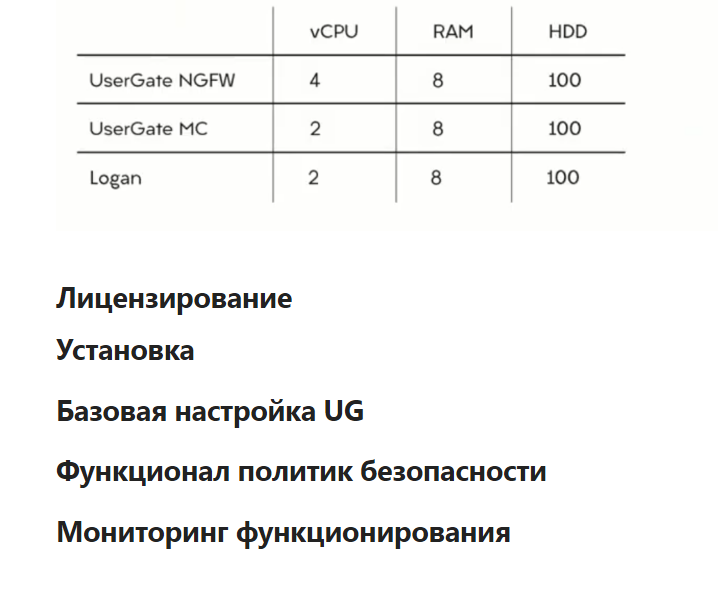

Контакты для вопросов tssolution
ask.university@tssolution.ru
dl@tssolution.ru
# Продукты UG
## NGFW
Универсальный интернет шлюз. Объединяет в себя 
- межсетевой экран
- маршрутизацию
- потоковый антивирус
- систему обнаружения и предотвращения вторжений
- VPN-сервер
- контентная фильтрация
- мониторинг и статистика

## UG Management Center
Единый центр управления администрирования межсетевых экранов

## UG Log analizer
- сбор журналов
- Сбор логов со сторонних устройств
- Уменьшение нагрузки на шлюз
- Автоматизированная отчетность
- Security Operation Center
- Аналитика событий в сети
- Dashboards
- Кастомные отчеты
Внедрение анализатора снижает нагрузку на сами физические и виртуальные хосты UG

## SUMMA
Новая концепция развития  безопасности сети

## Задачи бесплатного курса
- настройка МЭ и прокси
- Публикация ресурсов (DNAT, Reverse Proxy)
- Работа с пользователями
- Фильтрация контента и контроль приложений
- Обнаружение/предотвращение вторжений
- SOAR
- VPN (L2TP, SSL, Site-to-Site)
- Политики с MC (Management center)
- LM/SIEM система

## Стенд бесплатного курса
Хосты:
- UG NGFW
- UG LogAnalizer
- UG Management Center
ПК админа, ПК юзера

# Лицензирование
# Установка

# Базовая настройка UG

# Функционал политик безопасности

# Мониторинг функционирования
