Работа Админа заключается в разграничении доступных ресурсов пользователям и приложениям
# Межсетевой экран
## Зоны
UG работает с зонами
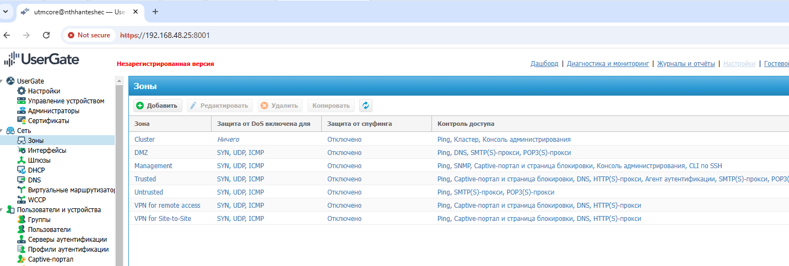
- MGM - Администрирования
- Trusted - LAN
- Untrusted - Internet
- DMZ - Post, WEB
- VPN For remote Access - Доступ удаленным пользователям
- VPN for Site-to-site - VPN для сайтов
Часто объединяют MGM и Trusted, чтобы администраторам было легече админить из локалки UG, для чего меняем:
1. Настройки зоны Trusted
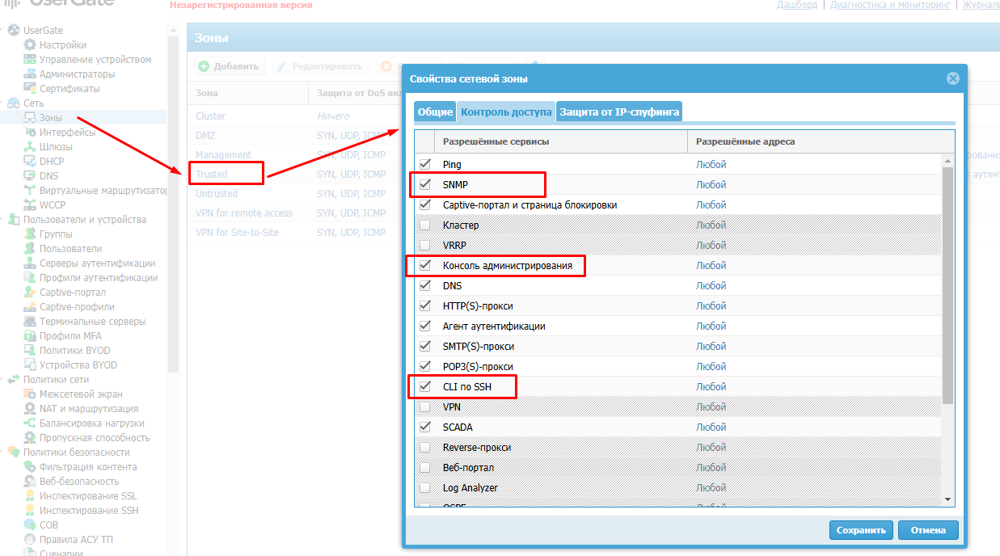
при этом необходимо ограничить доступ к консоли администрирования и CLI SSH. Длается это путем задания ip ПК администратора
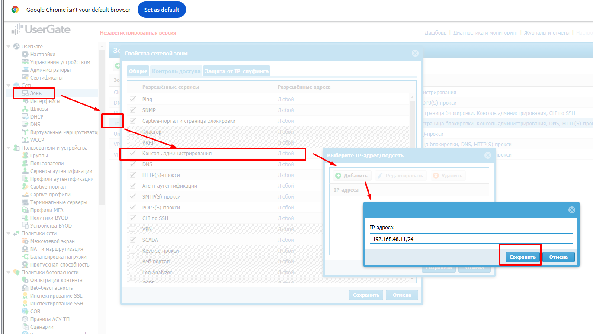
2. свойства порта/IF. Если выбросит из WEB-консоли, то зону нужно будет заново указать в свойствах IF через CLI
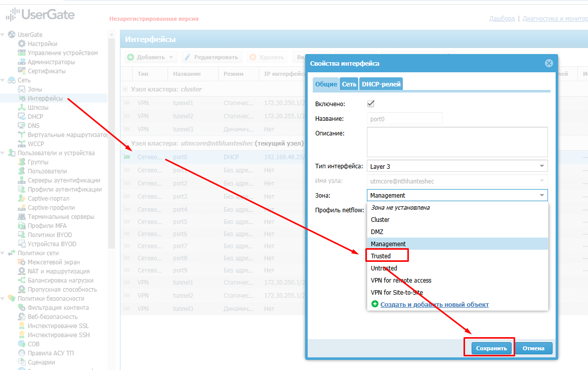

## Межсетевой экран
### Кое-что о политиках и правилах:
Политики сети необходимы чтобы админ разграничивал доступы.
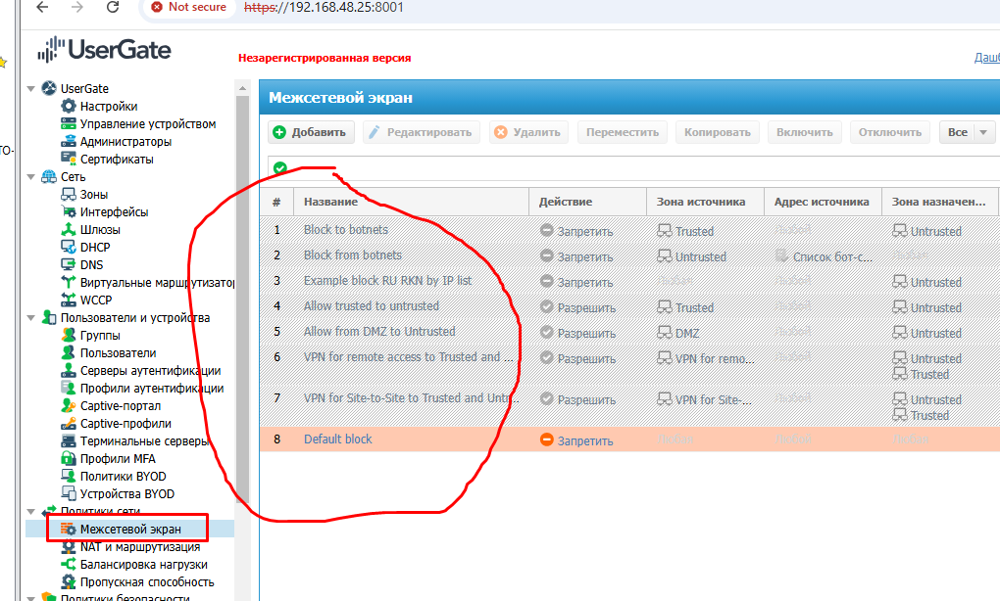
Ряд предустановленных правил. Даже активировав эти правила выйти наружу пока не получится, так как нет трансляции. Делаем терпеливо  базовую настройку испешим к NAT
1. Block-to-Botnet
2. Block-from-Botnet
3. Заблокировано РКН 
4. Allow Trusted-to-untrusted - выход из LAN в WAN 
5. Allow form DMZ-to-Untrusted - выход из DMZ в WAN 
6. VPN for Remote Access to Trusted/Untrusted
7. VPN for Site-To-Site to Trusted/Untrusted
8. Default Block - блокировка всего остального
### Allow Trusted-to-untrusted
#### Активируем это правило, не забывая про журналирование

#### добавим в него нашу LAN
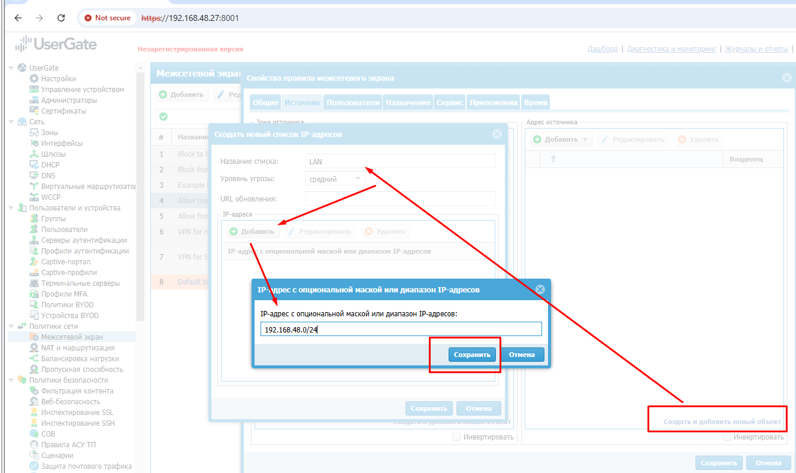
#### Зададим сервисы, доступные пользователям
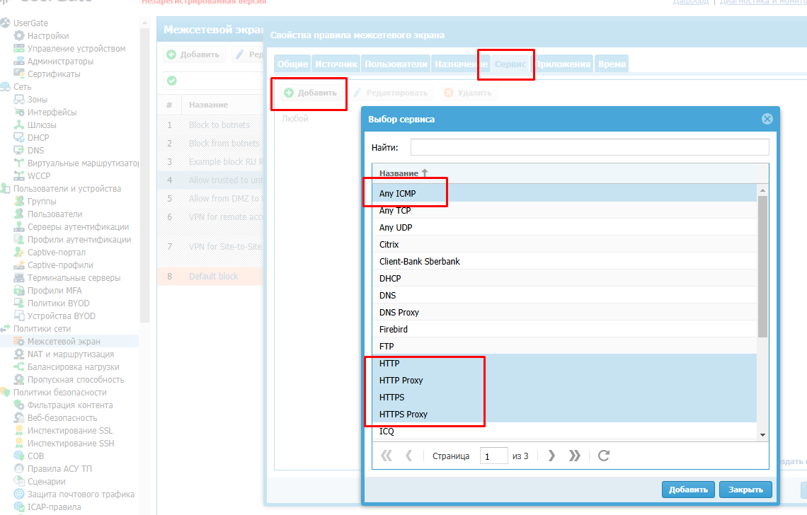
### Поработаем с DMZ
Для того чтобы стали доступны из LAN сервисы в DMZ
#### Переименуем и активируем правило
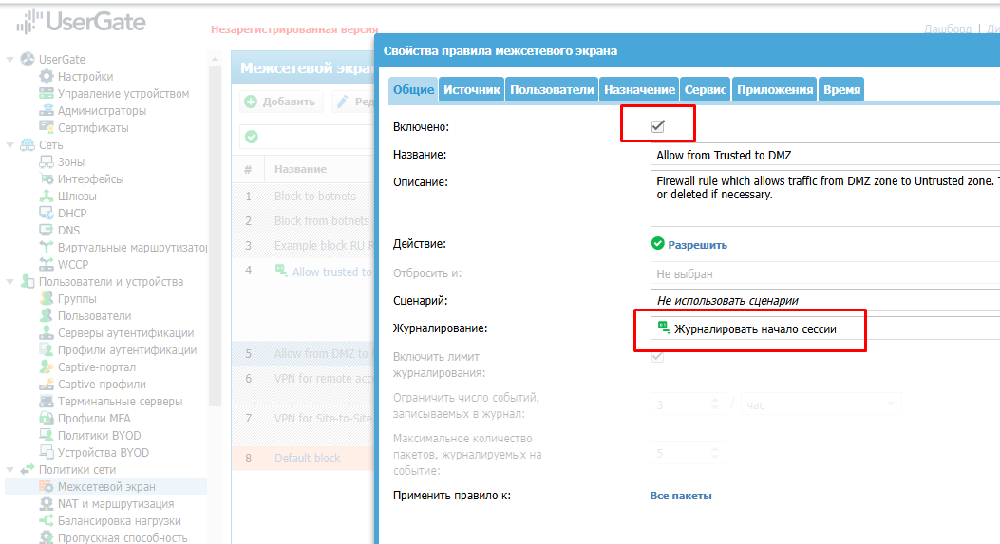
#### Переназначаем Источник и Назначение
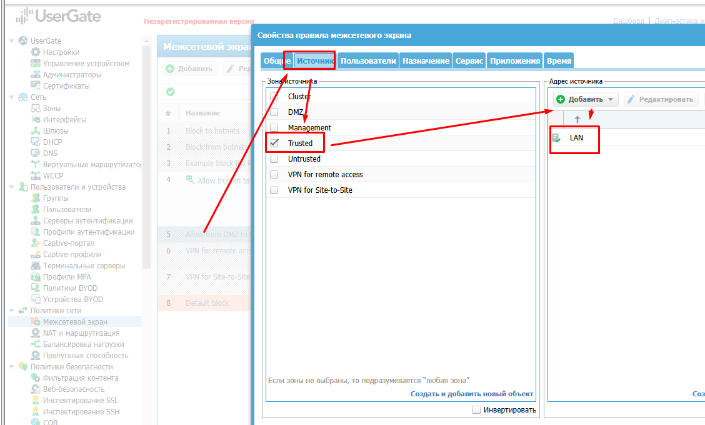
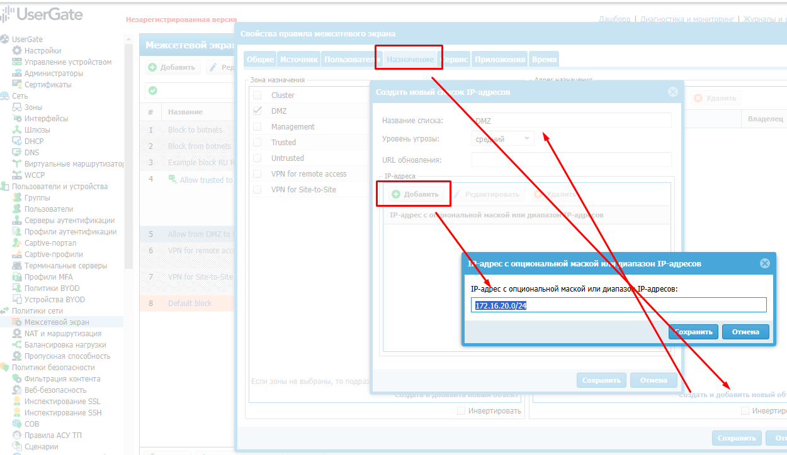
#### Назначаем сервисы
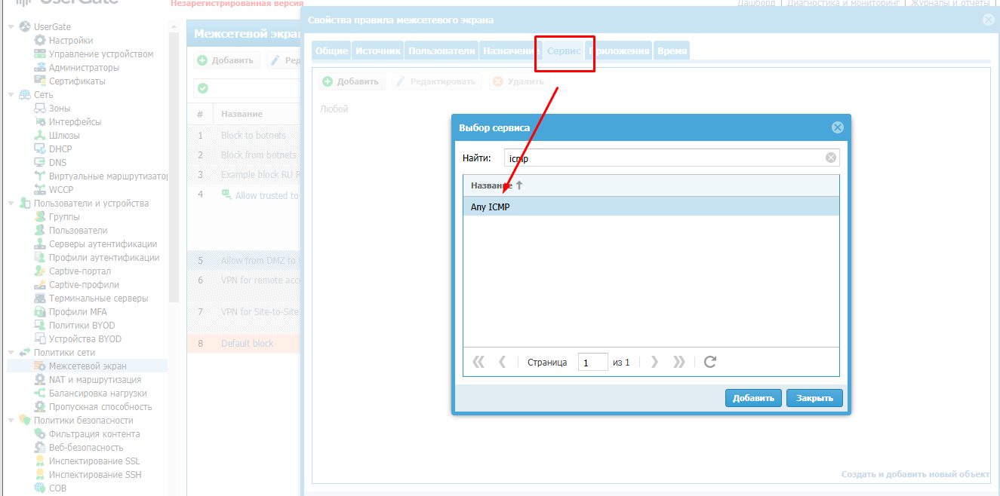
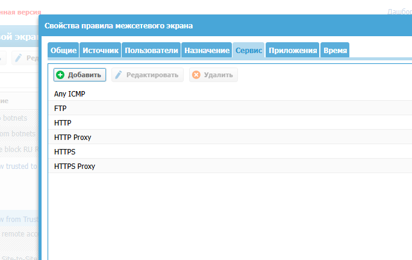

### Разрешим DNS
#### Создадим правило без журналирования, выше Allow trusted to untrusted
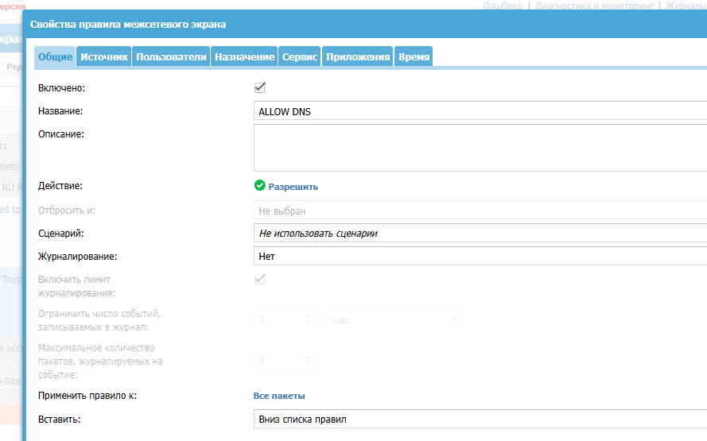
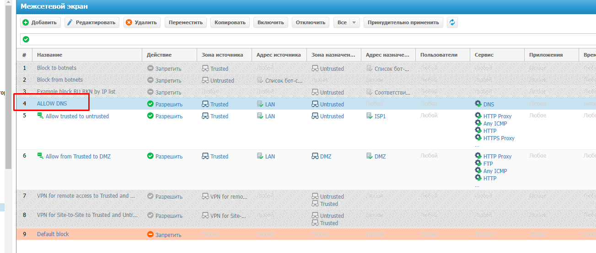
#### Зададим правильно SRC/DST
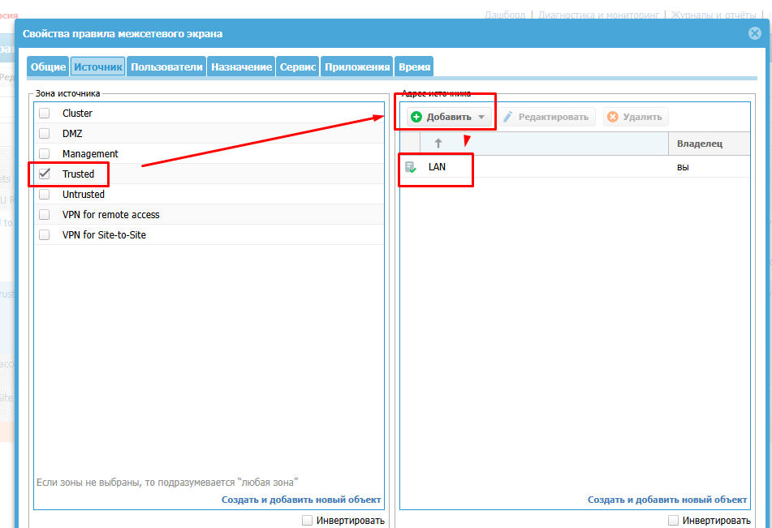
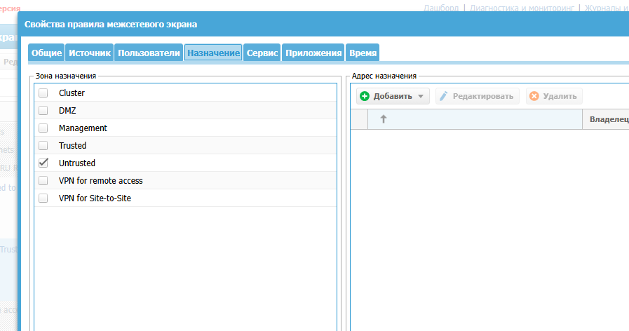
#### Сервис DNS
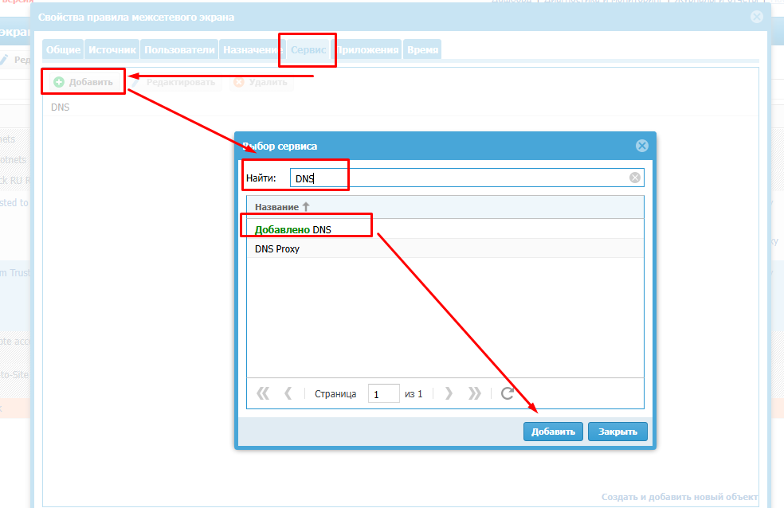
# NAT и маршрутизация
## Включение NAT 
Чтобы начал бегать трафик наружу с преднастроенными правилами - надо включить 1 правило
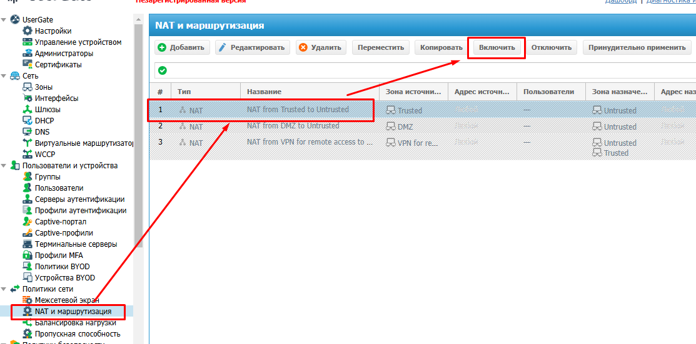

# Балансировка нагрузки

# Пропускная способность