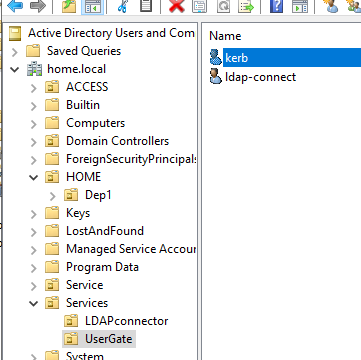
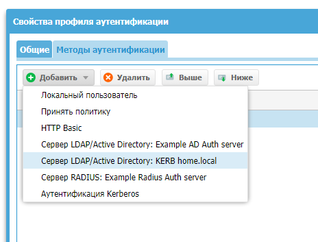
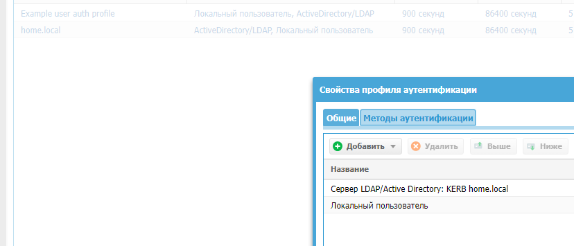
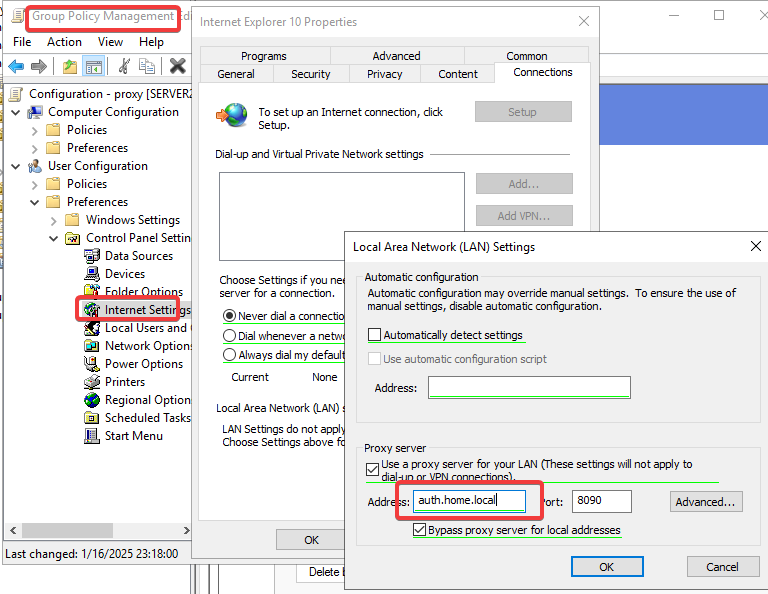

# Идентификация с точки зрения UG
## Способы авторизации в UG
### УЗ должна быть идентифицирована
Идентификация возможна посредством :
- ip - явное задание
- MAC
- логин/пароль - для УЗ через CAPTIVE-портал, который данные авторизации будет брать с:
	- AD
	- Radius
	- TACACS+
	- NTLM
	- Kerbers
	- локальные УЗ
- пользователей Терминального сервера Microsoft - нужен специальный агент терминального сервиса
- пользователя с установленным агентом авторизации (для Windows)
- пользователей при помощи протокола NTLM/Kerberos
Для создания локального пользователя нужно задать его имя, но чтобы идентифицировать его, необходимо указать:  
- **Логин и пароль** — для идентификации по имени и паролю. В этом случае потребуется настроить Captive-портал, где пользователь сможет ввести данное имя и пароль для авторизации.  
- **IP-адрес или диапазон**, MAC-адрес для идентификации с помощью комбинации MAC и IP-адресов. В данном случае необходимо обеспечить, чтобы данный пользователь всегда получал доступ в сеть с указанных MAC и/или IP-адреса.  
- **VLAN ID** для идентификации пользователя по тегу VLAN. В данном случае необходимо обеспечить, чтобы данный пользователь всегда получал доступ в сеть с указанного VLAN.
Если у пользователя указан и логин, и пароль, и IP/MAC/VLAN адреса, система использует идентификацию по адресу, то есть **идентификация по ip-адресу является более приоритетной**.

Ниже будут представлены практические примеры на частные случаи
### Сервера Аутентификации
"Серверы аутентификации" - это внешние источники учетных записей пользователей(сервера аутентификации), например, LDAP-сервер, или серверы, производящие аутентификацию для UserGate, например, Radius, TACACS+, Kerberos, SAML. Система поддерживает следующие типы серверов аутентификации:


### Авторизация Логин/пароль AD
UG оперирует следующими пользователями:
- **Пользователь Unknown** — множество пользователей, не идентифицированных системой; 
- **Пользователь Known** — множество пользователей, идентифицированных системой;  
- **Пользователь Any** — любой пользователь (объединение множеств пользователей Known и Unknown);  
- **Определенный пользователь** — пользователь, определенный и идентифицированный в системе.
Пока ничего не настроено, все Unknown. 
В первом приближении настройки ведутся чтобы пользователь авторизовался для получения доступа к интернер через Captive портал. Сaptive-портал позволяет авторизовать неизвестных пользователей (Unknown users), которые не были идентифицированы с помощью агентов терминальных серверов, агентов авторизации для Windows или заданы с явным указанием IP-адреса. Кроме этого, с помощью Captive-портала можно настроить самостоятельную регистрацию пользователей с подтверждением идентификации через SMS или e-mail. 
После настроек kerberos/RADIUS и т.п., этот способ доступа будет не актуальным. 
#### Задание сервера аутентификации для авторизации в AD
LDAP-коннектор позволяет:
- Получать информацию о пользователях и группах Active Directory или других LDAP-серверов. Поддерживается работа с LDAP-сервером FreeIPA. Пользователи и группы могут быть использованы при настройке правил фильтрации.
- Осуществлять аутентификацию пользователей через домены Active Directory/FreeIPA с использованием методов аутентификации Captive-портал, Kerberos, NTLM.


#### Задание пользователя коннектора LDAP
Заработало так: ldap-connect@home.local

#### Задание имени домена

Не забываем что для развертывания имени необходимо добавить правильный DNS-сервер

А на самом сервере зарегистрировать A-записи с указанием на страницы запроса авторизации.
Взято из инструкции (https://support.usergate.com/node/24220)


Проверим что пока не работает ))

Это происходит по причине отсутствия keytab файла. Этот файл необходим, если: 
- Необходимо чтобы пользователи входили без указания логина/пароля
- Через коннектор подключается больше 1000 УЗ
Если небольшое число пользователей, то этого не требуется

#### Задание профиля аутентификации
Профиль определяет куда будет отправляться запрос АУтентификации пользователя.
Мы хотим чтобы запрос на авторизацию отправлялся:
1. Локально
2. Ранее созданный объект "Сервер аутентификации"


Таким образом УЗ будут использоваться либо доменные, либо локальные

#### Задание Captive-профиля
Необходимо для задания страницы авторизации, как при авторизации на хотспоте WIFI. В данном уроке пока ОБЯЗАТЕЛЬНО следим чтобы лишних галочек не стояло, так как если у нас не настроены сертификаты, и мы поставим авторизацию https, то у нас ничего работать не будет.
В профиле связываются шаблон страницы авторизации и профиль аутентификации


Можно задать запрос/отображение Домена в портале входа:

#### Настройка Captive-портала
Настраиваются правила, нужные для аутентификации УЗ. При настройке указываем: 
- "Записывать в журнал правил"


- Зону источник, откуда ожидаем запросы на авторизацию
В данном случае из других зон авторазацию мы не ожидаем.

#### Проверка
Без правильной настройки сертификатов - проверка возможна только для http://, например для http://cbr.ru
Будет отображен запрос на имя/пароль пользователя

### Авторизация Логин/пароль для локальных УЗ
#### Создание локальной УЗ

#### Привязка УЗ к IP/MAC


#### Задание профиля аутентификации 
(см. ранее)
#### Проверка
Пока возможна только для http://, например для http://cbr.ru
### Авторизация при помощи агента
[Ознакомиться с мануалом своей версии. ](https://docs.usergate.com/ustanovka-i-nastrojka-agenta-terminal6nogo-servera-usergate_20.html)

Это необходимо когда пользователей задолбает каждый раз вводить логин/пароль в captive портал, или для терминальных серверов, поскольку множество пользователей работают с одного ip адреса. Агент терминального сервиса должен быть установлен на все терминальные серверы, пользователей которых необходимо идентифицировать. Агент представляет собой сервис, который передает на сервер UserGate информацию о пользователях терминального сервера и об их сетевых соединениях. 
#### Настройка зоны
Необходимо чтобы был активен сервис "Агент авторизации"


#### Задание пароля агента
Отличается от версии к версии. Смотреть точно в мануале: 
- **Для версий UserGate 6.1.4 и ниже**: для конфигурации пароля агентов перейдите в раздел **Пользователи и устройства ➜ Терминальные серверы**. В данном разделе будут отображаться все подключенные агенты терминальных серверов. Также в данном разделе можно управлять подключениями агентов. Чтобы задать пароль для подключения агентов, нажмите на кнопку **Настройки** и установите пароль.
- **Для версий UserGate 6.1.5 и выше**: перейдите в раздел **UserGate ➜ Настройки ➜ Модули** и в поле **Пароль агентов терминального сервиса** укажите пароль агентов.
Этот пароль пользователи будут вводить при аутентификации


#### Скачивание и установка агента
Файлы дистрибутива агента терминального сервера UserGate доступны в личном кабинете клиента UserGate по адресу [https://my.usergate.com](https://my.usergate.com/), в разделе **Все загрузки**. Такого раздела не нашел, скачал подходящую версию для 6,1,9

Агент ставиться через msi либо вручную, либо GPO. Доступны файлы admx GPO.
Также необходимо внести настройки в реестр, связанные с UG


После этого отключаем Captive-портал и перезагружаем сервер


В логах журнала трафика появились данные с авторизацией пользователя
#### Скачивание и установка агента терминального сервера
Файлы дистрибутива агента терминального сервера UserGate доступны в личном кабинете клиента UserGate по адресу [https://my.usergate.com](https://my.usergate.com/), в разделе **Все загрузки**. Такого раздела не нашел, скачал подходящую версию для 6,1,9

Программное обеспечение устанавливается в каталог вручную
```
“%ALLUSERSPROFILE%\Entensys\Terminal Server Agent”.
или 
C:\ProgramData\Entensys\TerminalServerAgent\
```


### Авторизация без пароля, kerberos, NTLM

https://support.usergate.com/node/21255

https://docs.usergate.com/37/#pol6zovateli-i-gruppy

Если браузер осуществляет запрос по https, но на NGFW дешифрование не настроено, то NGFW не в состоянии вмешаться в трафик и вставить туда требование авторизоваться по Kerberos. Для того, чтобы была возможность это сделать, в NGFW по умолчанию идёт правило Decrypt all for unknown users, которое включает дешифрование трафика для не авторизованных подключений.
 
#### Kerberos
https://support.usergate.com/ru/kb/version/6x/usergate-6/46-avtorizaciya-s-pomoshchyu-kerberos
##### Создать DNS-записи
Необходимо создавать **записи типа A**, не создавайте записи типа CNAME. В качестве IP-адреса необходимо указать IP-адрес интерфейса UserGate, подключенного в зону **Trusted**.
- для сервера UserGate. 
- для узлов блокировки, авторизации

##### Проверить УЗ обращения к AD


##### Keytab-файл
Пользователь для Kerberos и пользователь для LDAP-коннектора должны отличаться. Не используйте одну и ту же учетную запись.

Запустить командную строку от имени администратора и выполнить следующую команду, с указанием корректной УЗ и домена

```
ktpass.exe /princ HTTP/auth.home.local@HOME.LOCAL /mapuser kerb@HOME.LOCAL /crypto ALL /ptype KRB5_NT_PRINCIPAL /pass * /out C:\utm.keytab
```
В данном примере:
- auth.test.local - DNS - запись, созданная для сервера UserGate выше.    
- HOME.LOCAL - Kerberos realm domain, обязательно большими буквами.    
- kerb@HOME.LOCAL - имя пользователя в домене (созданное ранее ), имя realm-домена обязательно большими буквами.

После отработки процедуры создания keytab файла **Имя входа пользователя** (**Userlogon name**) изменилось (можно проверить в свойствах пользователя **kerb** во вкладке **Учётная запись**).


##### Донастройка UG
- **Сеть --> DNS --> Системные DNS-серверы** - Проверка валидности DNS 
- **UserGate --> Настройки --> Настройка времени сервера** - Проверка NTP
- **UserGate --> Настройки --> Модули** - проверка что на DNS верные А-записи
- **Пользователи и устройства --> Серверы авторизации** - проверить LDAP - коннектор для получения информации о пользователях и группах Active Directory и загрузить keytab - файл.


- **Проверить соединение**

- **Пользователи и устройства --> Профили авторизации** - добавляем kerberos настроенного домена


- **Пользователи и устройства --> Captive-профили** - проверяем


- **Пользователи и устройства --> Captive-портал**. - проверяем
- **Сеть -->** **Зоны** на вкладке **Контроль доступа** разрешите доступ к сервису **HTTP(S)-прокси** для зоны Trusted: к ней подключены пользователи домена, использующие авторизацию Kerberos.


##### настройки на компьютере пользователя 
- проверяем что сертификат CA, который выпускал сертификат UG - в доверенных
- Настройка GPO отвечавшей за PROXY



### Возня с сертификатами
https://docs.usergate.com/upravlenie-sertifikatami_90.html
Необходимо минимум 3 сертификата
- WEB GUI (для работы с порталом администрирования UG)
- auth.home.local (для правильной работы CAPTIVE-портала по SSL)
- CA (для правильной работы SSL инспектирования) - выгрузил сертификат контроллера домена с закрытой частью и паролем

Эти процедуры, влияют на прохождение https трафика, поэтому с локальными сертификатами каши не сваришь, пришлось работать с CA домена
1. Создание нового сертификата через CSR (для WebGUI и auth.home.local)

2. CSR запрос регистрируем на [CA - портале запроса сертификатов](http://localhost/certsrv/Default.asp)
3. Скачиваем полученный сертификат в формате DER
4. Привязка сертификата к порталу


 5. Экспорт сертификата контроллера домена для SSL фильтрации.
 
 
 


6. Импорт pfx с закрытой частью

7. Редактирование импортированного сертификата СА для SSL инспектирования
