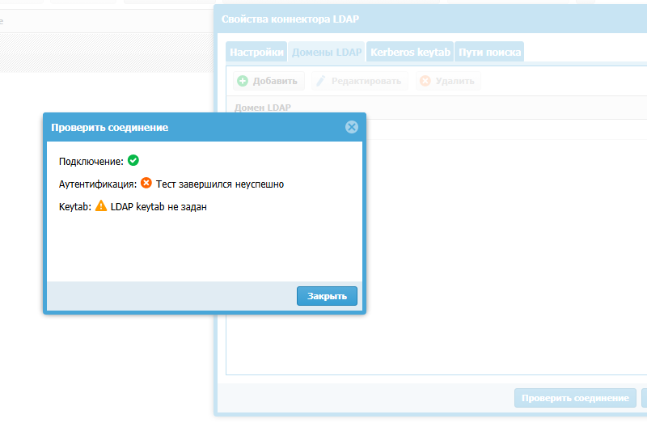

# Идентификация с точки зрения UG
## Способы авторизации в UG
### УЗ должна быть связана с:
- ip
- MAC
- логин/пароль
- агента Терминального сервера
- агента авторизации
- протокола NTLM/Kerberos

Ниже будут представлены практические примеры

### Сервера Аутентификации
Могут быть

### Авторизация Логин/пароль AD
#### Задание сервера авторизации AD

#### Задание пользователя коннектора LDAP

#### Задание имени домена

Не забываем что для развертывания имени необходимо добавить правильный DNS-сервер

А на самом сервере зарегистрировать A-записи с указанием на страницы запроса авторизации
Взято из инструкции (https://support.usergate.com/node/24220)

Проверим что пока не работает ))

Это происходит по причине отсутствия keytab файла. Этот файл необходим, если: 
- Необходимо чтобы пользователи входили без указания логина/пароля
- Через коннектор подключается больше 1000 УЗ
Если небольшое число пользователей, то этого не требуется

#### Задание профиля аутентификации
Профиль определяет будет отправляться запрос АУтентификации пользователя.
Мы хотим чтобы запрос на авторизацию отправлялся:
1. Локально
2. Ранее созданный объект "Сервер аутентификации"

Таким образом УЗ будут использоваться либо доменные, либо локальные

#### Задание Captive-профиля
Необходимо для задания страницы авторизации, как при авторизации на хотспоте WIFI.
В профиле связываются шаблон страницы авторизации и профиль аутентификации

#### Настройка Captive-портала
Настраиваются правила, нужные для аутентификации УЗ. При настройке указываем: 
- "Записывать в журнал правил"

- Зону источник, откуда ожидаем запросы на авторизацию
В данном случае из других зон авторазацию мы не ожидаем.

### Авторизация Логин/пароль для локальных УЗ
#### Создание локальной УЗ

#### Привязка УЗ к IP/MAC

#### Задание профиля авторизации 
(см. ранее)

### Авторизация при помощи агента

### Авторизация без пароля, kerberos

https://support.usergate.com/node/21255
