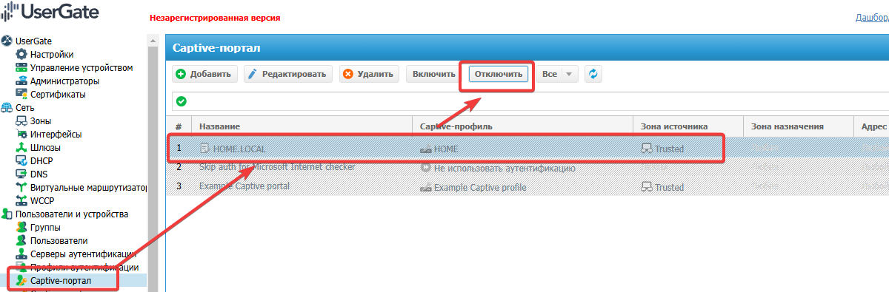
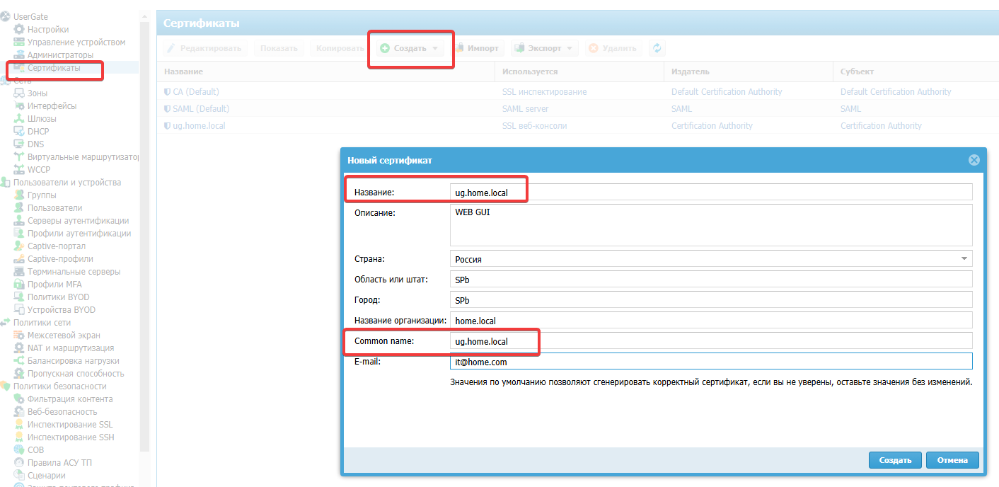

# Идентификация с точки зрения UG
## Способы авторизации в UG
### УЗ должна быть связана с:
- ip
- MAC
- логин/пароль
- агента Терминального сервера
- агента авторизации
- протокола NTLM/Kerberos
Для создания локального пользователя нужно задать его имя, но чтобы идентифицировать его, необходимо указать:  
- **Логин и пароль** — для идентификации по имени и паролю. В этом случае потребуется настроить Captive-портал, где пользователь сможет ввести данное имя и пароль для авторизации.  
- **IP-адрес или диапазон**, MAC-адрес для идентификации с помощью комбинации MAC и IP-адресов. В данном случае необходимо обеспечить, чтобы данный пользователь всегда получал доступ в сеть с указанных MAC и/или IP-адреса.  
- **VLAN ID** для идентификации пользователя по тегу VLAN. В данном случае необходимо обеспечить, чтобы данный пользователь всегда получал доступ в сеть с указанного VLAN.
Если у пользователя указан и логин, и пароль, и IP/MAC/VLAN адреса, система использует идентификацию по адресу, то есть **идентификация по ip-адресу является более приоритетной**.

Ниже будут представлены практические примеры на частные случаи
### Сервера Аутентификации
Могут быть


### Авторизация Логин/пароль AD
UG оперирует следующими пользователями:
- **Пользователь Unknown** — множество пользователей, не идентифицированных системой;    
- **Пользователь Known** — множество пользователей, идентифицированных системой;  
- **Пользователь Any** — любой пользователь (объединение множеств пользователей Known и Unknown);  
- **Определенный пользователь** — пользователь, определенный и идентифицированный в системе.
Пока ничего не настроено, все Unknown. 
В первом приближении настройки ведутся чтобы пользователь авторизовался для получения доступа к интернер через Captive портал. Сaptive-портал позволяет авторизовать неизвестных пользователей (Unknown users), которые не были идентифицированы с помощью агентов терминальных серверов, агентов авторизации для Windows или заданы с явным указанием IP-адреса. Кроме этого, с помощью Captive-портала можно настроить самостоятельную регистрацию пользователей с подтверждением идентификации через SMS или e-mail. 
После настроек kerberos/RADIUS и т.п., этот способ доступа будет не актуальным. 
#### Задание сервера авторизации AD

#### Задание пользователя коннектора LDAP
Заработало так: ldap-connect@home.local

#### Задание имени домена

Не забываем что для развертывания имени необходимо добавить правильный DNS-сервер

А на самом сервере зарегистрировать A-записи с указанием на страницы запроса авторизации.
Взято из инструкции (https://support.usergate.com/node/24220)


Проверим что пока не работает ))

Это происходит по причине отсутствия keytab файла. Этот файл необходим, если: 
- Необходимо чтобы пользователи входили без указания логина/пароля
- Через коннектор подключается больше 1000 УЗ
Если небольшое число пользователей, то этого не требуется

#### Задание профиля аутентификации
Профиль определяет куда будет отправляться запрос АУтентификации пользователя.
Мы хотим чтобы запрос на авторизацию отправлялся:
1. Локально
2. Ранее созданный объект "Сервер аутентификации"


Таким образом УЗ будут использоваться либо доменные, либо локальные

#### Задание Captive-профиля
Необходимо для задания страницы авторизации, как при авторизации на хотспоте WIFI. В данном уроке пока ОБЯЗАТЕЛЬНО следим чтобы лишних галочек не стояло.
В профиле связываются шаблон страницы авторизации и профиль аутентификации


Можно задать запрос/отображение Домена в портале входа:

#### Настройка Captive-портала
Настраиваются правила, нужные для аутентификации УЗ. При настройке указываем: 
- "Записывать в журнал правил"


- Зону источник, откуда ожидаем запросы на авторизацию
В данном случае из других зон авторазацию мы не ожидаем.

#### Проверка
Пока возможна только для http://, например для http://cbr.ru
Будет отображен запрос на имя/пароль пользователя

### Авторизация Логин/пароль для локальных УЗ
#### Создание локальной УЗ

#### Привязка УЗ к IP/MAC


#### Задание профиля аутентификации 
(см. ранее)
#### Проверка
Пока возможна только для http://, например для http://cbr.ru
### Авторизация при помощи агента
[Ознакомиться с мануалом своей версии. ](https://docs.usergate.com/ustanovka-i-nastrojka-agenta-terminal6nogo-servera-usergate_20.html)

Это необходимо когда пользователей задолбает каждый раз вводить логин/пароль в captive портал, или для терминальных серверов, поскольку множество пользователей работают с одного ip адреса. Агент терминального сервиса должен быть установлен на все терминальные серверы, пользователей которых необходимо идентифицировать. Агент представляет собой сервис, который передает на сервер UserGate информацию о пользователях терминального сервера и об их сетевых соединениях. 
#### Настройка зоны
Необходимо чтобы был активет сервис "Агент авторизации"


#### Задание пароля агента
Отличается от версии к версии. Смотреть точно в мануале: 
- **Для версий UserGate 6.1.4 и ниже**: для конфигурации пароля агентов перейдите в раздел **Пользователи и устройства ➜ Терминальные серверы**. В данном разделе будут отображаться все подключенные агенты терминальных серверов. Также в данном разделе можно управлять подключениями агентов. Чтобы задать пароль для подключения агентов, нажмите на кнопку **Настройки** и установите пароль.
- **Для версий UserGate 6.1.5 и выше**: перейдите в раздел **UserGate ➜ Настройки ➜ Модули** и в поле **Пароль агентов терминального сервиса** укажите пароль агентов.
Этот пароль пользователи будут вводить при аутентификации


#### Скачивание и установка агента
Файлы дистрибутива агента терминального сервера UserGate доступны в личном кабинете клиента UserGate по адресу [https://my.usergate.com](https://my.usergate.com/), в разделе **Все загрузки**. Такого раздела не нашел, скачал подходящую версию для 6,1,9

Агент ставиться через msi либо вручную, либо GPO. Доступны файлы admx GPO.
Также необходимо внести настройки в реестр, связанные с UG


После этого отключаем Captive-портал и перезагружаем сервер


В логах журнала трафика появились данные с авторизацией пользователя
#### Скачивание и установка агента терминального сервера
Файлы дистрибутива агента терминального сервера UserGate доступны в личном кабинете клиента UserGate по адресу [https://my.usergate.com](https://my.usergate.com/), в разделе **Все загрузки**. Такого раздела не нашел, скачал подходящую версию для 6,1,9

Программное обеспечение устанавливается в каталог вручную
```
“%ALLUSERSPROFILE%\Entensys\Terminal Server Agent”.
или 
C:\ProgramData\Entensys\TerminalServerAgent\
```


### Авторизация без пароля, kerberos

https://support.usergate.com/node/21255


### Возня с сертификатом
Пока не получилось уверенно делать эти процедуры, но они влияют на прохождение https трафика.
1. Создание нового

2. Привязка к порталу

3. Проверка и экспорт

При просмотре видно, что сертификат просит чтобы с ним сделали

4.  