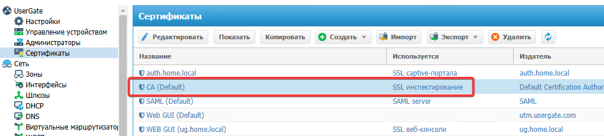
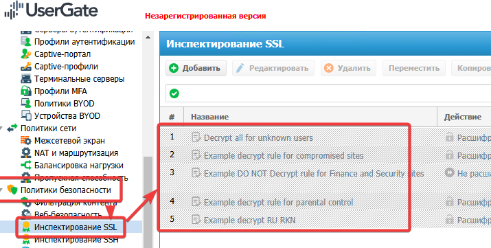
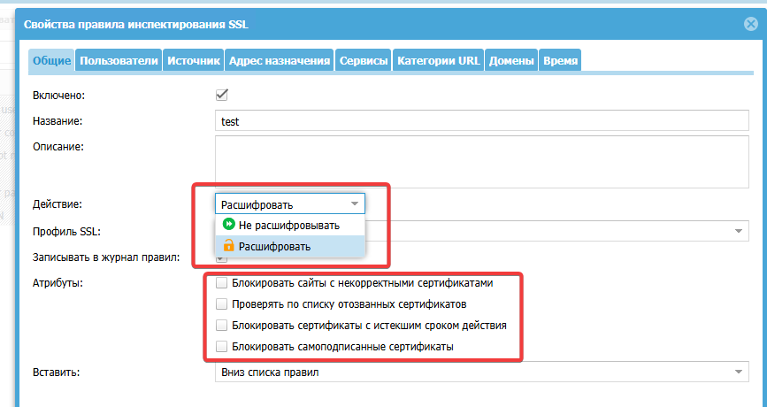
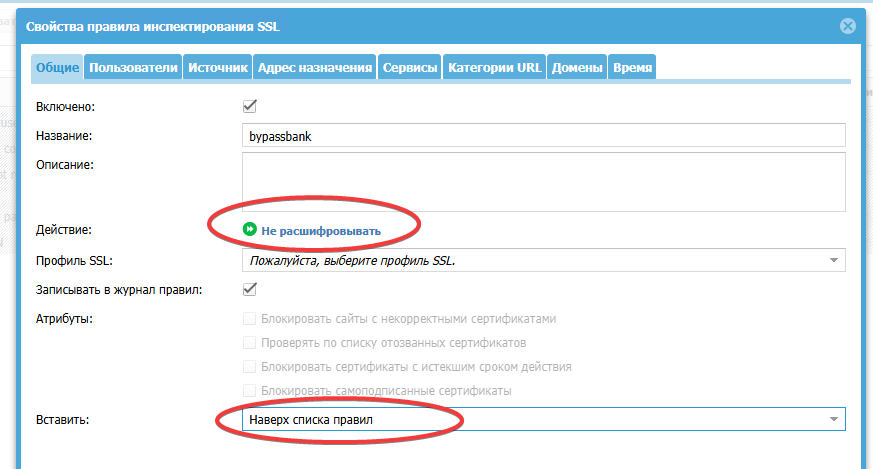
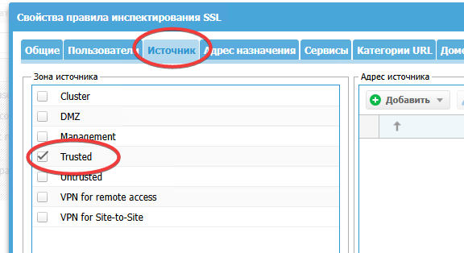
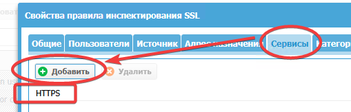
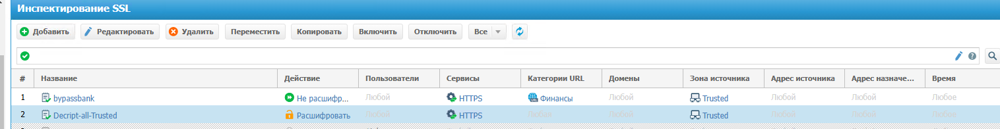

Рассматривается раздел политик безопасности, включающий в себя инспектирование SSL, фильтрацию контента и веб-безопасность. Контентная фильтрация и контроль приложений - то ради чего изобретались NGFW

# Инспектирование SSL
## Принцип MITM
Необходимо для контроля данных которыми пользователь обменивается с WEB-ресурсами. Принцип работы - атака MITM, при этом для успешной работы необходимо распространение сертификата **subordinate certificate CA**, который будет использоваться для генерации SSL-сертификатов интернет-хостов. UserGate поставляется с набором сертификатов среди которых есть CA (Default) — это самоподписанный сертификат для инспектирования SSL. Его можно скачать [по прямой ссылке со шлюза](http:// UserGate_IP:8002/cps/ca)

## Где все это лежит

При помощи политик, админ может разрешить/запретить контент пользователям

## Настройка инспектирования
Основное что мы делаем при создании правила
- расшифровываем или нет.

- дополнительно выделен 2 набор атрибутов, которые относятся к срабатыванию правила
С настройками вкладок №2, 3, 4 все понятно
- Пользователь
- Источник (Зона Trusted)
- Адрес назначения (списки IP-адресов)
С вкладками 5, 6, 7 - чуть сложнее 
- Сервисы - выбор HTTPS/SMTPS/POP3S
- Категории - выбор по дефолтным категориям, можно даже проверить к какой категории принадлежит сайт
- Домены - конкретное название доменного имени: ([www.example.com](http://www.example.com?roistat_visit=1158321), а не [http://www.example.com/home/](http://www.example.com/home/?roistat_visit=1158321)).
## Исключение из инспектирования
Например для банк-клиентов

2 вновь созданных результирующих правила выглядят так

Первым правилом мы пропускаем трафик к сайтам категории "Финансы" не производя инспекцию, вторым правилом мы дешифруем остальной трафик. В политике SSL инспекции если не создано ни одного правила, то SSL не перехватывается и не дешифруются, соответственно, контент, передаваемый по SSL, не фильтруется.

# Контентная фильтрация

# Контроль приложений
