Рассматривается раздел политик безопасности, включающий в себя инспектирование SSL, фильтрацию контента и веб-безопасность. Контентная фильтрация и контроль приложений - то ради чего изобретались NGFW

# Списки URL
Все просто, если понимать [инструкцию буквально](https://support.usergate.com/ru/docs/version/6x/usergate-6/116-spiski-url)
Доступны 2 типа списков:
- ручной (задаем URL вручную, в поле справа от названий списков)
- Обновляемый (задаем файл, содержащий URL)
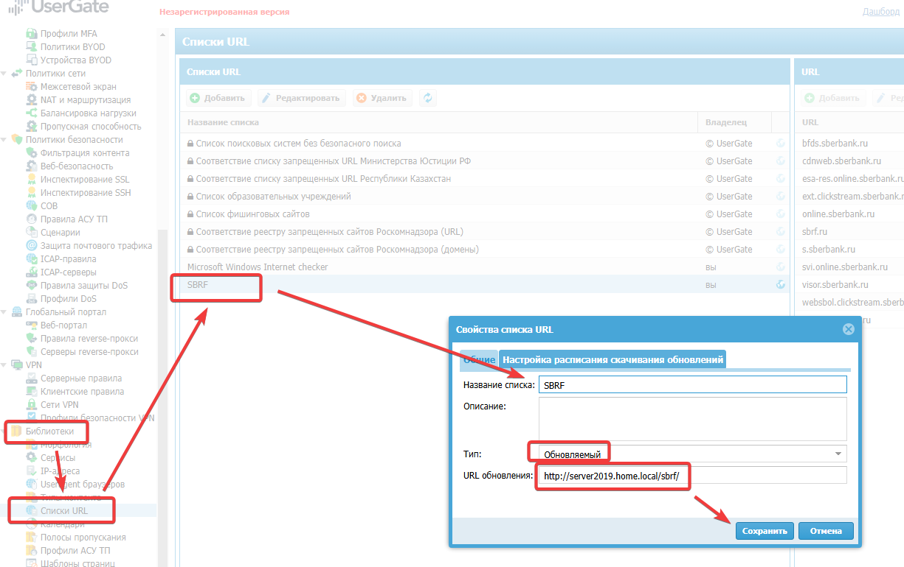
При этом структура файлов в каталоге с фильтром должна содержать следующие файлы
- list.zip - Список URL заархивированный zip
- version.txt - файл версий, в котором надо менять номер при изменении list.zip
# Инспектирование SSL
## Принцип MITM
Необходимо для контроля данных которыми пользователь обменивается с WEB-ресурсами. Принцип работы - атака MITM, при этом для успешной работы необходимо распространение сертификата **subordinate certificate CA**, который будет использоваться для генерации SSL-сертификатов интернет-хостов. UserGate поставляется с набором сертификатов среди которых есть CA (Default) — это сертификат для инспектирования SSL. Его можно скачать [по прямой ссылке со шлюза](http:// UserGate_IP:8002/cps/ca)
CA сертификат может быть как контроллера домена, так и subordinate, если в домене сделано все по науке и есть промежуточные CA
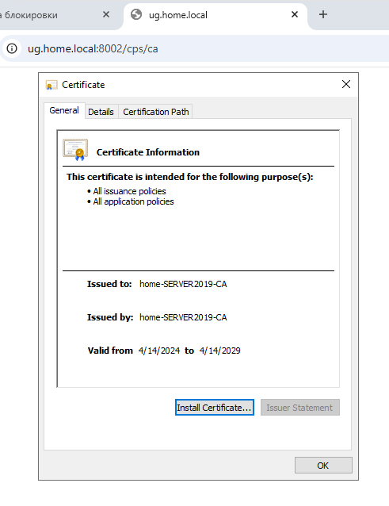
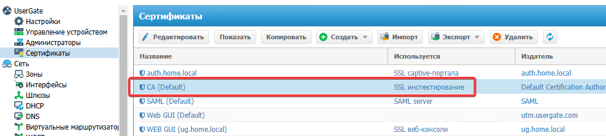
## Где все это лежит
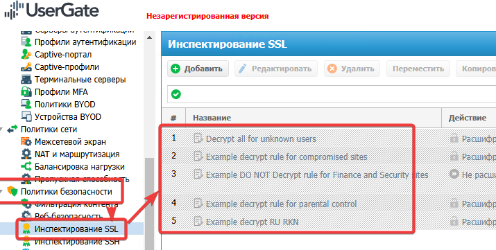
При помощи политик, админ может разрешить/запретить контент пользователям

## Настройка инспектирования
Основное что мы делаем при создании правила
- расшифровываем или нет.
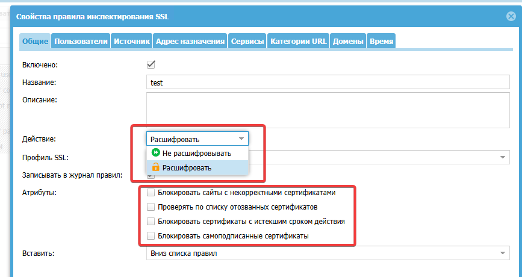
- дополнительно выделен 2 набор атрибутов, которые относятся к срабатыванию правила
С настройками вкладок №2, 3, 4 все понятно
- Пользователь
- Источник (Зона Trusted)
- Адрес назначения (списки IP-адресов)
С вкладками 5, 6, 7 - чуть сложнее 
- Сервисы - выбор HTTPS/SMTPS/POP3S
- Категории - выбор по дефолтным категориям UserGate, доступным по подписке, можно даже проверить к какой категории принадлежит сайт, работает только если **есть валидная лицензия**
- Домены - **список доменных имен** (см. ранее в этой лекции), содержащий конкретные названия доменных имен: ([www.example.com](http://www.example.com?roistat_visit=1158321), а не [http://www.example.com/home/](http://www.example.com/home/?roistat_visit=1158321)). 
## Исключение из инспектирования
Например для банк-клиентов
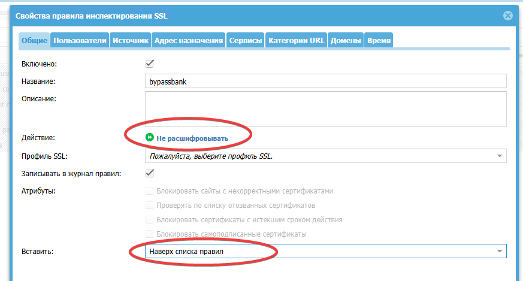

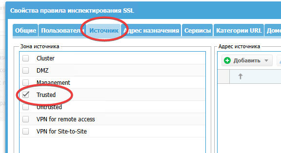

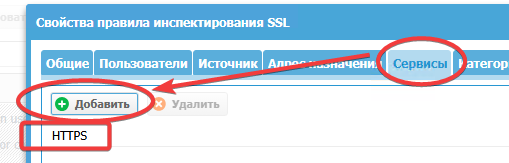

2 вновь созданных результирующих правила выглядят так
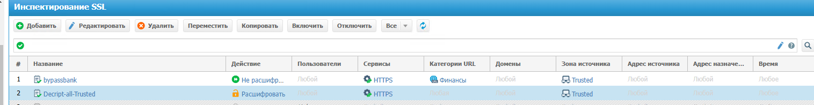
Первым правилом мы пропускаем трафик к сайтам категории "Финансы" не производя инспекцию, вторым правилом мы дешифруем остальной трафик. 
Тут важно, что **если нет или протухла лицензия**, то списки URL самого UG перестают работать, поэтому настройки должны выглядеть следующим образом:
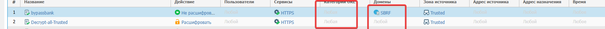
Журнал с байпасом инспекции трафика должен выглядеть так:
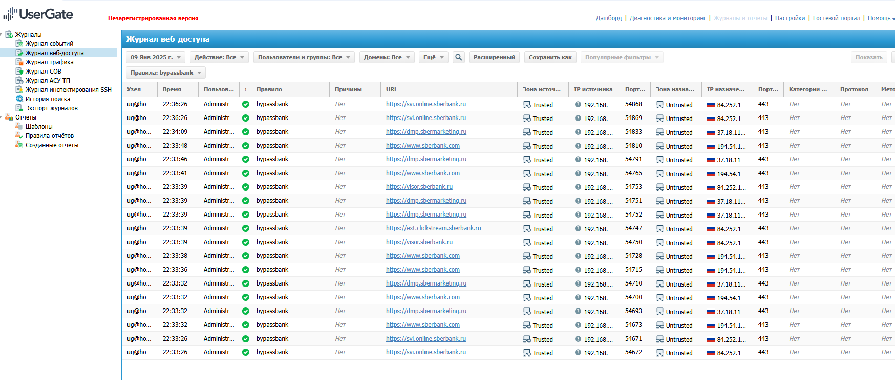

В политике SSL инспекции если не создано ни одного правила, то SSL не перехватывается и не дешифруются, соответственно, контент, передаваемый по SSL, не фильтруется.

# Контентная фильтрация
Это нужно для запрета или разрешения контента, передаваемого по протоколам HTTP/HTTPS, если настроено инспектирование. Напоминаю, что  использование списка URL будет работать, если есть лицензия).
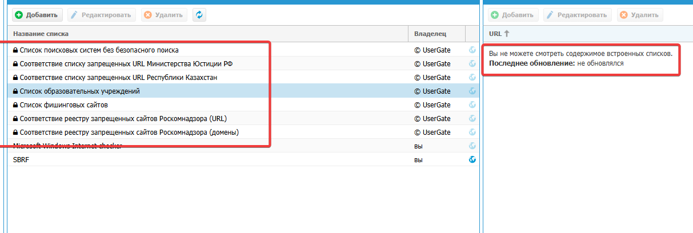
Правила из дефолтного конфига, как пример:
- 1 - разрешающего фильтрацию по списку URL образовательных  
- 2 - запрещающего фильтрацию по списку URL регуляторов, например РКН
- 3 - запрещающего фильтрацию по списку URL категории Threats (угрозы)
- 4 - запрет доступа к сайтам по списку URL "поисковых систем без безопасного поиска"
- 5 - запрет доступа по родительскому контролю
- 6 - запрет по морфологическим конструкциям
- 7 - запрет по срабатыванию антивирусной проверки
- 8 - предупреждение по непродуктивным сайтам
- 9 - запрет по списку РКН
- 10 - разрешение всего остального трафика 
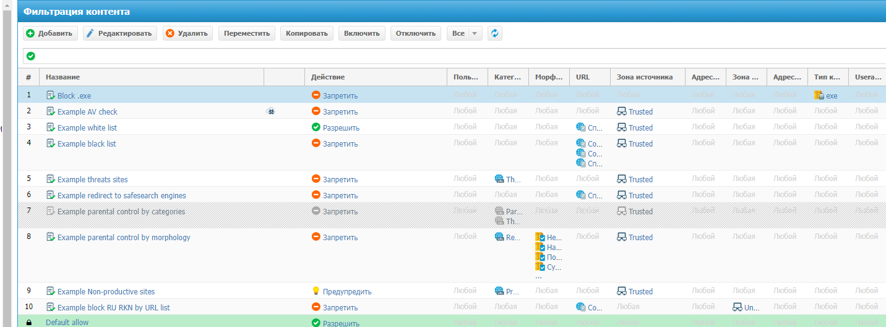
Правила применяются сверху вниз, до первого срабатывания. Если ничего не сработает, то сработает дефолтное правило "Разрешить все", так что очень важно делать максимальное число блокировок, особенно если у вас есть вышестоящая организация контролирующая исполнение вами согласованных и рекомендованных блокировок.

Для добавления пользователя или группы пользователей LDAP в правила фильтрации необходимо нажать на Добавить пользователя LDAP/Добавить группу LDAP, в поле поиска указать как минимум один символ, входящий в имена искомых объектов, после чего нажать на Поиск и выбрать желаемые группы/пользователей.
## Пример блокирование .exe файлов
- Закладка Общие
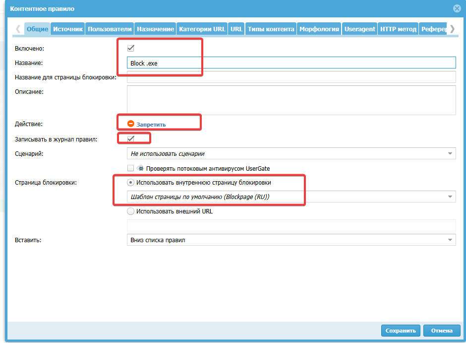
- Закладка "Тип контента"
(раньше называлась "MIME-типы контента") нужно выбрать какой контент передается в трафике. Существуют списки типов контента, предоставляемые разработчиками UserGate. Данные списки типов контента нельзя редактировать, их можно использовать при определении правил фильтрации контента. Также можно создать свои списки, добавив необходимый тип контента в формате MIME. 
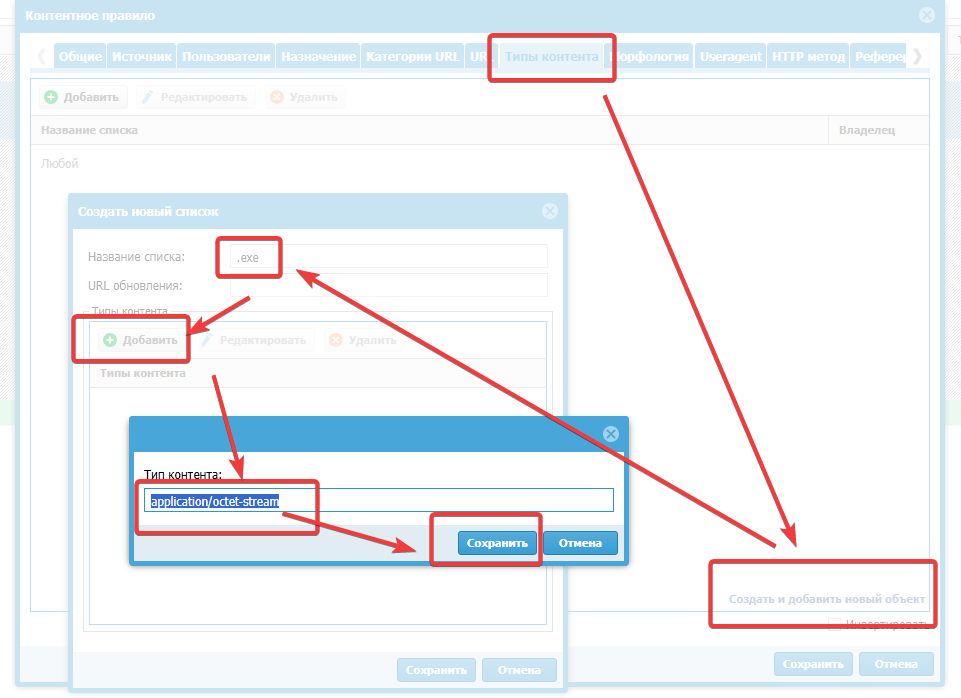

## Пример Родительский контроль
- вкладка морфология
позволяет добавить морфологический словарь для распознавания отдельных слов и словосочетаний на веб-сайте. Если в тексте содержится достаточное для блокировки количество указанных слов и словосочетаний, то доступ к сайту блокируется. Морфологический анализ выполняется как при проверке запроса пользователя, так и при получении ответа от веб-сервера и до его передачи пользователю. 
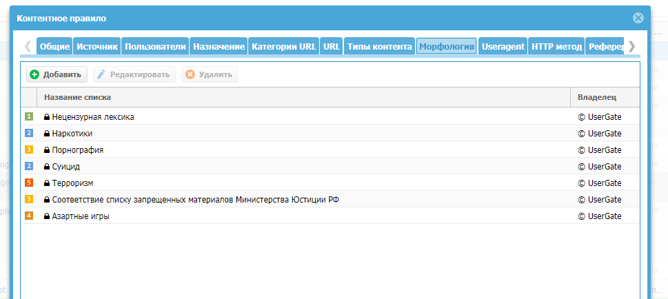

## Другие вкладки
- useragent
запретить или разрешить работу пользователей только с определенным типом браузеров. 
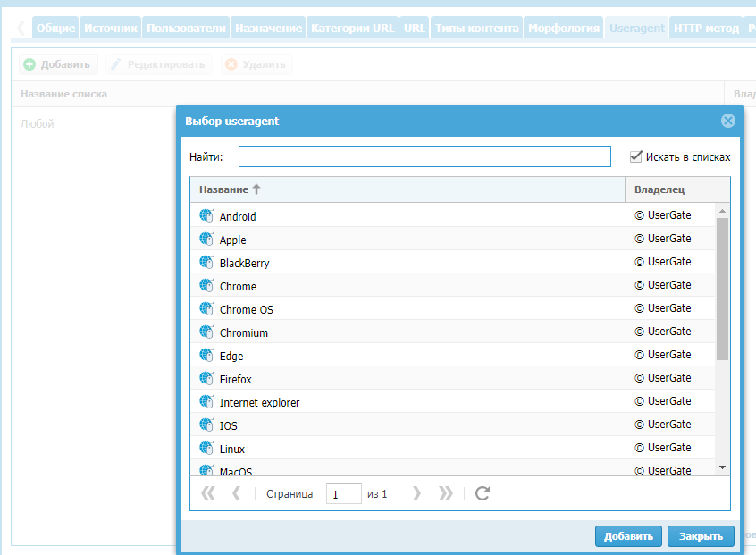
- http метод
 указать какой метод, используется в HTTP-запросах, как правило, это POST или GET.
- Рефереры
контент для определенных реферов, т.е. правило сработает, если для данной страницы реферер совпадает со списком указанных URL. 
## Пример проверки AV
Если надо проверять весь трафик, то надо очистить вкладку "Категория URL"
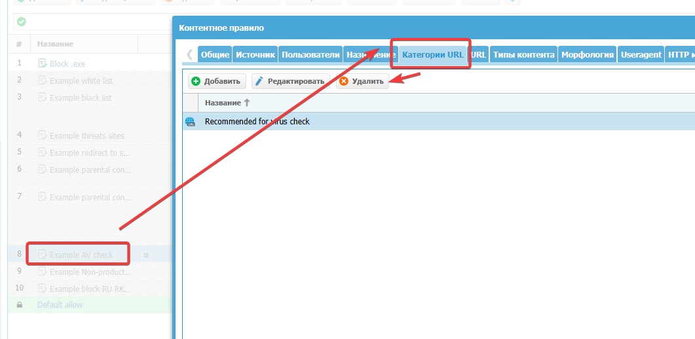

А так можно проверить к какой категории относится URL
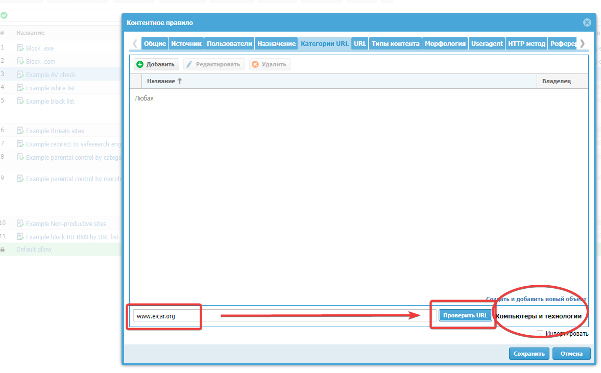
## Включение всех правил
Это можно делать, если уже включена HTTPS-инспекция (ну и настроены правильно все сертификаты )

## Тестирование 
Правило: **если что-то идет не так, то бакап, обновление, тестирование, откат к бэкапам**.
Откроем [сслыку](eicar.org) и найдем тестирование скачивания вредоносного файла
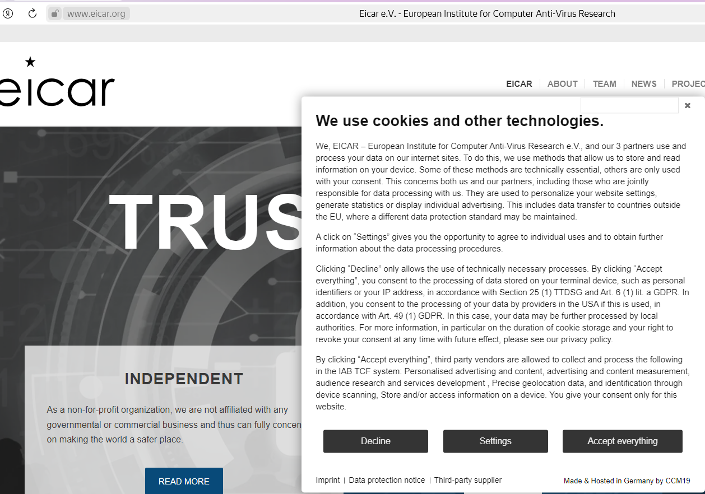
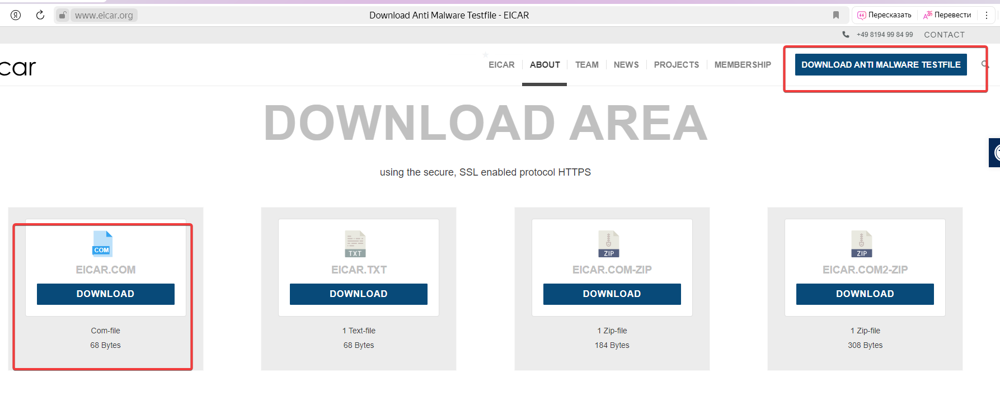
Поскольку мы ранее настроили https-инспекцию, то сработает правило антивируса и у нас при скачивании должна появиться страница заглушка. 
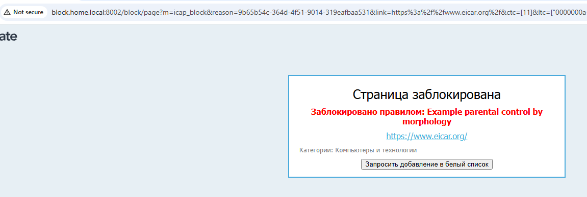
Я рассчитывал что блокировка будет по другому правилу, но получил по этому правилу. 
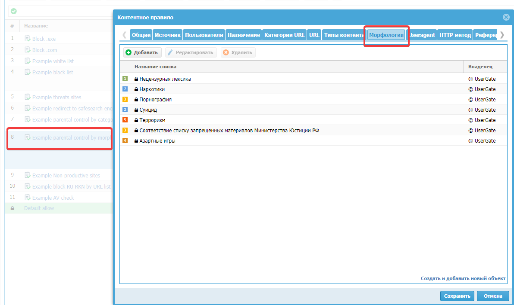
Попробую пошаманить, отключил правило
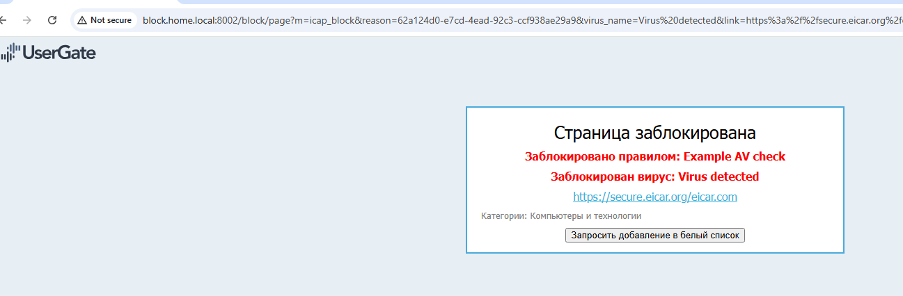

Если не появится, что-то пошло не так, то не хватает какой-то лицензии.
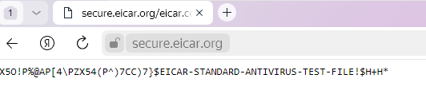
А вот блокировка EXE файла:
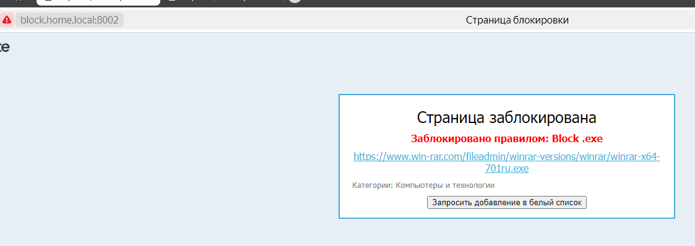
# Контроль приложений
полезная функция, если хотим тюнить тонко доступ к каким-либо аспектам работы того, что доступно пользователям через инет
## Создаем группу приложений
Создаем и наполняем определениями из балы UserGate
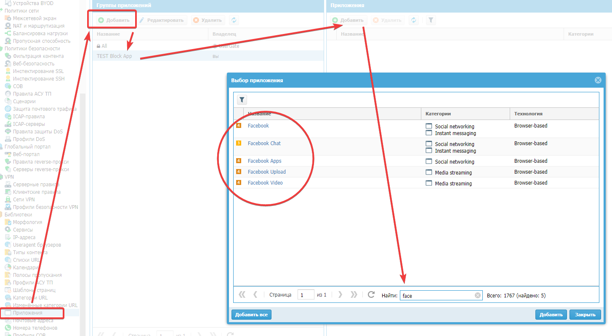
## Наложим ограничения на группу приложений
Свяжем группу приложений и привило межсетевого экрана
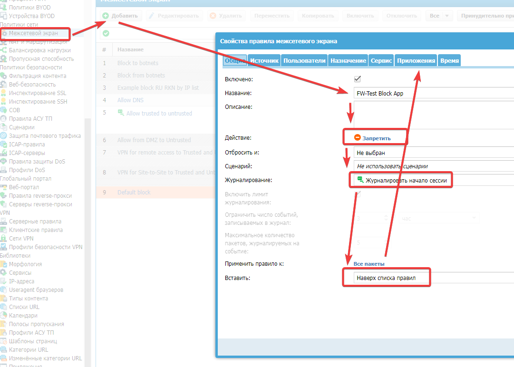

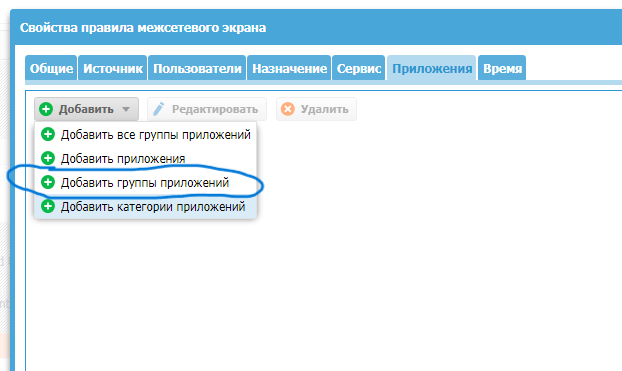

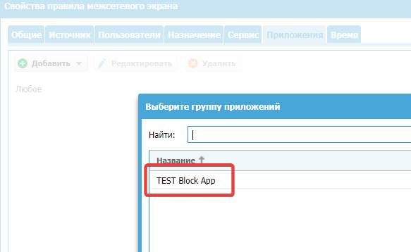

## Проверка
уже блокируется, с момента принудительного применения правил FW
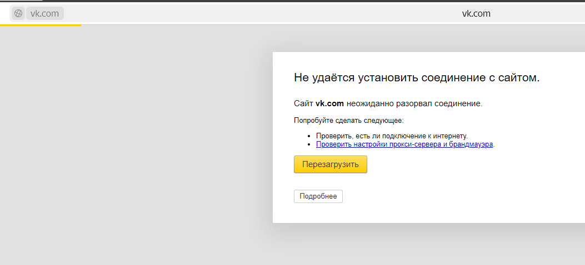

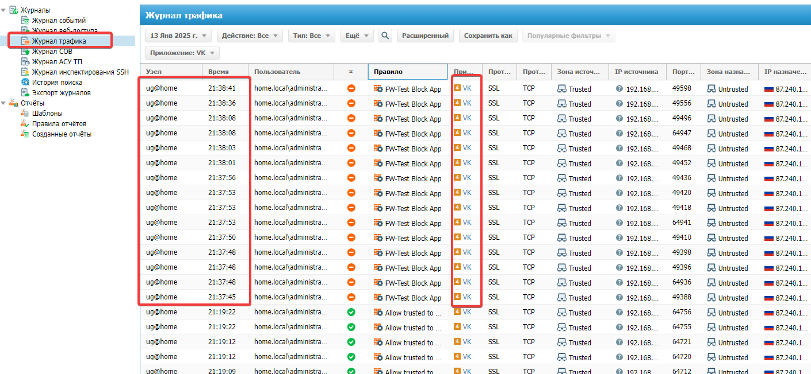

