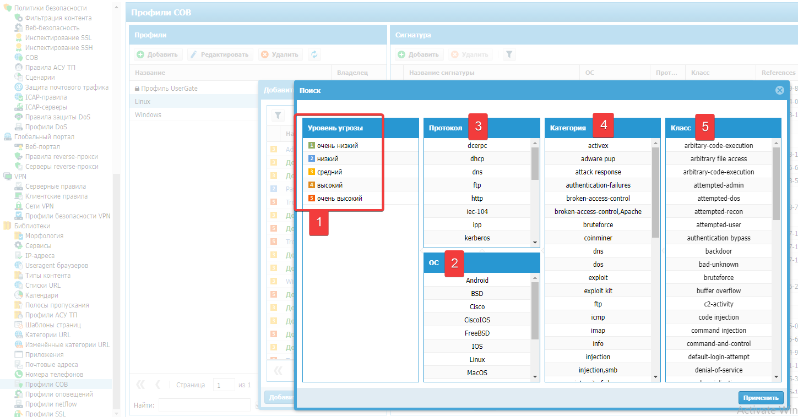
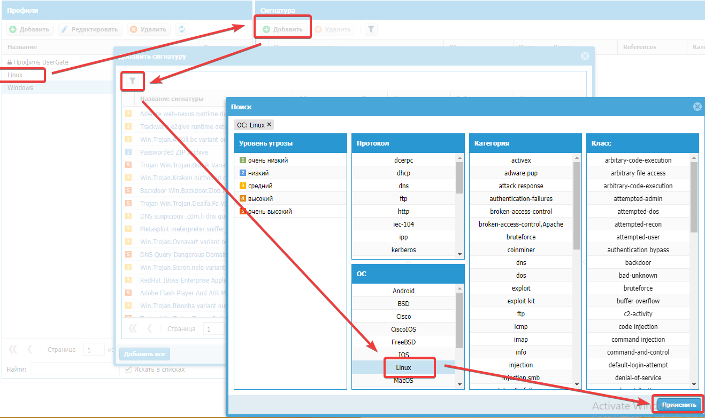
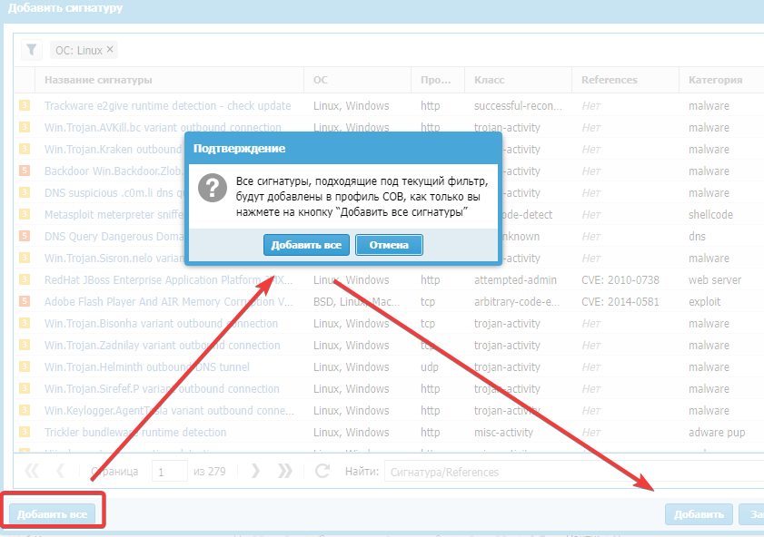
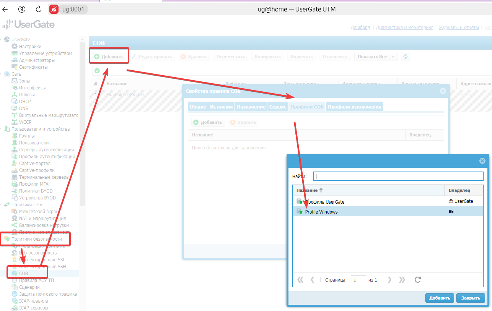
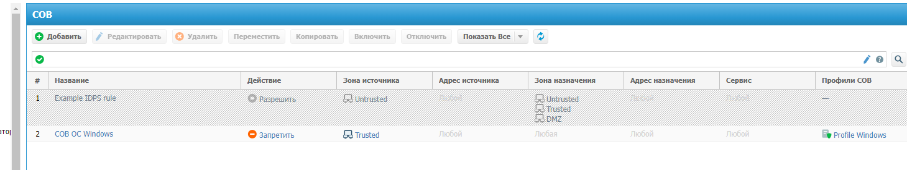

https://login.university.tssolution.ru/member/kursy/usergate-getting-started-v6-sistema-obnaruzheniya-vtorzhenij
Система обнаружения вторжений
## СОВ - это...
СОВ - это набор
- эвристических правил
- сигнатур известных атак
Работает в 2 режимах
- detect - обнаружение, без блокировка, просто запись в журнал
- Prevent - предотвращение, блокировка атаки и запись в журнал
## Сигнатуры
Это образцы шаблонов, на соответствие которым отслеживается трафик. Это подписка. 

Классификатор сигнатур:
1. Уровень угрозы – риск сигнатуры по 5-ти бальной шкале (очень низкий, низкий, средний, высокий, очень высокий).
2. Операционная система – операционная система, для которой разработана данная сигнатура (Android, BSD, Cisco, Windows, Linux и др.).
3. Протокол – протокол, для которого разработана данная сигнатура (IP, SSL, TCP, UDP). 
4. Категория – группа сигнатур, объединенных общими параметрами. Присутствуют разные категории, перечисленные ниже
```
attack_response – сигнатуры, определяющие ответы на известные сетевые атаки.
coinminer – скачивание, установка, деятельность известных майнеров.
dns – известные уязвимости DNS.
dos – сигнатуры известных Denial of services атак.
exploit – сигнатуры известных эксплоитов.
ftp – известные FTP-уязвимости.
imap – известные IMAP-уязвимости.
info – потенциальная утечка информации.
ldap – известные LDAP-уязвимости.
malware – скачивание, установка, деятельность известных malware.
misc – другие известные сигнатуры.
netbios – известные уязвимости протокола NETBIOS.
phishing – сигнатуры известных phishing атак.
pop3 – известные уязвимости протокола POP3.
rpc – известные уязвимости протокола RPC.
scada – известные уязвимости протокола SCADA.
scan – сигнатуры, определяющие попытки сканирования сети на известные приложения.
shellcode – сигнатуры, определяющие известные попытки запуска программных оболочек.
smtp – известные уязвимости протокола SMTP.
snmp – известные уязвимости протокола SNMP.
sql – известные уязвимости SQL.
telnet – известные попытки взлома по протоколу telnet.
tftp – известные уязвимости протокола TFTP.
user_agents – сигнатуры подозрительных Useragent.
voip – известные уязвимости протокола VoIP.
web_client – сигнатуры, определяющие известные попытки взлома различных веб-клиентов, например, Adobe Flash Player.
web_server – сигнатуры, определяющие известные попытки взлома различных веб-серверов.
web_specific_apps – сигнатуры, определяющие известные попытки взлома различных веб приложений.
worm – сигнатуры, определяющие сетевую активность известных сетевых червей.
```
5. Класс – тип атаки, которая детектируется данной сигнатурой. Присутствуют следующие классы:
```
arbitrary-code-execution – попытка запуска произвольного кода
attempted-admin – попытка получения административных привилегий.
attempted-dos – попытка совершения атаки Denial of Service.
attempted-recon – попытка атаки, направленной на утечку данных.
attempted-user – попытка получения пользовательских привилегий.
bad-unknown – потенциально плохой трафик
command-and-control – попытка общения с C&C центром
default-login-attempt – попытка логина с именем/паролем по умолчанию.
denial-of-service – обнаружена атака Denial of Service.
exploit-kit – обнаружен exploit kit
misc-activity – прочая активность.
misc-attack – обнаружена атака.
shellcode-detect – обнаружен исполняемый код.
string-detect – обнаружена подозрительная строка.
suspicious-login – попытка логина с использованием подозрительного имени пользователя.
trojan-activity – обнаружен сетевой троян.
web-application-attack – обнаружена атака на веб-приложение.

```

## Настройка СОВ
Настройка в 2 этапа:
- «Библиотеки» – «Профили СОВ» – «Добавить». 
- «Политики безопасности» – «СОВ» – «Добавить»
При этом смотрим тип ОС/железа и т.п. для которого добавляем профиль
### Добавление профиля

В примере добавим профиль для ОС Win и Lin




### Добавление правила СОВ
Добавляем ранее созданное определение
- Включено – включает или отключает правило.
- Название – название правила.
- Описание – описание правила.
- Действие – возможны следующие варианты:
    Разрешить – не блокирует трафик.
    Журналировать – не блокирует трафик и записывает в журнал (режим обнаружения).
    Запретить – блокирует трафик и записывает в журнал (режим предотвращения).
- Источник – указывается источник трафика.
- Назначение – указывается получатель трафика.
- Сервис – тип сервиса (HTTPS, DNS и др.).
- Профили – список профилей СОВ.
- Профили исключения – сигнатуры, которые будут исключены из профиля (например, которые создают ложные срабатывания).
- 




## Тестирование
Выполняется при помощи KALI Linux