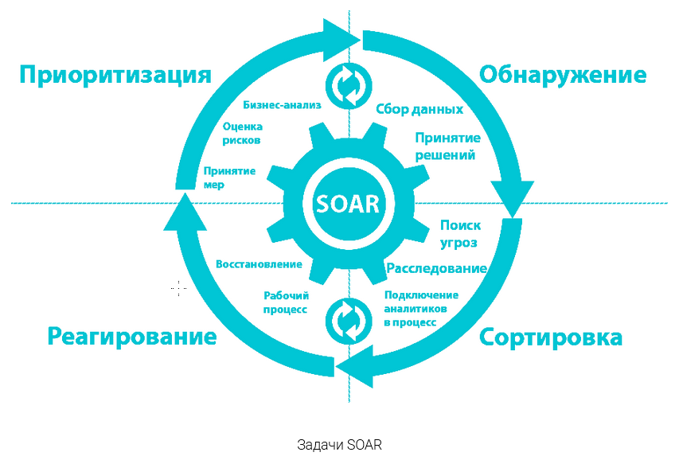
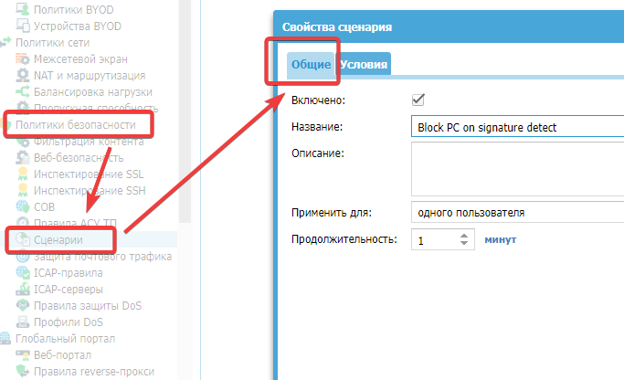
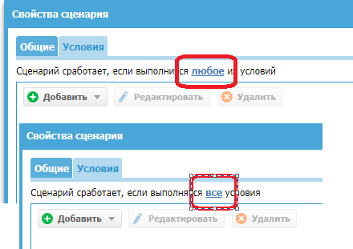
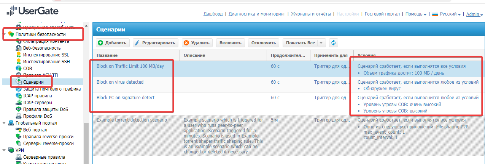
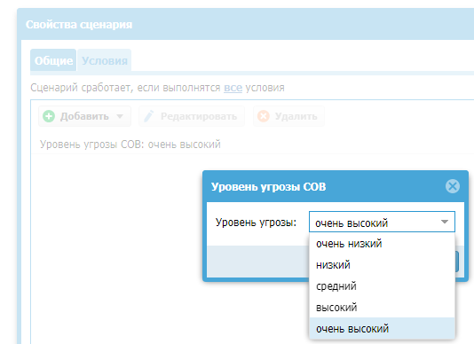
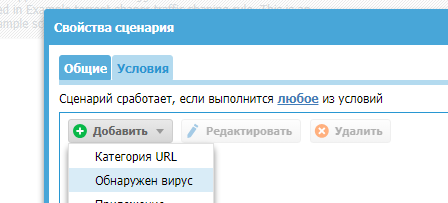
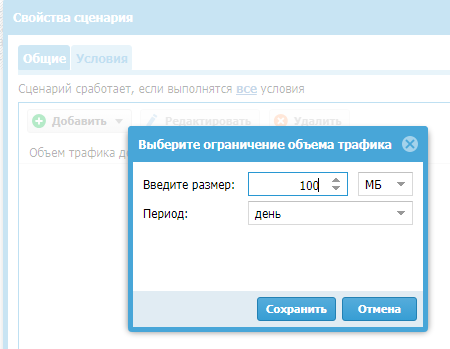
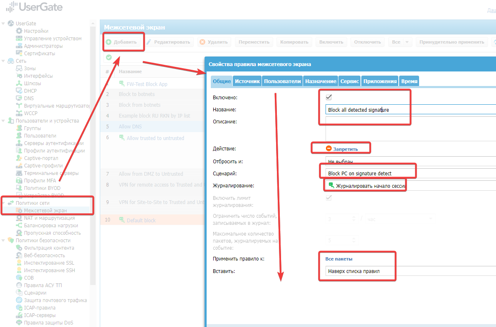
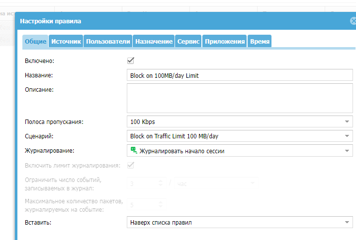
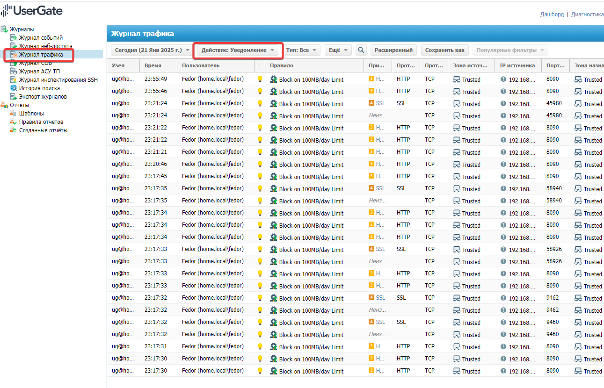

https://login.university.tssolution.ru/member/kursy/usergate-getting-started-v6-soar
## Общие понятия 
SOAR (Security Orchestration and Automated Response) – решение, предназначенное для сведения данных об инцидентах информационной безопасности для последующего анализа и принятия решений. Как видно из названия, SOAR в рамках инцидентов ИБ означает:
- оркестрация - (сбор информации через SIEM, антивирус, срабатываний правил firewall, DLP) - информация предоставляется в едином месте, для принятия решений
- автоматизация - оркестрация дает пищу для размышлений, но чтобы долго не думать - заранее настраивают сценарии (Playbooks) для автоматизации обработки инцидентов ИБ
- реагирование - активное устранение угрозы (например блокировка УЗ AD, удаление вредоносных объектов и т.п.)

## Задачи SOAR
Снизить скорость реакции, вступить в борьбу с угрозами раньше, чем это заметит офицер ИБ или пользователь. Достигается посредством сценариев.


## UserGate и концепция SOAR
UG как может пытается соответствовать путем внедрения сценариев на различные события при:
- анализ поведение различных процессов, 
- выявляет риски
- автоматически обеспечивать на основе этого анализа реакцию
- обеспечивают защиту от угрозы на самой ранней стадии.
Сценарии - дополнительные условия в правилах. Сценалии используют **условия**:
```
- Категория URL – совпадение указанных URL категорий в трафике.
- Обнаружен вирус – обнаружение вредоносной программы.
- Приложение – обнаружено указанное приложение в трафике.
- СОВ – сработка системы обнаружения вторжений.
- Типы контента (MIME-типы) – обнаружены указанные MIME-типа в трафике.
- Размер пакета – размер пакета в трафике пользователя превысил указанное значение.
- Сессий с одного IP – количество сессий с одного IP-адреса превысило указанное значение.
- Объем трафика – объем трафика пользователя превысил определенный лимит за указанную единицу времени.
```
## Пример сценариев
- Блокировка всего трафика у пользователя или группы пользователей, при срабатывании СОВ сигнатур высокого риска.
- локировка всего трафика пользователей или группы пользователей при обнаружении вируса в трафике у данного пользователя. 
- Блокировка или ограничение пропускной способности на 30 минут пользователю, который за последние 10 минут 5 раз использовал торрент.
- Ограничение пропускной способности пользователя, если он выработал лимит трафика за месяц.

### Где настроить
«Политики безопасности – «Сценарии» – «Добавить».


### Условия срабатывания:
Регистрируем Сценарии по условиям, при этом помним что если в правиле несколько условий - требуется выбрать **ВСЕ** или **ЛЮБОЕ**, для срабатывания правила. Лучше гранулировать правила.



- Правило на уровень СОВ

- Правило на обнаружение любого вируса (требует включение инспекции, со всеми вытекающими)

- Правило на ограничение трафика


## Применение сценариев к правилам
Созданные сценарии привязываются к политикам. причем в политиках никаких других настроек можно не применять. Данные правила сработают только в случае срабатывания сценария и заблокируют входящий и исходящий трафик на определенном хосте.

### Настроим блокировку на срабатывание антивирусных сигнатур
Пока настроить не удается - срабатывание на вирус не происходит. Задать вопрос ТП
Win видит вредоносный код, UG - не реагирует.
- «Политики сети» – «Межсетевой экран» – «Добавить» 

### Настроим блокировку на превышение 100 МБ/день
- «Политики сети» – «Пропускная способность» – «Добавить».
Тут получим именно блокировку после скачивания 100 МБ за день, по-сути на сутки.


Просмотреть результаты можно тут:
