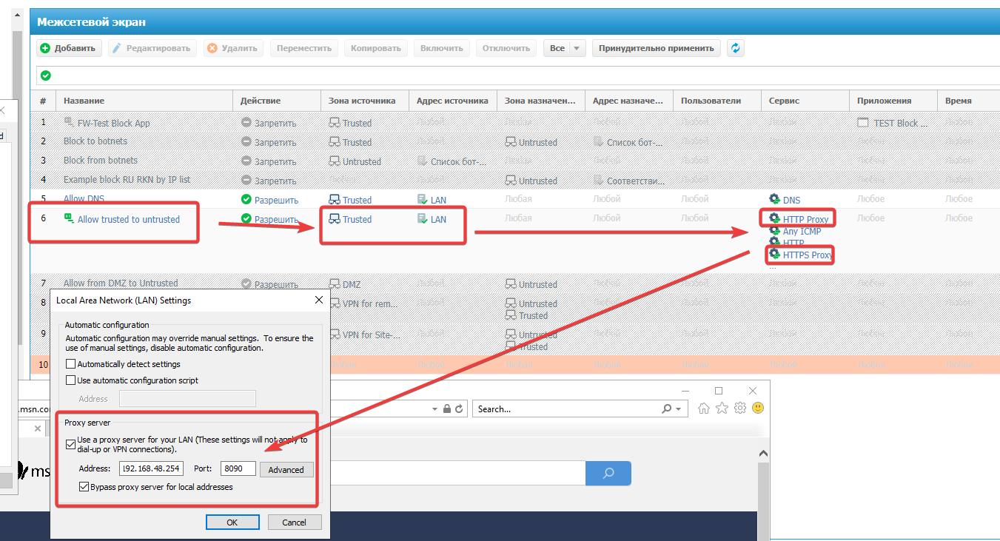

## Явный ВЕБ-прокси
- https://support.usergate.com/ru/kb/version/6x/usergate-6/31-nastroyka-usergate-s-odnim-interfeysom
- https://support.usergate.com/ru/kb/version/6x/usergate-6/37-yavnyy-veb-proksi

При явном прокси UG, указываете в браузере (или где нужно) адрес_ug:8090, или другой порт какой установили, а на самом UG, от этого адреса(подсети) разрешаете в правилах МЭ доступ в untrusted по 80,443.
Правила трансляции при явном 8090 не нужно

## Антивирусная проверка
Можно настроить если активирована фильтрация контента. 
