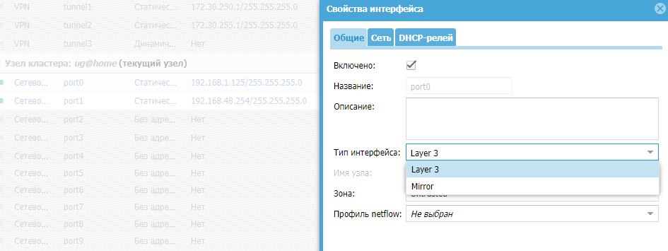
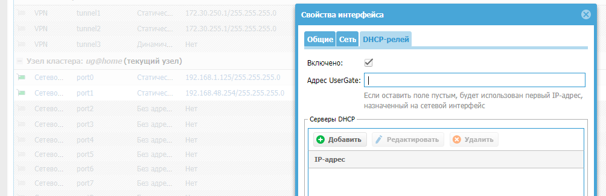
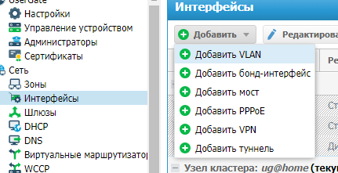
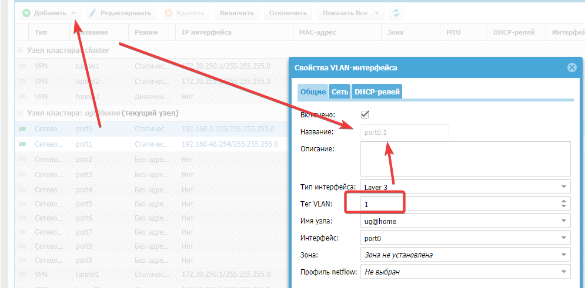
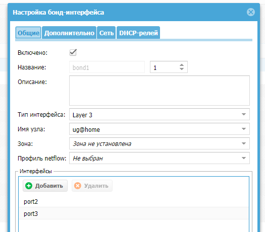
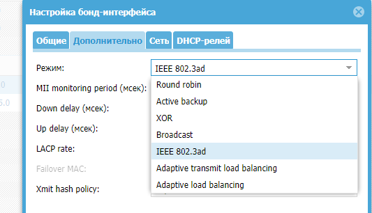
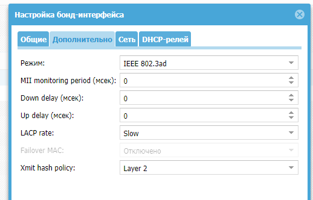

https://docs.usergate.com/pervonachal6naya-nastrojka-138/

# Требования к сетевому окружению

Для корректной работы МЭ UserGate должен иметь доступ до следующих серверов, расположенных в сети интернет:
```
Сервер регистрации - reg2.entensys.com, порты TCP 80, 443.
Сервер обновления списков и ПО UserGate - static.entensys.com, порты TCP 80, 443.
```

При создании кластера конфигурации необходимо обеспечить прохождение следующих протоколов между узлами:
```
Обеспечение репликации настроек - порты TCP 4369, TCP 9000-9100.
Сервис веб-консоли - TCP 8001.
```
# Подключение к UserGate и первоначальная настройка   
## IPMI
Для первоначального доступа к необходимо использовать в качестве имени пользователя admin, в качестве пароля — admin/P@ssw0rd, при первом входе обязательно его поменять
## Часовой пояс
## Язык

## Режим авторизации веб-консоли

## NTP

## модули UserGate

## Port0/Management

Для первоначального доступа к CLI необходимо использовать в качестве имени пользователя Admin, в качестве пароля — utm

Подключиться к веб-консоли UserGate по известному/настроенному адресу, он должен выглядеть примерно следующим образом: https://UserGate_IP_address:8001.

## Язык

## Пароль для входа в WEB

## Зоны/IP IF
### Зоны
- Зона Management (сеть управления), интерфейс port0.
- Зона Trusted (LAN).
- Зона Untrusted (Internet).
- Зона DMZ.
- Зона Cluster.
- Зона VPN for remote access.
- Зона VPN for Site-to-Site.
### Настройка физических IF
 - Вкл/Откл
 - Тип IF (L3/Mirror): Layer 3, можно назначить IP-адрес и использовать его в правилах межсетевого экрана, контентной фильтрации и других правилах, это стандартный режим работы интерфейса. Интерфейс, работающий в режиме Mirror, может получать трафик со SPAN-порта сетевого оборудования для его анализа.

 - Зона
 - MAC/MTU
 - IP (Static/DHCP)
 - DHCP Relay: указать в поле Адрес UserGate IP-адрес интерфейса, на котором добавляется функция релея, и указать один или несколько серверов DHCP, куда необходимо пересылать DHCP-запросы клиентов.

### Логические IF

#### VLAN
Так тут называется сабинтерфейсы. При создании VLAN необходимо указать:

- Вкл/Выкл
- Название (автоматически на основании порта и тега VLAN)
- Тип IF (см. как у физического IF)
- Тег VLAN (max 4094)
- Имя узла - Узел кластера UserGate, на котором будет создан
- Физический IF (Можно задать принудительно)
- Зона (см. как у физ. IF)
- Сеть (Статика/DHCP/без адреса)
- DHCP-релей (см. как у физ. IF)
#### BOND
объединить несколько физических интерфейсов в один логический агрегированный интерфейс для повышения пропускной способности или для отказоустойчивости канала

- Вкл/выкл
- Название
- Имя узла - Узел кластера UserGate, на котором будет создан
- Зона
- Интерфейсы (физические IF/члены BOND)
Вкладка Дополнительно


- **режим** (согласовать с ностройкой Eth-Channel второго участника обмена)
	- ***Round robin*** - для **балансировки нагрузки и отказоустойчивости**. Пакеты отправляются последовательно, начиная с первого доступного интерфейса и заканчивая последним. 
	- ***Active backup*** - для **отказоустойчивости** (. Только один сетевой интерфейс из объединенных будет активным. Другой интерфейс может стать активным только в том случае, когда упадет текущий активный интерфейс. При такой политике MAC-адрес бонд-интерфейса виден снаружи только через один сетевой порт, во избежание появления проблем с коммутатором. 
	- ***XOR*** - для **балансировки нагрузки и отказоустойчивости.**. Передача распределяется между сетевыми картами используя формулу: [(«MAC-адрес источника» XOR «MAC-адрес назначения») по модулю «число интерфейсов»]. Получается, одна и та же сетевая карта передает пакеты одним и тем же получателям. Опционально распределение передачи может быть основано и на политике «xmit_hash». 
	- ***Broadcast*** - для **отказоустойчивости**. Передает все на все сетевые интерфейсы. Эта политика применяется .
	- ***IEEE 802.3ad*** - режим работы, установленный по умолчанию, поддерживается большинством сетевых коммутаторов. Создаются агрегированные группы сетевых карт с одинаковой скоростью и дуплексом. При таком объединении передача задействует все каналы в активной агрегации согласно стандарту IEEE 802.3ad. Выбор, через какой интерфейс отправлять пакет, определяется политикой; по умолчанию используется XOR-политика, можно также использовать «xmit_hash» политику.
	- ***Adaptive transmit load balancing***. Исходящий трафик распределяется в зависимости от загруженности каждой сетевой карты (определяется скоростью загрузки). Не требует дополнительной настройки на коммутаторе. Входящий трафик приходит на текущую сетевую карту. Если она выходит из строя, то другая сетевая карта берет себе MAC-адрес вышедшей из строя карты.
	- ***Adaptive load balancing***. Включает в себя предыдущую политику плюс осуществляет балансировку входящего трафика. Не требует дополнительной настройки на коммутаторе. Балансировка входящего трафика достигается путем ARP-переговоров. Драйвер перехватывает ARP-ответы, отправляемые с локальных сетевых карт наружу, и переписывает MAC-адрес источника на один из уникальных MAC-адресов сетевой карты, участвующей в объединении. Таким образом, различные пиры используют различные MAC-адреса сервера. Балансировка входящего трафика распределяется последовательно (round-robin) между интерфейсами.
- **MII monitoring period** (мсек) - Устанавливает периодичность MII-мониторинга в миллисекундах. Определяет, как часто будет проверяться состояние линии на наличие отказов. Значение по умолчанию - 0 - отключает MII-мониторинг.
- **Down delay** (мсек) - Определяет время (в миллисекундах) задержки перед отключением интерфейса, если произошел сбой соединения. Эта опция действительна только для мониторинга MII (miimon). Значение параметра должно быть кратным значениям miimon. Если оно не кратно, то округлится до ближайшего кратного значения. Значение по умолчанию 0.
- **Up delay** (мсек) - Задает время задержки в миллисекундах, перед тем как поднять канал при обнаружении его восстановления. Этот параметр возможен только при MII-мониторинге (miimon). Значение параметра должно быть кратным значениям miimon. Если оно не кратно, то округлится до ближайшего кратного значения. Значение по умолчанию 0.
- **LACP rate** - с каким интервалом будут передаваться партнером LACPDU-пакеты в режиме 802.3ad. Возможные значения:
    - Slow - запрос партнера на передачу LACPDU-пакетов каждые 30 секунд.
    - Fast - запрос партнера на передачу LACPDU-пакетов каждую 1 секунду.
- **Failover MAC** - тольков в режиме **active-backup** при переключении интерфейсов Определяет, как будут прописываться MAC-адреса на объединенных интерфейсах . Обычно - одинаковый MAC-адрес на всех интерфейсах. Возможные значения:
	- Отключено - устанавливает одинаковый MAC-адрес на всех интерфейсах во время переключения.
	- Active - MAC-адрес на бонд-интерфейсе будет всегда таким же, как на текущем активном интерфейсе. MAC-адреса на резервных интерфейсах не изменяются. MAC-адрес на бонд-интерфейсе меняется во время обработки отказа.
	- Follow - MAC-адрес на бонд-интерфейсе будет таким же, как на первом интерфейсе, добавленном в объединение. На втором и последующем интерфейсе этот MAC не устанавливается, пока они в резервном режиме. MAC-адрес прописывается во время обработки отказа, когда резервный интерфейс становится активным, он принимает новый MAC (тот, что на бонд-интерфейсе), а старому активному интерфейсу прописывается MAC, который был на текущем активном.
- **Xmit hash policy** - в режиме XOR или IEEE 802.3ad - хэш-политика передачи пакетов через объединенные интерфейсы:
	- Layer 2 - использует только MAC-адреса для генерации хэша. При этом алгоритме трафик для конкретного сетевого хоста будет отправляться всегда через один и тот же интерфейс. Алгоритм совместим с IEEE 802.3ad.
	- Layer 2+3 - использует как MAC-адреса, так и IP-адреса для генерации хэша. Алгоритм совместим с IEEE 802.3ad.
	- Layer 3+4 - используются IP-адреса и протоколы транспортного уровня (TCP или UDP) для генерации хэша. Алгоритм не всегда совместим с IEEE 802.3ad, так как в пределах одного и того же TCP- или UDP-взаимодействия могут передаваться как фрагментированные, так и нефрагментированные пакеты. Во фрагментированных пакетах порт источника и порт назначения отсутствуют. В результате в рамках одной сессии пакеты могут дойти до получателя не в том порядке, так как отправляются через разные интерфейсы.
- Сеть (Статика/DHCP/без адреса)
- DHCP-релей (см. как у физ. IF)
#### МОСТ
## GW
https://docs.usergate.com/nastrojka-shlyuzov_384.html
Для NGFW необходимо указать IP-адрес одного или нескольких GW. **Настройка шлюза уникальна для каждого из узлов кластера.**

Замечено, что при включении - дефолтного маршрута нет и UG недоступен по сети. Чтобы заработал, необходимо:
- Задать GW
```
gateway add -ipv4 10.96.29.1 -enabled true -default true
```
- Задать маршрут в сеть через нужный IF
```
route add -dest 10.96.28.0/24 -gw 10.96.29.1 -iface port 7 -enabled true
route add -dest 10.96.19.0/24 -gw 10.96.30.1 -iface bond1.930 -enabled true
```
Со стороны коммутатора LACP
```
port link-type trunk
undo port trunk allow-pass vlan 1
port trunk allow-pass vlan 930
stp loop-protection
mode lacp-static
```
## DNS
необходимо, чтобы NGFW мог разрешать доменные имена в IP-адреса. Укажите корректные IP-адреса серверов DNS в настройке Системные DNS-серверы.