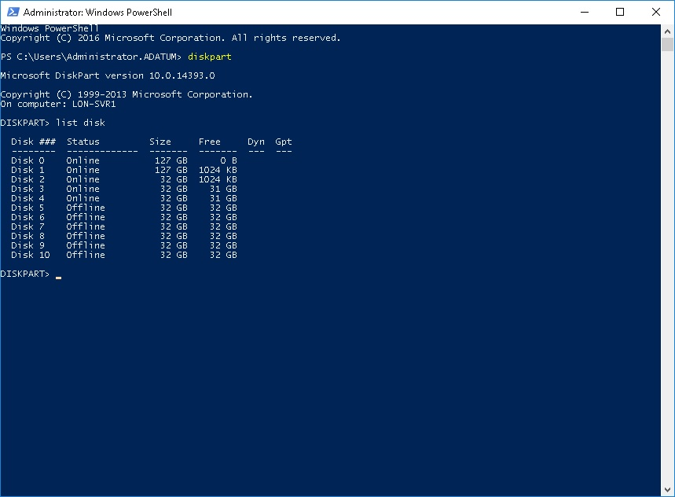
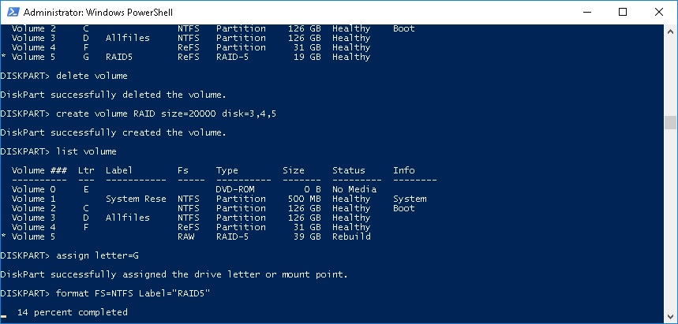

# Module2/Lesson2 - Managing volumes in Windows Server
```
diskpart
List disk 
Select disk 3 
Online disk - если он offline
Attributes disk clear readonly - Если возникает ошибка Disk Readonly
Convert dynamic 
Create volume simple size=500 disk=3 
list volume
assign letter=G 
format FS=NTFS Label="Mirror"
```


Добавление Mirror
```
Select disk 4 
Online disk - если он offline
Attributes disk clear readonly - Если возникает ошибка Disk Readonly или WriteProtected
Convert dynamic 
list volume
Select volume 5
add disk 4 - Результатом будет DiskPart succeeded in adding a mirror to the volume.
```
Создание RAID из 3 onlyne Dynamic дисков:
```
create volume raid size=1000 disk=1,2,3
list volume
select volume <X> - выбираем вновь созданный том
assign letter=G 
format FS=NTFS Label="Mirror"

```


Удаление тома
```
list volume
select volume <X>
delete volume - 
```
