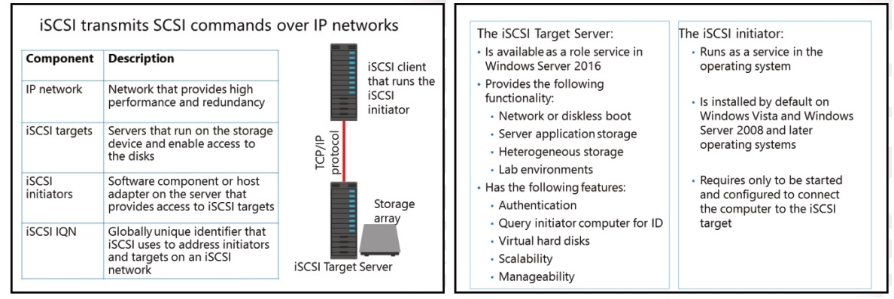

# Module3/Lesson2 - Comparing FC, iSCSI, and FCoE
## FC
• Arbitrated loop. FC хосты и хранилища объединены в кольцо, без свичей.
• Point-to-point. FC хосты подключаются напрямую к хранилищу. Количество подключенных устройств ограничивается встроенными портами. 
• Switched fabric. Switched fabric использует FC свичи. Все FC хосты подключаются к FC свичам, которые в свою очередь подключены к хранилищам. 

Компоненты:
- Фабрика (свичи). В некоторых случаях может возникнуть необходимость коммутировать в фабрику не только оптику, но и медь
- HBA. Карты расширения серверов для подключения к FC или Ethernet. Минимум 1 порт, лучше - 2
- Кабели. FC - SM/MM(подходит для DC); Ethernet - FCoE/FCoIP
- Контроллеры (головы) хранилищ(-а). Управляют подключением к фабрике
## iSCSI
Возможность подключать по ip-сетям SCSI-устройства.
