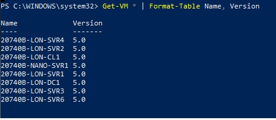
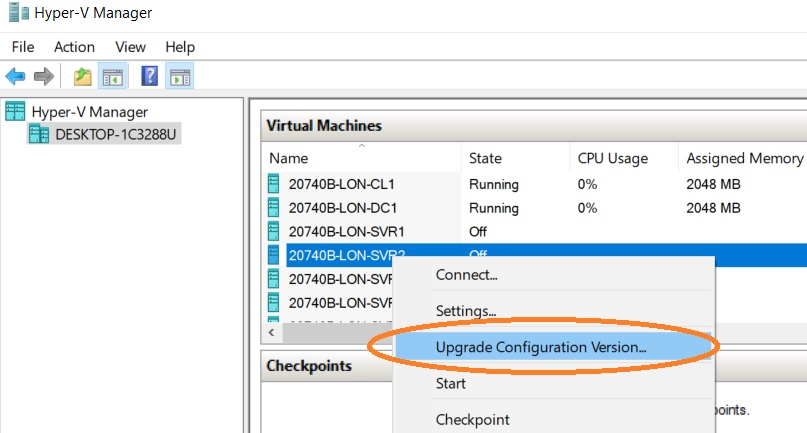
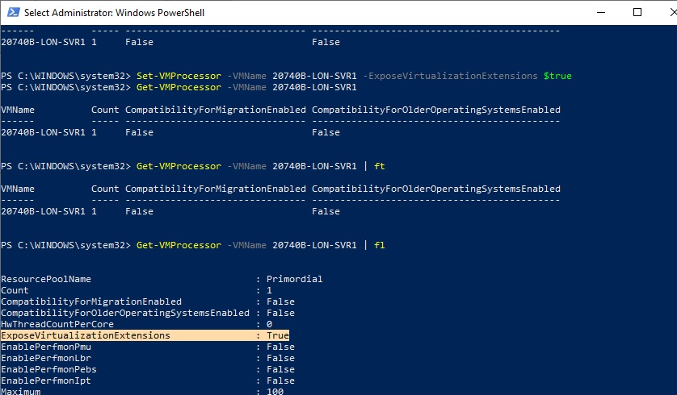
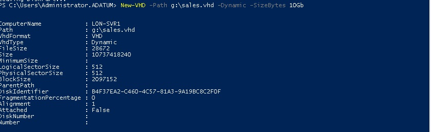

Понадобилось потестировать создание виртуальных дисков VHD в VM. Чтобы заработала вложенная виртуализация, я пробую следующее:
```
Get-VM * | Format-Table Name, Version
```

Делаем upgrade 
```
Update-VMVersion <vmname>
```
или


Затем
```
Set-VMProcessor -VMName 20740B-LON-SVR1 -ExposeVirtualizationExtensions $true
Get-VMProcessor -VMName 20740B-LON-SVR1 | fl
```


Ну и внутри VM: systeminfo.exe


после этого удалось создать VHD файл

